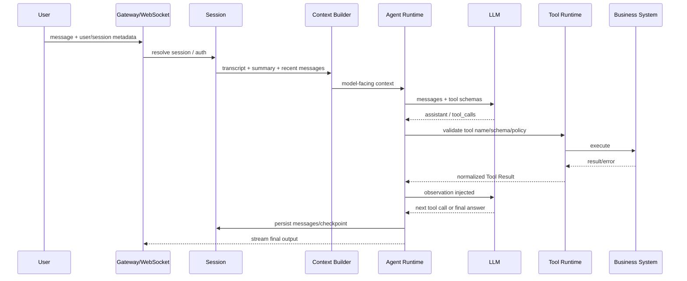

# Agent Loop 深挖：从一次用户消息到 Tool Loop、Context Governance 与停止条件

> 目标：这篇不是回答“Agent Loop 是什么”，而是回答**一个真正可运行的 Agent Runtime 在一轮请求里到底发生了什么、状态在哪里、谁有权执行 Tool、失败如何收敛，以及 nanobot 当前源码具体落在哪里**。

## 面试题

> Agent Loop 一次模型调用前后到底做了什么？Session、Context、Tool Call、Tool Result、Checkpoint、Injection、停止条件分别处在哪一层？

---

## 一、面试官真正考什么

如果只回答：

```text
User → LLM → Tool → LLM → Answer
```

只能说明知道 Agent 的表面流程。

高级面试真正想确认的是：

1. **会话状态和执行状态是否分离**；
2. **完整历史和模型上下文是否分离**；
3. **模型是否只有“提议动作”的权力，而 Runtime 才有“执行动作”的权力**；
4. **Tool Result 如何作为 observation 回注**；
5. **Context 超限时在哪个阶段压缩**；
6. **用户中途发新消息时是否能插入正在执行的 Turn**；
7. **Tool/LLM 失败、达到 iteration budget 后如何停止**；
8. **进程重启以后到底恢复 conversation，还是恢复 execution state**。

所以 Agent Loop 本质上不是一个 `while(true)`，而是一套**有状态、有预算、有安全边界、有恢复点的运行时协议**。

---

# 二、先建立正确的分层

建议把系统分成四层：

```text
┌──────────────────────────────────────────┐
│ Product / Transport                     │
│ WebSocket / HTTP / Telegram / WebUI     │
│ user_id / session_id / tenant / auth    │
└─────────────────┬────────────────────────┘
                  ↓
┌──────────────────────────────────────────┐
│ Session / Context Layer                  │
│ Durable Transcript / Summary / Memory   │
│ Context Projection / Token Budget       │
└─────────────────┬────────────────────────┘
                  ↓
┌──────────────────────────────────────────┐
│ Agent Runtime / Harness                  │
│ Iteration / Tool Policy / Hook / Retry   │
│ Checkpoint / Injection / Stop Reason     │
└─────────────────┬────────────────────────┘
                  ↓
┌──────────────────────────────────────────┐
│ Business / External World               │
│ DB / HTTP API / MCP / Order / Payment   │
└──────────────────────────────────────────┘
```

其中最关键的一句是：

> **LLM 负责概率性决策；Runtime 负责决定这个决策能不能执行；业务系统负责最终事实。**

这三个责任如果混在一起，系统就会出现典型问题：

- 模型说“退款成功”，但支付网关其实超时；
- 模型生成一条 SQL 就直接执行，没有权限校验；
- Tool Call 名字存在，但参数语义越权；
- 进程重启以后把用户原问题重放一遍，造成重复下单。

---

# 三、一次完整 Turn 到底经历哪些阶段

建议面试时把一轮 Agent 执行拆成 10 个边界。



下面逐层拆。

## 1. Resolve Session

入口拿到的通常不只是 `message`，至少应该有：

```text
user_id
tenant_id
conversation_id / session_key
request_id
channel
permission_scope
metadata
```

这一层解决的是“这句话属于谁、属于哪个会话、可以访问什么”，而不是让模型自己判断。

## 2. Load Durable State

持久化层应该保存的是**事实历史**，包括：

```text
user message
assistant message
tool call
tool result
summary checkpoint
runtime checkpoint
provider state（如有）
```

注意：这份历史不等于下一次全量发给模型。

## 3. Build Model-facing Context

这是很多回答最容易漏掉的地方。

### Durable Transcript

是长期事实：

```text
完整历史、审计、恢复、回放
```

### Model-facing Context

是本轮投影：

```text
System Prompt
+ 当前权限/运行说明
+ Memory/RAG
+ 历史 Summary
+ 最近原始消息
+ Tool Schema
+ 当前用户请求
```

也就是说：

```text
Transcript = 数据源
Context = 查询结果 / 投影
```

而不是：

```text
Context = 整个 history.jsonl
```

## 4. Context Governance

真正成熟的 Runtime 在调用 LLM 前会检查：

- 当前 token 估算；
- Tool Schema 占多少；
- 输出 token budget；
- 是否触发压缩；
- 是否需要丢弃过旧原始消息；
- 是否必须保留未闭合的 Tool Call/Tool Result 对。

Context Compaction 的位置应该是：

```text
加载历史
   ↓
计算 token budget
   ↓
必要时压缩旧历史
   ↓
构建本轮 request messages
   ↓
调用 LLM
```

而不是模型返回以后才想起来“上下文太长了”。

---

# 四、nanobot 当前源码具体怎么对应

nanobot 当前把核心 tool-using loop 下沉到了：

```text
nanobot/agent/runner.py
```

其中 `AgentRunSpec` 已经暴露了很多 Runtime 层真正需要的参数：

```python
initial_messages
transcript_input
transcript_builder
tools
runtime
max_iterations
max_tool_result_chars
concurrent_tools
checkpoint_callback
injection_callback
terminal_injection_callback
llm_timeout_s
continuation_callback
provider_state
```

这个结构非常值得面试讲，因为它说明 Agent Runtime 不只是：

```python
provider.chat(messages)
```

而是把**上下文、Tool、并发、Checkpoint、Injection、LLM timeout、Provider State**统一作为一次 Run 的执行参数。

`AgentRunner._run_core()` 中会建立：

```text
ContextGovernanceConfig
ProviderConversationStateController
ModelRequestState
```

然后进入：

```python
for iteration in range(spec.max_iterations):
```

所以 nanobot 的 iteration budget 是 Runtime 明确控制的，不是让模型无限 ReAct。

---

# 五、一次模型返回 Tool Call 后发生什么

模型返回 Tool Call 后，必须分两件事：

```text
模型“生成了 Tool Call”
        ≠
Tool 已经执行
```

正确链路：

```text
LLM Response
   ↓
Tool Call Request
   ↓
Tool Registry 查找
   ↓
prepare_call / 参数处理
   ↓
安全与边界检查
   ↓
before_execute_tool hook
   ↓
Tool.execute()
   ↓
after_execute_tool / error hook
   ↓
Normalize Tool Result
   ↓
回注 messages
```

nanobot 的执行层在：

```text
nanobot/agent/tools/execution.py
```

它不是简单 `await tool()`，还包含：

- `prepare_call`；
- repeated external lookup guard；
- workspace boundary；
- SSRF boundary；
- Tool error normalization；
- hook；
- concurrency-safe batch。

这就是为什么我会把 **Tool Runtime 看成 Harness 的一部分**，而不是 LLM 的附件。

---

# 六、Tool Result 为什么还要再发给模型

Tool Result 是 observation，不一定是最终用户答案。

例如：

```json
{
  "road": "A路",
  "devices": 128,
  "abnormal_energy": 17,
  "alarm_count": 46
}
```

用户问的是：

> 为什么昨晚 A 路能耗异常？

原始工具只提供事实，模型还需要：

1. 判断是否需要第二个工具查设备历史；
2. 关联报警；
3. 分析异常模式；
4. 最终生成用户可理解的结论。

所以 Agent Loop 本质是：

```text
Decision
   ↓
Action
   ↓
Observation
   ↓
New Decision
```

这也是 ReAct 的工程化版本。

---

# 七、停止条件不能只靠“模型没返回 Tool Call”

生产环境至少应该有多类停止条件。

## 1. Natural Stop

模型返回最终答案且没有 Tool Call。

## 2. Iteration Budget

例如：

```text
max_iterations = 8
```

达到上限必须终止或进入 finalization，而不是无限循环。

## 3. Time Budget

```text
run_deadline
llm_timeout
tool_timeout
```

## 4. Repeated Action Guard

连续请求同一个外部目标，可能说明模型陷入循环。

## 5. Security Boundary

例如 SSRF、workspace violation，不应该因为模型“坚持”就继续尝试绕过。

## 6. User Cancellation / New Intent

用户可以中途改口：

```text
“不要最早了，改成最便宜。”
```

这时继续旧 Loop 可能已经没有意义。

---

# 八、nanobot 的中途消息 Injection 是什么

nanobot `AgentRunner` 有：

```text
injection_callback
terminal_injection_callback
continuation_callback
```

并且内部有限制：

```text
_MAX_INJECTIONS_PER_TURN
_MAX_INJECTION_CYCLES
```

这意味着一个正在执行的 Turn，不必等完全结束以后才能看到用户的新消息。

简化链路：

```text
Agent 正在执行 Tool
      ↓
用户新消息进入 pending queue
      ↓
injection_callback drain
      ↓
标准化为新的 user message
      ↓
append 到当前 messages
      ↓
下一轮 LLM 看到新要求
```

这比传统 Chat Completion 的“一问一答”更接近真正 Runtime。

但这里还有一个工程问题：

> 如果旧 Worker 已经在后台执行，用户改口以后旧结果晚到怎么办？

这就需要上层再补：

```text
plan_id
plan_version
step_id
cancellation_token
artifact_version
```

nanobot 的 Injection 能解决“新意图进入当前 Turn”，但不等于已经具备完整 DAG replan + stale result discard。

---

# 九、Agent Loop 中哪些必须由代码硬控制

建议面试时直接画这张边界表：

| 事项 | LLM 可以决定 | Runtime/代码必须决定 |
|---|---:|---:|
| 是否需要查询更多信息 | ✅ | 可限制预算 |
| 选择哪个只读 Tool | ✅ | ✅ 做白名单校验 |
| Tool 参数草案 | ✅ | ✅ Schema/业务校验 |
| SQL 是否可执行 | ❌ | ✅ |
| 当前用户权限 | ❌ | ✅ |
| 是否允许退款 | ❌ | ✅ |
| Tool 是否重试 | 可建议 | ✅ Retry Policy |
| 是否真的退款成功 | ❌ | ✅ 业务事实源 |
| 最大循环次数 | ❌ | ✅ |
| 是否可访问私网 | ❌ | ✅ |

一句话：

> **LLM 决策可以是软的，执行边界必须是硬的。**

---

# 十、实际项目应该记录哪些运行数据

只存聊天内容不够。

推荐至少有：

```json
{
  "run_id": "r-1001",
  "turn_id": "t-32",
  "session_id": "s-8",
  "iteration": 3,
  "model": "...",
  "prompt_tokens": 8200,
  "completion_tokens": 430,
  "tool_call_id": "tc-7",
  "tool_name": "query_alarm",
  "tool_latency_ms": 312,
  "tool_status": "SUCCEEDED",
  "stop_reason": "completed"
}
```

为什么？

因为线上用户只会告诉你：

> “这个 Agent 昨天有一次答错了。”

没有这些 ID，你根本无法从：

```text
用户问题 → Context → Model → Tool → Observation → 最终答案
```

完整回放。

---

# 十一、场景：城市照明异常分析跑一遍

用户：

> 昨天晚上哪些道路能耗异常？帮我找一下原因。

### Step 1：入口

```text
user_id=u17
session=s101
permission_scope=project:A
```

### Step 2：Context

加载：

```text
System Prompt
project:A 权限范围
历史 summary
最近 8 个 turn
query_energy / query_alarm / query_device_history Tool Schema
当前问题
```

### Step 3：LLM Round 1

返回：

```text
query_energy(date=昨天, scope=project:A)
```

### Step 4：Runtime

检查：

```text
Tool 是否存在
参数 Schema
项目权限
SQL 范围
只读属性
```

### Step 5：Observation

返回 17 个异常设备。

### Step 6：LLM Round 2

模型判断还缺原因证据，再调用：

```text
query_alarm(device_ids=[...])
query_device_history(device_ids=[...])
```

若两者是 `concurrency_safe`，可并行。

### Step 7：Round 3

信息足够，生成：

```text
A路异常主要集中于 01:30-03:00，
其中 11 盏设备同时出现功率突增和驱动器告警，
更像设备侧异常而不是调光策略整体偏高。
```

### Step 8：Persist

保存 transcript、tool result、usage、stop reason。

---

# 十二、常见错误回答为什么不够

## 错误 1：Agent 就是 while 循环

缺少状态、预算、边界、恢复。

## 错误 2：把历史全部塞给模型

没有 Context Engineering。

## 错误 3：Tool Call 就等于 Tool 已执行

混淆模型决策和 Runtime side effect。

## 错误 4：让 Prompt 约束高风险动作

Prompt 是软约束，不能当权限系统。

## 错误 5：只讲成功路径

高级面试一定会追：超时、重启、重复 Tool、用户改口、Tool 半成功怎么办。

---

# 十三、面试官继续追问

### Q1：Tool Result 很大怎么办？

不要原样回注。先做结构化裁剪、分页、摘要、artifact 引用；保留事实定位 ID，必要时让模型按需继续读。

### Q2：为什么不用模型自己判断停止？

模型可以判断“信息够不够”，但系统必须有 hard budget 防止 loop、成本失控和恶意输入。

### Q3：如果用户中途改需求？

当前 Turn 可以 Injection；更复杂的长任务要给 Plan 加 version/cancellation，防旧 Worker 污染新状态。

### Q4：Agent Loop 和 Workflow 最大区别？

Agent Loop 的下一步通常是运行时由模型决定；Workflow 的状态转移是预定义并可验证的。生产常常是外层 Workflow、节点内 Agent。

---

# 十四、2 分钟面试口述版

> 我不会把 Agent Loop 简化成 User→LLM→Tool→Answer。真正的 Runtime 一轮请求先解析 user/session/permission，然后从 Durable Transcript 构造 Model-facing Context；调用模型后，模型只产生 Tool Call 提议，Runtime 还要做 Tool Registry、Schema、权限和安全边界校验，再执行 Tool。Tool Result 作为 observation 回注模型，进入下一轮决策，直到 final answer 或达到 iteration/time/security budget。nanobot 当前这部分主要落在 `agent/runner.py` 和 `agent/tools/execution.py`，`AgentRunSpec` 里已经包含 context、tool、checkpoint、injection、timeout、provider state 等运行参数，而且 Loop 有明确的 `max_iterations`。我认为 Agent 工程化的核心不是让模型更自由，而是把这种不确定决策放进一个有状态、有预算、可恢复、可追踪的 Harness 里。

---

## 源码阅读顺序

```text
nanobot/agent/runner.py
        ↓
nanobot/agent/context_governance.py
        ↓
nanobot/agent/tools/registry.py
        ↓
nanobot/agent/tools/execution.py
        ↓
nanobot/agent/loop.py
        ↓
nanobot/session/manager.py
        ↓
nanobot/session/recovery.py
```
