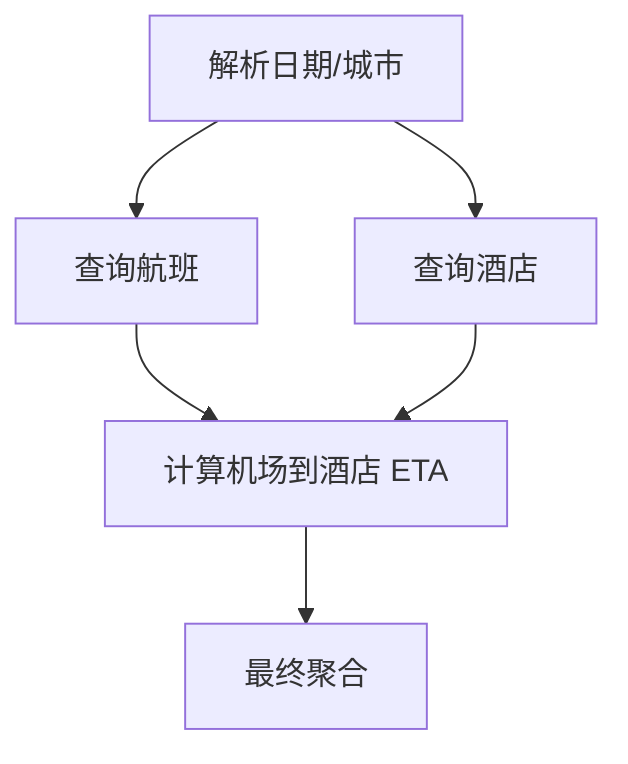

# Parallel Tool Calling：并行工具调用、依赖链与超时调度

## 面试题

> 工具调用中的并行调用（Parallel Tool Calling）与依赖链调用如何设计调度引擎？当其中某个工具超时时，如何保证整体执行流的正确性？

## 面试官真正考什么

这道题不是在问 `asyncio.gather()` 或 `CompletableFuture.allOf()` 怎么用，而是在考你有没有把 Agent 的工具执行看成一个**有依赖、有状态、有副作用、有 deadline 的调度系统**。

真正需要解决的是：

- 哪些 Tool 可以并行，哪些必须串行
- 依赖关系怎么表达
- 某个 Tool 超时时，下游节点是否还能继续
- side-effect Tool 超时后为什么不能直接重试
- partial success 怎么聚合
- 如何避免迟到结果污染已经重规划的新任务

## 核心结论

并行 Tool Calling 的正确抽象不是“同时发几个请求”，而是：

```text
Execution Graph
      ↓
Dependency Resolver
      ↓
Ready Queue
      ↓
Scheduler
  ├─ Tool A
  ├─ Tool B
  └─ Tool C
      ↓
State Store
      ↓
Aggregator / Replan
```

Tool 节点至少要携带：

```text
tool_call_id
step_id
plan_version
depends_on
required / optional
side_effect
idempotent
retry_policy
timeout
deadline
status
```

## 1. 并行和依赖链如何同时存在

比如用户说：

> 查明天上海到北京最早航班，同时找国贸酒店，最后结合落地机场推荐交通方案。

合理的依赖图是：



这里 `B` 和 `C` 可以并行，但 `D` 必须等待两者。

调度器不应该按代码顺序硬编码，而是根据每个 step 的 `depends_on` 判断是否进入 ready queue。

## 2. Tool 状态机不要只有 success / fail

至少建议：

```text
PENDING
  ↓
READY
  ↓
RUNNING
  ├─ SUCCEEDED
  ├─ FAILED
  ├─ TIMEOUT
  ├─ CANCELLED
  └─ UNKNOWN
```

其中 `UNKNOWN` 很重要。

例如 `create_order` 请求已经发到外部系统，外部可能已经成功，但本地在收到响应前超时。此时不能简单标 `FAILED`，更不能自动 replay。

## 3. 超时分三层

### Tool timeout

单个工具自己的最大执行时间，例如：

```text
weather: 3s
hotel_search: 5s
visa_policy: 8s
```

### Step deadline

一个业务 step 允许的总耗时，可能包含 retry。

### Global run deadline

整个 Agent Run 的总预算，例如 30s。

调度时应该使用剩余 deadline：

```text
remaining = run_deadline - now
actual_timeout = min(tool_timeout, remaining)
```

否则单个 Tool 自己重试 3 次就可能把全局 SLA 拖垮。

## 4. 一个 Tool 超时，整体要不要失败

不能一刀切，要根据 `required / optional`。

例如：

```text
Flight Worker  → SUCCESS   required
Hotel Worker   → TIMEOUT   optional
Visa Worker    → SUCCESS   required
```

那么聚合器可以返回：

```text
航班结果：可用
签证结果：可用
酒店结果：暂未获取
```

而不是因为酒店超时把整个任务判失败。

但如果签证政策是能否出行的硬约束，它超时就不能直接给最终肯定方案。

## 5. side-effect Tool 超时为什么不能直接 retry

查询类工具：

```text
query_weather
query_flight
query_device_status
```

通常可以有限重试。

副作用工具：

```text
create_order
refund
send_message
pay
create_work_order
```

超时后可能出现：

```text
Runtime 看起来：TIMEOUT
外部系统实际：SUCCESS
```

所以正确流程是：

```text
TIMEOUT
  ↓
UNKNOWN
  ↓
根据 business_request_id / idempotency_key 查询外部真实状态
  ├─ SUCCESS → 收敛为成功
  ├─ NOT_FOUND → 允许安全重试
  └─ UNKNOWN → 等待 / 人工
```

## 6. late result 怎么处理

用户可能在 Tool 执行中改变目标：

```text
Plan v1：最早航班
      ↓
Worker 正在跑
      ↓
用户改口：最便宜
      ↓
Plan v2
```

旧 Worker 的结果晚到时必须带：

```text
plan_version = 1
```

而当前 state 是：

```text
plan_version = 2
```

则直接丢弃或只作为 reusable artifact，不允许覆盖新计划状态。

## 7. 结合 nanobot 怎么讲

nanobot 当前有并发 Tool Execution 能力，`concurrency_safe` 的工具可以并行执行；但它不是一个通用 DAG Scheduler。

因此可以把 nanobot 理解为：

```text
LLM
 ↓
一次产生多个 Tool Calls
 ↓
Runtime 对并发安全 Tool 并行执行
 ↓
Tool Results 回注
```

如果要实现：

- 显式依赖图
- step status
- required / optional
- global deadline
- plan_version
- cancellation token
- late result discard

这些更适合在上层 Workflow / Planner Runtime 中补。

## 8. Java / Spring 里怎么落

可以定义：

```java
record ToolNode(
    String stepId,
    String toolName,
    Set<String> dependsOn,
    boolean required,
    boolean sideEffect,
    Duration timeout,
    RetryPolicy retryPolicy,
    long planVersion
) {}
```

执行层可以用 `CompletableFuture`、虚拟线程或 Reactor，但**并发原语不是重点，状态机才是重点**。

例如：

```text
Dependency Resolver
    ↓
ready nodes
    ↓
ExecutorService / Virtual Threads
    ↓
Result Event
    ↓
State Store CAS Update
    ↓
unlock dependent nodes
```

## 失败模式与 Trade-off

### 失败 1：所有 Tool 一把 `gather`

问题：忽略依赖和副作用，任一失败后不知道哪些结果还能用。

### 失败 2：所有超时都 retry

问题：副作用操作可能重复执行。

### 失败 3：没有 plan_version

问题：旧异步结果污染新计划。

### 失败 4：没有 global deadline

问题：局部 retry 把整条链路拖到不可控。

## 常见追问

### Q1：并发 Tool 多了如何限流？

用 per-provider bulkhead / semaphore，不只看线程池；还要尊重下游 QPS、DB connection pool 和 provider rate limit。

### Q2：某个 required Tool 一直超时怎么办？

达到 retry/deadline 后进入降级、澄清、人工或失败终止，不允许模型无限循环。

### Q3：并行执行时 Tool Result 顺序乱了怎么办？

按 `tool_call_id / step_id` 关联，不依赖返回顺序。

## 1～2 分钟面试口述版

> 我不会把 Parallel Tool Calling 理解成简单的并发 API，而会把它做成一个带依赖和状态的 execution graph。每个 Tool 节点有 depends_on、required/optional、timeout、retry policy、side-effect 和 plan_version。调度器只把依赖完成的节点放进 ready queue，可并行的并行，有依赖的串行。超时也不能统一处理：read-only Tool 可以有限重试，副作用 Tool 超时后要进入 UNKNOWN，再通过 idempotency key 或 business_request_id 对账，不能直接 replay。全局还要有 run deadline，聚合器支持 partial success，并通过 plan_version 防止旧异步结果污染用户修改后的新计划。nanobot 当前支持并发安全 Tool 的并行执行，但如果要做到显式 DAG、required/optional、late-result 丢弃这些能力，我会在上层 Planner/Workflow Runtime 里补。