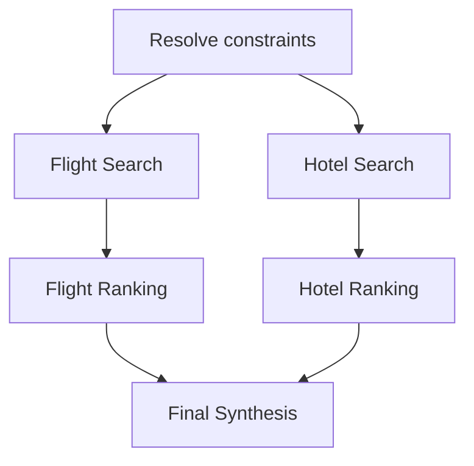

# 02. 规划、路由与 Multi-Agent——全量深度版

> 覆盖 `02-01`～`02-14`。重点不是“多开几个 Agent”，而是任务分解、状态所有权、并发、取消、旧结果、权限和聚合。

---

## 02-01. 意图识别是模型做还是分类器做？为什么

### 核心结论

不要把问题简化成“LLM vs 分类器”。生产系统真正要做的是 **Routing Decision**：决定请求走固定逻辑、轻量模型、强模型、Agent、Workflow 还是拒绝/确认。

### 三层路由

```text
Request
  ↓
Deterministic Rules
  ├─ /help / status / 固定命令 / 高风险入口
  ↓
Light Router / Classifier
  ├─ intent
  ├─ complexity
  ├─ requires_tools
  ├─ multi_step
  └─ risk
  ↓
Policy Table
  ↓
Fast Model / Strong Model / Agent / Workflow
```

分类器适合标签稳定、流量大、样本充足的场景；LLM Router 适合组合意图、长尾语义和上下文依赖。最终模型选择由代码 policy 决定，不让 Router LLM 自己任意指定 provider/model。

### 为什么“意图”不能等于“权限”

即使 Router 判断用户要退款，也不代表用户有退款权限。Routing 只决定后续策略；Tool execute-time policy 仍要再次校验 user/tenant/scope/risk。

### 项目对照

nanobot 的 Tool 选择主要发生在模型+Tool Schema 层，核心 Runtime 当前不是一个通用复杂度 Router；可在 AgentDock/Gateway 的 Driver/Task 层加路由。AgentDock 本身已有多个 driver（Nanobot、Vanilla、API、Codex、OpenCode 等），天然适合成为 model/runtime policy 的上层承载点。

---

## 02-02. 意图歧义或漏识别怎么兜底？举一个旅游组合意图

### 核心结论

用**最小澄清**，不是把 Agent 变成表单。只有某个缺口会改变正确性、风险或不可逆动作时才阻塞。

例如：

> “周六去台北一日游，上午故宫，中午吃牛肉面，下雨下午安排室内，晚上 21 点高铁。”

拆出来是：日期、POI、餐厅、天气条件、路线、离站 deadline。若出发地缺失会显著影响路线，就问；午餐预算没说可以先按中档默认并标注假设。

### 可实现的决策模型

```text
Missing Slot
   ↓
Does wrong guess change safety/result materially?
   ├─ No  → default + explicit assumption
   └─ Yes → clarify
```

可以为 clarification 设置 budget，例如最多 1～2 次，避免用户体验退化。

### 漏识别怎么办

不是只靠 Router 自己复查。可以在 Planner、Tool precondition、Reviewer 三处发现：
- Planner 发现任务依赖缺失；
- Tool 返回 `MISSING_REQUIRED_CONTEXT`；
- Reviewer 检查目标覆盖率。

这叫多层防御，而不是“分类器必须 100% 准”。

---

## 02-03. 场景：查明天上海飞北京最早航班，再推国贸附近酒店，怎么拆任务

### 先解析共享约束

```text
“明天” → absolute date + timezone
上海/北京 → city scope + multi-airport set
“最早” → departure earliest? arrival earliest?
“国贸附近” → geo radius / commute definition
```

### 再构造依赖图

在没有“落地多久到酒店”的约束时，Flight Search 和 Hotel Search 可并行：



如果新增“下飞机 30 分钟能到酒店”，就必须让酒店排序依赖具体到达机场/ETA：

```text
Flight → arrival airport/time
             ↓
          Route ETA
             ↓
        Hotel rerank
```

### 工程字段

`task_id / step_id / depends_on / required / timeout / artifact_id / plan_version`。不要把“航班 JSON”直接复制给所有 Worker，搜索结果存 Artifact，只传引用和摘要。

---

## 02-04. Agent 编排是 ReAct 还是 Plan-and-Execute？长任务为什么选后者或混合

短任务直接 ReAct 的优势是适应环境快；长任务如果完全 ReAct，常见问题是目标漂移、重复 Tool、难恢复、难估成本。

因此常用结构：

```text
Planner（强模型）
   ↓ structured plan
Step 1 → Worker 内局部 ReAct
Step 2 → Worker 内局部 ReAct
Step 3 → deterministic service
   ↓
Reviewer / Finalizer
```

Plan-and-Execute 的计划不能理解成“一次计划永不改变”，应该支持带版本的局部 replan。

### nanobot / Pi 对照

nanobot `AgentRunner` 是典型 tool loop，更像局部 ReAct Runtime；`SubagentManager` 能跑后台/inline subagent，但不是一个通用 durable Planner DAG。Pi Harness 更强调 durable operation/lane，而业务级 Planner Graph 仍需要上层定义。

### 什么时候不需要 Planner

如果一次请求通常 1～2 个 Tool 即完成，引入 Planner 会增加一次模型调用、状态和错误面，收益可能为负。

---

## 02-05. 多 Agent 怎么分工？Router / Planner / Worker / Reviewer 各自边界

### 正确边界

```text
Router   —— 选择处理域/策略，不执行业务
Planner  —— 产出结构化任务图，不直接拥有所有副作用工具
Worker   —— 执行当前 step，只拿最小工具集
Reviewer —— 验证目标/证据/约束，不默认拥有写工具
```

### 最重要的是 Tool Boundary

角色不是 Prompt 里的名字，而是**能力视图**。Reviewer 即使 Prompt 写“只检查”，如果 Registry 仍给它 `refund/delete`，安全性仍然差。

### 状态共享

共同使用：

```json
{
  "plan_id":"p1",
  "plan_version":4,
  "step_id":"s3",
  "status":"RUNNING",
  "artifacts":["a10"],
  "evidence":["tc92"],
  "constraints":{"budget":5000}
}
```

不要共享所有私有思考和全量 transcript。

### nanobot 对照

`SubagentManager` 当前会给 subagent 独立 `ToolRegistry`、状态和并发槽，说明 subagent 本质上是独立执行单元；但 Router/Planner/Reviewer 的完整角色模型和共享 Task State 仍应由平台层补。

---

## 02-06. 三个 Worker 并行查航班、酒店、签证，其中一个超时，最终结果怎么聚合

### 状态不能只有 SUCCESS/FAIL

```text
PENDING → RUNNING
            ├─ SUCCESS
            ├─ FAILED
            ├─ TIMEOUT
            ├─ CANCELLED
            └─ UNKNOWN
```

聚合前还要知道 `required / optional`。

例如：

```text
Flight = SUCCESS  required
Hotel  = TIMEOUT  optional
Visa   = SUCCESS  required
```

可以返回部分成功并标注酒店缺失；如果 Visa 是旅行合法性的硬前提，则 Visa timeout 不允许直接给“可以出行”的最终结论。

### deadline 体系

- per-tool timeout；
- per-step deadline；
- global run deadline。

实际 timeout 应取 `min(tool_timeout, remaining_run_deadline)`。

### late result

Worker 返回必须带 `plan_version`。用户改需求后 v1 Worker 晚到，而 current plan 已 v2，则结果只能进入 stale artifact，不能写 current state。

---

## 02-07. 用户中途改口“不要最早了，要最便宜”，原 Plan 怎么作废重规划

### 不要简单 cancel 全部

先做 plan diff：

```text
Plan v1: earliest flight
User changes objective
Plan v2: cheapest flight
```

可复用的 artifact（日期、机场集合、酒店候选）可以保留；依赖旧目标的 flight ranking 和下游 ETA 需要 invalidate。

### 必备字段

```text
plan_id
plan_version
step_id
artifact_version
cancellation_token
created_by_version
```

### nanobot 能做什么

nanobot 当前有 pending user message / injection callback，可在安全边界把用户的新消息注入正在运行的 Agent Turn，因此能让模型“知道用户改口”；但它不是完整 plan-version state machine。上层 AgentDock/Planner Runtime 需要负责版本、取消和 stale result。

### 状态转换

```text
v1 RUNNING
  ↓ user change
v1 SUPERSEDED
v2 ACTIVE
  ↓
v1 late result → STALE
v2 result      → ACCEPT
```

---

## 02-08. 简单问题和复杂问题怎么路由到不同模型？

### 三层 Model Routing

1. **Rules**：固定 FAQ、系统命令、纯结构化抽取走 fast/direct。
2. **Light Router**：输出 complexity/tool/multi-step/reasoning/risk 特征。
3. **Runtime Escalation**：实际运行中发现 repeated repair、tool loop 加深、grader fail、context 变大，再升级模型。

### 复杂度 ≠ 风险

“退款 10 元”推理复杂度低，但风险高。风险高意味着 Tool Policy/HITL/状态机更严格，不一定意味着必须使用最强模型。

### Step 级路由更优

```text
Planner            → strong model
query DB           → Tool, no LLM
extract fields     → small model
constraint tradeoff→ strong model
format final JSON  → small model
```

### nanobot 边界

当前核心 Runner 使用运行时指定 model/provider；可支持 model/model_preset 切换，但并没有一个通用的按复杂度自动路由器。AgentDock 更适合作为统一 Driver/Model Policy 层。

---

## 02-09. 什么时候应该拆 Subagent？拆得越多越好吗？

### 拆分条件

至少满足其中之一：
- 可真正并行，明显缩短 wall time；
- Tool 权限域不同；
- Context 隔离能显著降低噪声；
- 专业角色需要不同模型/Prompt；
- 任务可形成独立 artifact，可失败/重试。

不要因为“看起来复杂”就拆。

### 拆太多的成本

```text
更多 LLM calls
更多 handoff
更多 state sync
更多 token duplication
更多 failure surface
更难 trace
```

### 一个经验判断

如果子任务没有独立输入/输出契约、不能独立验证、也不能独立重试，它可能不该成为 Subagent，只是一个普通 Step。

### nanobot

`SubagentManager` 用 semaphore 控制最大并发，维护 `_running_tasks`、`SubagentStatus` 和 session→task 映射。这也说明并发 Subagent 是受资源治理的，不应无限 spawn。

---

## 02-10. Handoff 最难的是什么？Agent 之间应该传什么？

最难的不是“把一段 prompt 发给另一个 Agent”，而是**语义、证据、状态和权限的连续性**。

### Handoff contract

```json
{
  "task_id":"t1",
  "plan_version":7,
  "goal":"verify hotel availability",
  "constraints":{"area":"Guomao","budget":1200},
  "artifacts":[{"id":"a9","type":"hotel_candidates"}],
  "evidence_refs":["tool:tc81"],
  "allowed_tools":["hotel_lookup"],
  "deadline":"..."
}
```

### 不应该传什么

- 整个会话历史；
- 上游模型完整私有 reasoning；
- 与当前 step 无关的敏感信息；
- 无 provenance 的一句“总结说没问题”。

### Artifact Store

大结果放外部 store，只传 `artifact_id + schema + summary + provenance`，这样可以做权限和版本控制。

---

## 02-11. Multi-Agent 怎么避免“互相甩锅”、来回转接和死循环？

### 根因

如果每个 Agent 都能自由把任务 handoff 给任何 Agent，而且没有 owner/terminal condition，就会出现 A→B→C→A。

### 解决机制

- `task_owner` 唯一；
- handoff graph allowlist；
- `handoff_count` / `max_depth`；
- 目标和 success criteria 固定；
- Reviewer 只能返回 ACCEPT / REVISE / ESCALATE，不无限重新委派；
- identical state fingerprint 重复出现触发 no-progress stop。

```text
Router → Planner → Worker → Reviewer
            ↑         │
            └─ REVISE ┘   (最多 N 次)
```

### 失败收敛

超过预算后必须进入明确状态：`NEEDS_USER / NEEDS_HUMAN / FAILED`，而不是继续聊天式转接。

---

## 02-12. Multi-Agent 常见编排模式有哪些？代码编排还是模型编排？

常见模式：

1. **Router → Specialist**：域分流。
2. **Planner → Workers → Aggregator**：任务分解与并行。
3. **Generator → Reviewer / Critic**：生成+校验。
4. **Hierarchical Supervisor**：多层 supervisor。
5. **Blackboard / Shared State**：多个角色围绕共享 artifact/state 工作。

### 代码 vs 模型

稳定拓扑、高风险流程由代码编排；开放任务的 step/worker 选择可由模型提议。

```text
Code owns graph constraints
Model proposes path within graph
```

如果所有节点、所有边都让模型临时发明，恢复、成本预测和权限治理会非常困难。

---

## 02-13. MCP 和 A2A 分别解决什么？为什么不能用一个协议全包？

### MCP

核心是 Agent/Host 与外部工具、资源、服务之间的能力互操作。重点对象是 Tool/Resource/Prompt 等能力暴露。

### A2A 类协议

重点是 Agent 与 Agent/远端任务执行体之间的任务委托、状态和结果协作。

### 为什么分开

```text
Agent → Tool
需要：schema、arguments、tool result、resource

Agent → Agent
需要：task、capability、progress、handoff、artifact、status
```

语义不同。强行一个协议全包，会导致 Tool 调用背上不必要的 Agent 生命周期语义，或者 Agent 协作只剩一个粗糙 function call。

### 业务边界

无论 MCP/A2A 都不能自动解决 tenant auth、domain transaction、idempotency、billing，这些是协议外的系统责任。

---

## 02-14. Multi-Agent 除了 Handoff，还有哪些通信方式？怎么选？

### 四类方式

**直接消息**：低延迟、小上下文，但耦合高。

**Shared Task State / Blackboard**：多个 Agent 读写结构化状态，适合 Planner/Worker/Reviewer；要求 single-writer/CAS 规则。

**Artifact/Event**：通过 artifact store + event bus 传递大结果，适合异步长任务。

**RPC/A2A Task Delegation**：跨进程/跨团队 Agent，适合远端 capability。

### 怎么选

看四个维度：同步还是异步、payload 大小、是否需要持久化、是否多写者。

### 推荐企业形态

```text
Control Plane (AgentDock)
       ↓ task/event
Shared Task Store / Artifact Store
       ↓
Agent A / Agent B / Agent C
       ↓
MCP/Tool/Business Service
```

Agent 之间尽量不要把“聊天消息”当唯一协议；真正协作要有 task_id、step_id、version、artifact、evidence 和 status。

---

# 本章统一掌握的状态模型

```text
Task
 ├─ task_id
 ├─ owner
 ├─ plan_id / plan_version
 ├─ status
 ├─ constraints
 ├─ budget/deadline
 └─ artifacts

Step
 ├─ step_id
 ├─ depends_on
 ├─ assigned_agent
 ├─ allowed_tools
 ├─ required/optional
 ├─ attempt
 └─ status
```

真正的 Multi-Agent 工程能力，不是角色 Prompt 写得多漂亮，而是：**状态可持久化、权限可隔离、并发可控、旧结果可拒绝、失败可收敛、轨迹可回放。**
