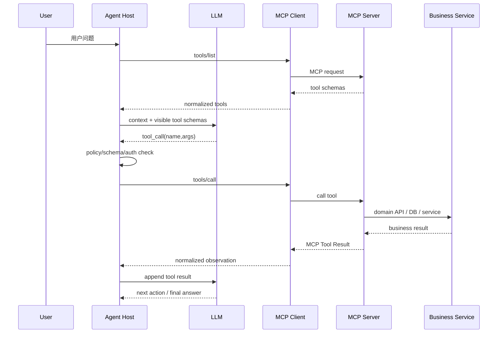

# MCP 深挖：它不是“把 REST 包一层”，而是把 Tool 能力变成可发现、可调用、可治理的协议边界

## 面试题

> MCP 到底解决什么？Host、Client、Server 各自做什么？和原来的 Tool Callback / REST API 是什么关系？为什么接了 MCP 以后仍然需要 Tool Runtime 和权限层？

---

## 1. 面试官真正考什么

很多回答停在：

> MCP 是 Model Context Protocol，可以让模型调用外部工具。

这远远不够。

真正要讲清楚的是：

1. **谁发现工具**
2. **谁持有连接和会话**
3. **谁把 Server 能力转换成模型可见 Schema**
4. **谁执行权限和安全校验**
5. **Tool Result 怎么变成模型 observation**
6. **为什么 MCP Server 不能替代业务权限和 Agent Runtime**

---

## 2. 三个角色必须分清

### Host

Host 是最终承载 Agent/LLM 运行环境的应用，比如：

```text
ChatGPT / Claude Desktop / IDE / Agent Runtime / 你的 Web Agent
```

Host 决定：

- 当前用户是谁
- 当前 Session 是什么
- 哪些 MCP Server 可以连接
- 哪些工具要暴露给模型
- 调用结果如何进入上下文

### MCP Client

Client 是 Host 内部连接某个 MCP Server 的协议实现。

```text
Host
 ├─ MCP Client A → Filesystem Server
 ├─ MCP Client B → Postgres Server
 └─ MCP Client C → Business Server
```

它负责：

- 建立 transport
- initialize / capability negotiation
- tools/list
- tools/call
- resources/prompts（如果支持）
- 处理协议消息和错误

### MCP Server

Server 对外声明自己能提供的能力：

```text
tools
resources
prompts
```

一个业务 MCP Server 可以暴露：

```text
query_device_status
list_alarms
create_work_order
```

但 Server 本身并不自动知道“当前用户是否有资格调用 create_work_order”。这仍然需要身份上下文和业务授权。

---

## 3. 完整调用链



最重要的一点：

> **LLM 不直接调用 MCP Server。真正调用 MCP Server 的是 Host/Runtime。**

模型只是输出一个 Tool Call Proposal。

---

## 4. MCP 和原来 Tool Callback 是什么关系

如果你原来已经有：

```python
def query_device_status(device_id): ...
```

或者 Java：

```java
DeviceStatus queryStatus(String deviceId)
```

接 MCP 时不应该把业务逻辑重写一遍，而应该增加 Adapter：

```text
Existing Domain Service
        ↑
Tool Adapter
        ↑
MCP Server Endpoint
```

也就是说：

```text
业务能力不变
调用契约标准化
```

### 迁移方式

```text
Phase 1
现有 Tool Callback 保持
MCP 只新增一种 transport/provider

Phase 2
统一内部 ToolDescriptor
name/schema/risk/auth/retry

Phase 3
本地 Tool 和 MCP Tool 都注册进同一个 Registry
```

最终 Runtime 不关心 Tool 是：

```text
Local Python
Java HTTP
MCP Server
CLI
Remote Function
```

Runtime 只看到统一 Tool Contract。

---

## 5. 为什么不能把 MCP Tool Schema 原样全部塞给模型

当有多个 Server、上百个 Tool 时：

```text
Server A 30 tools
Server B 50 tools
Server C 40 tools
```

如果每轮把 120 个 JSON Schema 全塞 Prompt：

- Token 浪费
- Tool selection accuracy 下降
- 相似 Tool 容易混淆
- 上下文压缩更频繁

因此 Host 需要 Progressive Disclosure：

```text
用户请求
  ↓
Domain Router
  ↓
候选 Server / Tool Set
  ↓
只暴露 Top-K Tool Schemas
  ↓
LLM
```

甚至可以两级：

```text
Tool Catalog Retrieval
      ↓
select relevant tools
      ↓
fetch full schema
```

这属于 Host/Harness 能力，不是 MCP 协议自己替你完成。

---

## 6. 不同 Server 返回格式不一致怎么办

错误做法：让模型自己适配所有 Server 原始结果。

例如：

```json
Server A: {"items": [...]}
Server B: {"data": {"rows": [...]}}
Server C: "plain text"
```

全部原样扔给模型，会造成：

- Context 噪音
- Prompt 里充满“如何解析结果”的规则
- Tool 切换时模型不稳定

更合理的是 Host/Adapter 层标准化：

```json
{
  "status": "SUCCESS",
  "data": {...},
  "source": "device-mcp",
  "meta": {
    "latency_ms": 83,
    "cache": false
  }
}
```

错误也统一：

```text
INVALID_ARGUMENT
PERMISSION_DENIED
NOT_FOUND
RETRYABLE_ERROR
UNKNOWN
HARD_ERROR
```

模型应该看到“业务语义”，而不是每个 Server 的 transport 差异。

---

## 7. Tool Schema 正确为什么仍然不代表可以执行

MCP Schema 只能说明：

```text
参数长什么样
```

不能说明：

```text
当前用户是否允许
当前状态是否允许
这个金额是否合理
这个动作是否需要确认
```

例如：

```json
{
  "refund_order": {
    "order_id": "O1",
    "amount": 100000
  }
}
```

完全符合 JSON Schema，也可能业务非法。

所以执行前要过多层：

```text
Tool exists
   ↓
JSON Schema validation
   ↓
Agent role policy
   ↓
User/Tenant authorization
   ↓
Business semantic validation
   ↓
Risk/HITL
   ↓
Idempotency
   ↓
Execute
```

MCP 不是安全框架。

---

## 8. Server 端应该负责什么安全

Host 做一次校验还不够，Server 也不能完全信任 Host。

Server 端至少仍要：

- 参数校验
- 身份/租户验证（如果传入）
- 数据范围过滤
- 业务状态机
- 只读/写权限
- Rate Limit
- 审计

这叫 Defense in Depth。

假如 Host 有 Bug 或某个 Client 被绕过，业务 Server 仍不能让请求直接越权。

---

## 9. Tool Result 为什么不能直接返回用户

MCP Tool Result 是 Observation，不一定是用户最终答案。

例如：

```json
{
  "device_id": "L1001",
  "voltage": 218.3,
  "current": 0,
  "alarm_codes": ["SOURCE_FAULT"]
}
```

用户问的是：

> 这盏灯为什么不亮？

Tool Result 只是证据，Agent 还要把：

```text
电流为 0
+ 灯源故障报警
+ 昨晚曾正常
```

综合成诊断解释。

但对于确定性 UI 操作，也可以绕过 LLM 直接渲染结构化结果。因此要区分：

```text
Tool Observation for Model
vs
Structured Result for UI
```

企业 Agent 常常需要两条输出通道。

---

## 10. MCP Tool 超时怎么处理

Transport timeout 不等于业务失败。

### 查询类 Tool

```text
TIMEOUT
 → limited retry
 → fallback / partial result
```

### 副作用 Tool

```text
create_work_order
refund
send_message
```

如果 Server 已经执行成功，但网络响应丢了：

```text
Host 看：TIMEOUT
Server/业务看：SUCCESS
```

所以进入：

```text
UNKNOWN
  ↓
用 business_request_id 对账
```

MCP 只是调用协议，Exactly-once 仍然需要业务幂等。

---

## 11. MCP 与 A2A 为什么不是一回事

MCP 更关注：

```text
Agent/Host 如何访问 Tool/Resource/Prompt
```

A2A 更关注：

```text
Agent 与 Agent 之间如何发现能力、委托任务、交换状态/结果
```

如果把一个独立 Agent 当成 MCP Tool 也不是不能做，但会丢掉很多 Agent-level 语义，例如：

- 长任务状态
- Task lifecycle
- 中间进度
- Handoff ownership
- Capability negotiation

所以两者层次不同。

---

## 12. 结合 nanobot 怎么讲

nanobot 的核心仍然是：

```text
AgentRunner
 ↓
ToolRegistry
 ↓
Tool Execution
 ↓
Observation 回注
```

MCP 最适合作为 Tool Provider 的一种来源，而不是替代 `ToolRegistry`、权限、Context、Checkpoint。

企业扩展可以做：

```text
              Unified Tool Registry
              /       |        \
          Local    MCP Tool    HTTP Tool
            |         |           |
       metadata: risk/auth/retry/concurrency
```

这样模型与 Runtime 不需要知道底层 transport。

---

## 13. Java/Spring MCP Server 怎么落

业务 Service 不改：

```java
@Service
class DeviceService {
    DeviceStatus queryStatus(String tenantId, String deviceId) { ... }
}
```

MCP Adapter：

```text
MCP Request
  ↓
Principal/Tenant Resolver
  ↓
Schema Validation
  ↓
Authorization
  ↓
DeviceService
  ↓
Result Normalizer
  ↓
MCP Response
```

并把：

```text
trace_id
run_id
tool_call_id
business_request_id
```

透传进业务链路，方便端到端 Trace。

---

## 14. 面试常见追问

### “接 MCP 后为什么还要自己的 Tool Registry？”

因为 Registry 不只是保存 Schema，还管理：权限、风险、并发安全、retry、timeout、版本和业务 metadata。

### “MCP Server 能不能直接连数据库？”

技术上可以；企业核心业务更推荐复用 Domain Service，让权限、事务和审计不被绕过。

### “Tool 很多怎么选？”

Catalog Retrieval + Domain Routing + Progressive Disclosure，不是一次暴露全部 Schema。

---

## 15. 1～2 分钟口述版

> 我把 MCP 理解成 Tool/Resource 能力的标准协议边界，而不是一个 Agent Runtime。Host 承载用户、Session、LLM 和权限上下文；Host 内部的 MCP Client 连接 Server，通过 tools/list 获取能力，再把经过筛选的 Tool Schema 暴露给模型。模型只提出 Tool Call，真正执行前还要经过 Runtime 的 Schema、角色权限、用户租户权限、业务校验和高风险确认。MCP Server 负责把能力标准化提供出来，但也仍然要做服务端权限、事务和审计。我们原来的本地 Tool/HTTP Tool 不需要重写业务逻辑，只要通过 Adapter 统一注册到 Tool Registry。这样 MCP 解决的是互操作，Runtime 解决的是执行治理，两层不能混为一谈。
