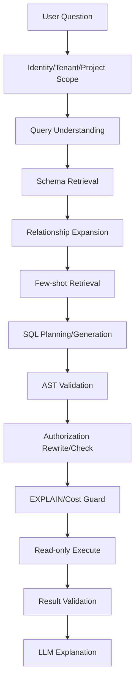

# Text-to-SQL 深挖：300+ 表、权限、复杂 JOIN 场景到底怎么做

## 面试题

> 企业库有 300+ 张表，用户问自然语言问题，Agent 怎么找到相关表、生成 SQL、保证权限和性能？如果某些权限条件必须关联业务表才能过滤，又该怎么处理？

---

## 1. 面试官真正考什么

这道题不是在问“把数据库 Schema 给 LLM，让它生成 SQL”。真正考的是你有没有把 NL2SQL 看成一条**检索 + 规划 + 生成 + 校验 + 权限 + 执行 + 反馈**的完整链路。

一个能上线的 Text-to-SQL 系统至少要解决：

```text
Schema 太大
表名/字段名不直观
业务关系隐含
用户权限复杂
SQL 可能越权
SQL 可能很慢
模型可能生成不存在字段
同一问题可能有多种合法 SQL
```

如果回答只有“Embedding 找相关表 → LLM 生成 SQL”，通常只能做 Demo。

---

## 2. 完整链路



这条链里，LLM 只负责一部分。

---

## 3. 为什么不能把 300 张表 Schema 全塞给模型

假设每张表 30 个字段，300 张就是 9000 个字段，再加注释、主外键、样例值，Prompt 很快变成几万甚至十几万 Token。

问题不仅是贵，还会导致：

- 相关表被无关 Schema 淹没
- 相似字段名混淆
- 模型跨错表 JOIN
- 生成速度变慢
- Context 压缩频繁

所以第一步是 **Schema Retrieval**。

---

## 4. Schema Retrieval 应该检索什么

不要只对 DDL 做 Embedding。

建议为每张表建立可检索文档：

```text
表名
中文业务名
业务描述
字段名 + 字段语义
主键/外键
典型过滤条件
所属业务域
数据粒度
时间字段
常见 JOIN
样例值/枚举
权限相关字段
```

例如：

```text
lamp_device
业务：单灯设备主表
粒度：一行一盏灯
关键字段：device_id、pole_id、project_id、road_id
常见 JOIN：lamp_device.pole_id → pole.id
权限：通常通过 project_id；历史表需要经 device → project 关联
```

比裸 DDL 更容易检索。

---

## 5. 混合检索比纯向量更适合 Schema

用户可能问：

> 查一下 PD129 设备昨晚电流异常情况。

`PD129`、字段名、表名、设备编码这种精确 Token，BM25/关键词非常强。

而用户问：

> 哪些灯昨天耗电突然变高？

“耗电突然变高”可能对应 `energy_delta`、`power_consumption`、`abnormal_type`，向量语义更有效。

所以：

```text
BM25 TopK
   +
Vector TopK
   ↓
RRF Merge
   ↓
Schema ReRank
```

通常比单一向量检索稳。

---

## 6. 为什么还需要 Relationship Expansion

假设用户问：

> 查某项目下未处理的漏电报警。

Schema Retrieval 可能召回：

```text
alarm_event
project
```

但实际关系是：

```text
alarm_event.device_id
   ↓
device.pole_id
   ↓
pole.project_id
   ↓
project.id
```

如果只拿 Top-K 表，不做关系扩展，模型根本看不到中间桥表。

所以需要维护一个 Schema Graph：

```text
Table Node
Column Node
FK Edge
Business Join Edge
Permission Edge
```

检索到核心表后，按 1~2 hop 扩展必要邻居，而不是全库展开。

---

## 7. 业务关系不能只靠数据库 FK

企业库常见问题：

- 历史原因没有外键
- 字段同名但语义不同
- 逻辑关联写在代码里
- 多租户权限通过业务链路间接关联

所以除了数据库元数据，还要有 Business Join Catalog：

```json
{
  "left": "alarm_event.device_id",
  "right": "device.device_id",
  "join_type": "INNER",
  "semantic": "报警归属设备",
  "confidence": 1.0
}
```

来源可以是：

- SQL 日志挖掘
- ORM Mapping
- 人工标注
- BI 查询
- 存量代码分析

---

## 8. 权限绝对不能靠 Prompt

这是 Text-to-SQL 最关键的安全边界。

错误方案：

```text
System Prompt:
“请只查询当前用户有权限的数据。”
```

模型完全可能漏掉过滤条件。

权限必须由代码/数据库保证。

---

## 9. 简单权限：直接 Predicate Injection

如果所有表都有 `tenant_id/project_id`：

模型生成：

```sql
SELECT * FROM lamp_device WHERE status='offline';
```

系统 AST Rewrite：

```sql
SELECT * FROM lamp_device
WHERE status='offline'
  AND project_id IN (...authorized projects...);
```

关键点是 AST 级改写，不要字符串拼接。

---

## 10. 复杂权限：权限需要跨表 JOIN 怎么办

这正是企业库最常见的情况。

例如 `energy_history` 没有 `project_id`：

```text
energy_history.device_id
      ↓
device.device_id
      ↓
device.project_id
```

用户只允许项目 P1/P2。

不能要求模型“记得自己 JOIN device 再过滤”。

更可靠的是把权限定义成 Policy Template：

```text
Resource: energy_history
Authorization Path:
energy_history.device_id
  -> device.device_id
  -> device.project_id
Filter:
device.project_id IN :allowed_projects
```

Runtime 在 AST 层注入必要 JOIN + Predicate。

---

## 11. PostgreSQL RLS 能不能解决

RLS 很适合当最后一道 DB 边界，但不是所有复杂权限都能简单表达。

### 基础方式

应用建立 DB Session 后设置：

```sql
SET app.current_user_id = 'u1';
SET app.tenant_id = 't1';
```

RLS Policy：

```sql
USING (tenant_id = current_setting('app.tenant_id'))
```

### 跨表权限

Policy 也可以通过 `EXISTS` 关联权限表：

```sql
USING (
  EXISTS (
    SELECT 1
    FROM device d
    JOIN user_project up ON up.project_id = d.project_id
    WHERE d.device_id = energy_history.device_id
      AND up.user_id = current_setting('app.current_user_id')
  )
)
```

优点：就算 LLM SQL 漏了权限，数据库仍拒绝越界结果。

缺点：复杂 RLS 可能影响查询计划、调试难、跨库/外部数据源不适用。

### 推荐

```text
应用层 Policy/AST Guard
+
数据库 RLS（可行时）
```

双层防御。

---

## 12. SQL 生成前最好先生成 Logical Plan

不要让模型直接从自然语言跳到长 SQL。

可以先输出：

```json
{
  "metrics": ["energy_kwh"],
  "dimensions": ["road_name"],
  "filters": [
    {"field":"event_time","op":"between","value":"last_night"}
  ],
  "tables": ["energy_history","device","road"],
  "joins": [
    "energy_history.device_id=device.device_id",
    "device.road_id=road.id"
  ],
  "aggregation":"sum"
}
```

Runtime 校验 Plan 后，再让模型或模板生成 SQL。

这样更容易定位问题：是语义理解错，还是 SQL syntax 错。

---

## 13. Few-shot 不应该固定写在 Prompt 里

300+ 表场景不可能固定塞几十个 SQL 示例。

应做 Dynamic Few-shot Retrieval：

```text
User Query
 ↓
检索相似历史问题
 ↓
过滤已验证成功 SQL
 ↓
Top 2~5 examples
 ↓
Prompt
```

Example metadata：

```text
business_domain
tables_used
query_pattern
aggregation_type
permission_pattern
verified=true
```

尤其对复杂 JOIN 和时间语义很有效。

---

## 14. SQL AST Validation 要检查什么

至少：

```text
只允许 SELECT
禁止 DDL/DML
禁止多语句
表/列必须存在
函数白名单
JOIN 数量上限
Subquery depth
禁止 pg_sleep / file / network extension
强制 LIMIT
```

还要做 semantic validation：

- 聚合列与 group by 是否一致
- 时间字段是否选对
- 单位是否匹配
- 禁止跨 tenant 数据源

---

## 15. 为什么还要 EXPLAIN / Cost Guard

SQL 语法完全正确，也可能把数据库打挂。

执行前：

```sql
EXPLAIN (FORMAT JSON) ...
```

检查：

```text
estimated total cost
estimated rows
seq scan on huge table
join cardinality
```

超过阈值：

```text
拒绝
重写
要求缩小时间范围
或走异步任务
```

数据库账户还应该：

```text
read-only
statement_timeout
resource group
connection limit
```

---

## 16. SQL 执行结果也要验证

执行成功不代表回答可信。

例如用户问“昨晚”，结果返回 0 行：

可能是：

- 真没数据
- 时区错
- 时间字段选错
- 权限过滤后为空
- JOIN 把数据过滤掉了

所以 Result Validator 可以检查：

```text
row_count
null ratio
expected columns
unit/range
permission scope
```

如果异常，可以让 Agent 做受控修正，而不是直接回答“没有数据”。

---

## 17. 一个实际城市照明例子

用户：

> 昨晚哪个项目的单灯能耗异常最多？

系统：

```text
1. Resolve user → allowed projects P1/P2/P5
2. Query understanding:
   metric = abnormal lamp count
   time = yesterday 18:00~today 07:00
   group by project
3. Retrieve schema:
   energy_alarm / device / project
4. Relationship expansion
5. Generate logical plan
6. SQL generation
7. Inject permission path
8. AST validation
9. EXPLAIN
10. Execute read-only
11. Result validation
12. LLM explanation
```

最终 SQL 只是第 6~10 步的一部分。

---

## 18. 怎么做 Eval

不能只看 SQL Exact Match，因为同一问题可能有多个等价 SQL。

更重要的是：

```text
Execution Accuracy
Result Set Equivalence
Permission Safety
Table Selection Accuracy
Column Selection Accuracy
Join Path Accuracy
Latency
DB Cost
Clarification Rate
```

再把失败分类：

```text
schema retrieval error
join error
semantic parse error
permission error
SQL syntax error
performance guard reject
```

这样才知道优化哪层。

---

## 19. 1～2 分钟面试口述版

> 对 300 多张表的 Text-to-SQL，我不会把全量 Schema 直接塞给模型。先做身份和权限范围解析，再对带业务语义的 Schema 文档做 BM25+向量混合检索，命中核心表后基于 FK 和人工维护的 Business Join Graph 扩展必要桥表。生成 SQL 前可以先生成 Logical Plan，再配动态 Few-shot。模型生成 SQL 后必须经过 AST 校验、权限注入和 EXPLAIN Cost Guard，最后用只读账号、statement timeout 执行。权限绝不能靠 Prompt，如果目标表没有 project_id，我会用 Policy Catalog 描述跨表授权路径，在 AST 层自动补 JOIN/EXISTS；PostgreSQL 条件允许时再叠加 RLS 作为最后一道边界。评估也不只看 SQL 字符串，而看执行结果等价、权限安全、表/字段/Join 选择和数据库成本。
