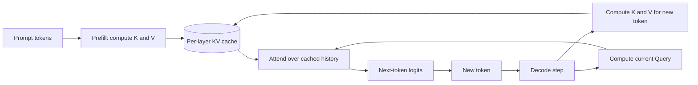
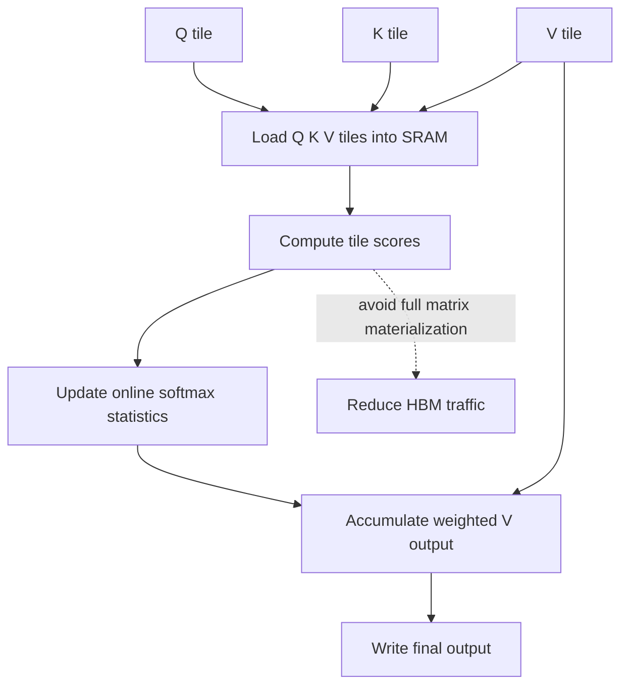
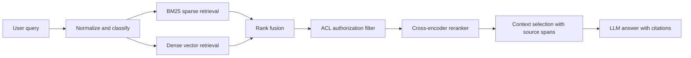
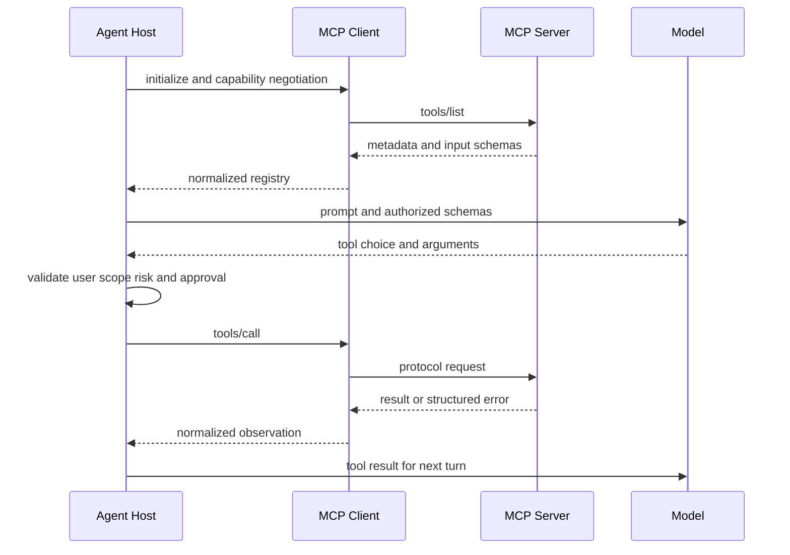
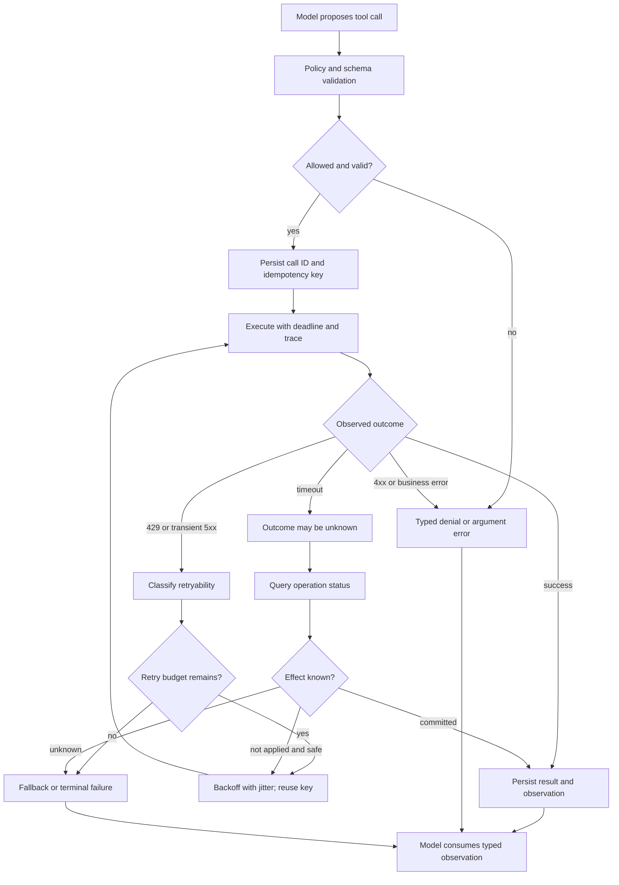
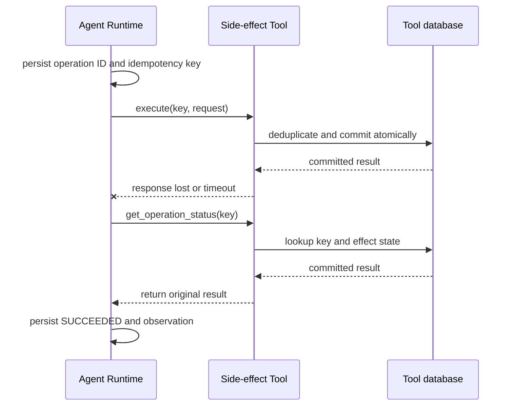

# 深度答案样板

> 本文件给出 5 道代表题的中文深度答案。流程图用于展示数据流、调用边界和失败处理；所有估算都写明前提。

## LLM-002：KV Cache 是什么？显存如何估算？

### 面试官考察点与 30 秒回答

KV Cache 保存 Transformer 每层历史 token 的 Key 和 Value。自回归生成时，历史 token 的 K/V 已经算过；每一步只需计算新 token 的 K/V，再由当前 Query 读取历史缓存。这样避免重复计算，但显存会随层数、并发序列、上下文长度、KV 头数、头维度和 dtype 大小增长。GQA/MQA 减少 KV 头；PagedAttention 主要改善动态分配和碎片；量化、滑动窗口、前缀缓存各自解决不同问题。

### 数据流



设层数 L、活动序列数 B、每条序列缓存长度 S、KV 头数 H_kv、每头维度 D_h、每元素 b 字节。每层每 token 同时缓存 K 与 V，因此：

```text
M_KV = 2 × L × B × S × H_kv × D_h × b bytes
```

假设 80 层、8 个 KV heads、每头 128 维、BF16（2 bytes）、单序列 128,000 token：

```text
2 × 80 × 1 × 128,000 × 8 × 128 × 2
= 41,943,040,000 bytes ≈ 39.1 GiB
```

该结果只包括 KV 张量，实际还要留模型权重、工作区、通信缓冲区、激活、元数据和碎片余量。批处理中要看并发 token 总量及上下文长尾，不能只按平均长度规划。

### 工程取舍

- GQA/MQA 减少 KV 头数，直接降低缓存字节数，但模型结构变化可能影响质量，不能对任意既有模型无损替换。
- Paged KV 按块按需分配，可减少预留浪费、支持共享前缀；它不改变单 token 的理论 K/V 元素数。
- KV 量化降低每元素字节数，但引入量化误差和反量化成本，必须实测质量与吞吐。
- 滑动窗口限制可见历史，减少缓存同时也改变可访问信息。
- Prefix Cache 只复用严格相同的前缀；缓存键应包含模型版本、适配器、位置编码和租户边界。

## INF-005：FlashAttention FLOPs 没明显减少，为什么更快？

传统精确 Attention 的一个瓶颈是把 N×N 的注意力分数/概率矩阵在 HBM 与片上存储之间反复读写。FlashAttention 以 IO-aware 分块方式加载 Q/K/V，在 SRAM/shared memory 中完成小块矩阵运算，并使用在线 softmax 累计结果，避免物化整张注意力矩阵。主导 FLOPs 仍近似 O(N²D)，但 HBM 流量和中间张量峰值会明显下降。



对每个 Query 行维护当前最大值 m、归一化和 l、加权输出 o。读入新的分数块 s 后，更新 m' = max(m, max(s))，按指数因子缩放已有累积并加入新块贡献，最终输出 o/l。这与整体 softmax 数学等价，存在浮点舍入差异。

运行时间不仅由 FLOPs 决定，也受 HBM 带宽、同步、kernel launch、占用率影响。受数据搬运限制时收益大；短序列或其他开销占主导时收益可能有限。FlashAttention 不等同于稀疏注意力，也不自动降低 O(N²D) 的算术复杂度；它不能替代 KV Cache，后者用于复用自回归生成的历史 K/V。

## RAG-002：BM25 与 Dense Retrieval 如何选择？何时组合？



BM25 依赖词项匹配、词频与逆文档频率，擅长设备号、错误码、型号、代码符号和罕见专名。Dense Retrieval 通过 embedding 找语义近邻，适合查询和文档措辞不同但意图相近的场景。两者错误模式互补，生产 RAG 常采用 Hybrid Search。

BM25 原始分数与向量相似度的量纲不同，不能默认直接相加。一个稳健起点是 RRF：

```text
RRF(d) = Σ_r 1 / (k + rank_r(d))
```

其中 rank_r(d) 是文档在检索器 r 中的名次，k 是平滑常数，需在验证集调优。RRF 只使用名次，会丢失分数置信度；也可以校准分数或学习权重。融合后再由 cross-encoder 对少量候选做联合打分，精度更高但计算昂贵，因此放在高召回之后。

ACL 是硬性安全约束。优先让租户/ACL 过滤参与检索，或在可信边界内、候选进入 reranker/LLM 前校验。未授权文本不能进入模型或日志。纯 post-filter 会令候选不足并降低召回；权限更新要及时传播，缓存按权限版本隔离。评估应按权限、语言、查询类型切片，同时测 Recall@k、MRR、nDCG、引用支持率、ACL 传播时延和 p95/p99。

## AGENT-004：MCP 与 Function Calling 有什么区别？

Function Calling 是模型 API 的交互形式：应用把工具 schema 给模型，模型返回结构化调用意图，宿主决定鉴权、执行和回填结果。MCP 是 AI 应用的客户端—服务端协议，标准化能力发现和调用，并定义 Tools、Resources、Prompts 等能力类型及传输/会话约定。它们处于不同抽象层：MCP tool schema 通常由 host 转换成模型可消费的函数 schema；模型发出调用后，host 再将其路由为 MCP 请求。



协议本身不等于授权。Host 仍需校验租户范围、身份、参数、超时、审计、结果大小和副作用审批。Schema 是能力描述，不是授权凭证；工具结果是不可信输入，要防间接 Prompt Injection。远程凭据和工具可见性需按用户/租户隔离。

## AGENT-002：Tool Timeout、错误和 Retry 如何设计？



429 通常遵循 Retry-After；暂时性 5xx、连接重置可有限指数退避；参数错误应修正调用而非原样重试；401/403 返回权限问题；业务拒绝不应盲目重试。409 要区分幂等冲突、乐观锁冲突和可恢复状态。重试受调用 deadline、Agent 总时限、最大尝试数和租户预算约束。退避可采用 min(cap, base × 2^n) + jitter，抖动用于避免 thundering herd。

超时不代表副作用没发生。创建订单、付款、控制设备等操作可能已经提交，只是响应丢失。Runtime 应区分 FAILED、SUCCEEDED、UNKNOWN；UNKNOWN 时优先按 operation ID/幂等键查询。相同逻辑操作重试沿用同一个键，业务端还必须原子记录该键与副作用结果。只发幂等键但服务端不去重，并不构成幂等。若下游不支持幂等和状态查询，应停止自动重试并转待核对/人工处理。



生产方案应包含有限 deadline/retry budget、错误分类、退避抖动、权限与参数校验、幂等及状态核对、结构化 observation、fallback 和人工接管。Runtime 无法仅凭提示词保证任意工具 exactly-once。
