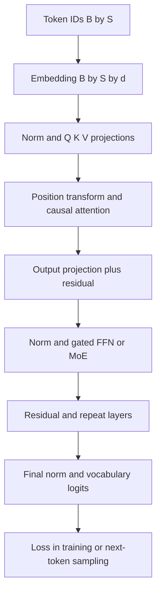

# 跨公司高频题深度答案：LLM 内部原理与架构

> 对应全量题目索引第一部分的 16 道题。原题顺序与题号保持一致；图用于解释关键数据流，答案包含适用边界和工程追问。

## LLM-01｜Explain scaled dot-product attention and why the 1/sqrt(d_k) scaling factor matters.

**原题来源分组**：跨公司高频题 / LLM 内部原理与架构 / 第 1 题。

### 中文题：缩放点积注意力为什么除以根号 d_k？

先写出单头注意力：Q=XW_Q、K=XW_K、V=XW_V，输出为 softmax(QKᵀ/√d_k + M)V，其中 M 是因果或 padding mask。若 Q、K 各维近似独立、均值零、方差一，点积的方差约为 d_k；不缩放时 d_k 增大使 logits 绝对值变大，softmax 容易饱和，梯度集中在少数位置。除以 √d_k 后让 logit 方差保持在近似常数级。这个推导是初始化附近的统计直觉，训练后各维不必独立同分布。

工程上要分清 mask 的语义：因果 mask 在 softmax 前将未来位置置为负无穷；padding mask 避免无效 token 被归一化。数值实现常先减每行最大值，再指数化，避免溢出。复杂度中 QKᵀ 和对 V 的加权均为 O(S²d)，长上下文的中间矩阵及 IO 是瓶颈之一。面试追问时说明缩放解决 logit 尺度，不解决二次序列复杂度。

## LLM-02｜What is the KV cache, and what are its memory implications at scale? Derive the formula.

**原题来源分组**：跨公司高频题 / LLM 内部原理与架构 / 第 2 题。

### 中文题：KV Cache 的显存与代价

每次 decode 的新 Query 要读取历史 K/V；把历史层级 K/V 存起来，避免反复执行旧 token 的投影和前向计算。标准估算为 M=2LBSH_kv d_h b bytes；L 层、B 条活动序列、S 个实际缓存 token、H_kv 个 KV 头、d_h 头维、b 字节。80 层、8 KV 头、128 维、BF16、单序列 128k token 约 39.1 GiB。实际还要加权重、工作区、块表、碎片和其他激活；动态 batch 要看总活动 token 数和长度分布。

GQA/MQA 减少 H_kv；量化降低 b；滑动窗口改变可见历史 S；PagedAttention 优化分配与复用，不能说它直接减少理论每 token K/V 元素。Prefix Cache 复用相同 token 前缀且必须纳入模型版本、位置参数和租户权限。长上下文解码会反复读缓存，往往更受显存带宽限制。参见 [数值与流程图](../01-deep-answer-samples.md#llm-002kv-cache-是什么显存如何估算)。

## LLM-03｜What are Multi-Query Attention (MQA) and Grouped-Query Attention (GQA), and what do they trade away?

**原题来源分组**：跨公司高频题 / LLM 内部原理与架构 / 第 3 题。

### 中文题：MQA、GQA 与 MHA 的取舍

MHA 中每个 Query 头各有 K/V 头；MQA 让所有 Query 头共享一组 K/V；GQA 把 Query 头分组，同组共享 K/V。假设 Query 头 32 个、头维 128：MHA 的 KV 头数为 32，GQA 若 4 组则为 4，MQA 为 1；在层数、长度、dtype 不变时，理论 KV 容量及每步读取量分别随 32、4、1 成比例变化。注意“4 组”与“每组 4 个头”不能混用。

共享 K/V 减轻 cache 和带宽压力，但降低不同 Query 头独立表示 K/V 的自由度，质量影响由模型架构、训练和任务决定。GQA 是两端之间的折中；从已训练 MHA 转换通常需额外适配或训练，不能只在推理时把头强行合并并声称无损。评估应同时看长上下文质量、吞吐、TPOT 和显存占用。

## LLM-04｜What is Multi-head Latent Attention (MLA) and why did DeepSeek introduce it?

**原题来源分组**：跨公司高频题 / LLM 内部原理与架构 / 第 4 题。

### 中文题：MLA 为什么降低 KV Cache？

MLA 在每个 token 上将 K/V 信息压缩成共享的低秩 latent 表示，推理时主要缓存压缩 latent，并对位置部分采用单独处理；相关投影可以在计算中吸收到后续矩阵运算，避免按普通多头 K/V 全量缓存。DeepSeek-V2 采用该设计以减小 KV Cache，从而提升长序列和高并发服务效率。

它和 GQA 的机制不同：GQA 降低独立 KV 头数，MLA 则改变表示形式，把内容信息压到较小的 latent 维。不能把压缩率直接套用到其他模型；还要计入位置分量、对齐、kernel 支持和解压/计算开销。面试可画“隐藏状态 → 压缩 latent + 位置分量 → 缓存 → decode 重建/吸收投影 → attention”的数据流，再比较质量、显存与计算。

## LLM-05｜Explain FlashAttention. It does not reduce FLOPs, so why is it faster?

**原题来源分组**：跨公司高频题 / LLM 内部原理与架构 / 第 5 题。

### 中文题：FlashAttention 为什么 FLOPs 近似不变却更快？

标准 attention 若物化 S×S 分数/概率矩阵，会产生大量 HBM 写入与重读。FlashAttention 分块处理 Q/K/V，在 SRAM 中计算局部分数，维护在线 softmax 的最大值、归一化和与输出累积，最终写出结果。数学上仍计算精确注意力，主导算术量仍近似 O(S²d)，但降低高带宽内存与片上内存之间的 IO 和中间张量峰值。因而在 IO 占主导的形状上加速显著；短序列或不匹配的 kernel 形状可能收益较小。

它不是稀疏注意力，也不是 KV Cache 的替代品。训练反向传播还需选择保存或重算中间量，形成 IO、算力、显存之间的取舍。流程图与在线归一化见 [深度样板](../01-deep-answer-samples.md#llm-005flashattention-flops-没明显减少为什么更快)。

## LLM-06｜How does Byte Pair Encoding work, and what are its failure modes (numbers, code, non-Latin scripts)?

**原题来源分组**：跨公司高频题 / LLM 内部原理与架构 / 第 6 题。

### 中文题：BPE 如何训练与编码，在哪些输入上失效？

Byte Pair Encoding 从基础符号（常用字节级表示）开始，统计训练语料中相邻符号对，反复把高频对合并为新 token，并记录合并规则。编码时按确定的预分词和合并顺序执行，最终映射为 token ID。字节级 BPE 能表示任意 UTF-8 字节，不意味着跨语言效率相同；需要区分“不会 OOV”与“分词效果好”。

数字串可能被切成不稳定片段，损害位数运算和格式泛化；代码里的空白、标识符、罕见符号可能膨胀 token 数；非拉丁文字的 fertility（每词/字符 token 数）可能更高，压缩率和上下文有效长度变差。评估应按语言、数字、代码分别统计 token/字符、token/词、边界一致性，并在下游任务和服务成本上验证。更换 tokenizer 会改变 embedding 与输出词表，不能无代价替换已训练模型。

## LLM-07｜What is positional encoding in transformers, and how has it evolved (sinusoidal → learned → RoPE → ALiBi)?

**原题来源分组**：跨公司高频题 / LLM 内部原理与架构 / 第 7 题。

### 中文题：位置编码从绝对到相对有什么变化？

没有位置信息，自注意力对 token 序列的排列缺少区分能力。正弦/余弦编码按固定频率把绝对位置加到表示上；可学习绝对 embedding 在训练范围内灵活，但未训练的位置没有可靠参数。RoPE 对 Q/K 作位置相关旋转，使点积中自然出现相对位置差；ALiBi 在 attention logits 上按头加入与距离相关的线性偏置。

比较时要区分表示方式、外推能力和计算实现：固定函数不等于天然可靠超长外推，线性偏置也不是对所有任务无损。长上下文能力还依赖训练长度、数据分布、注意力模式、检索定位和推理数值稳定性。评测应包括不同距离的 needle retrieval、多跳证据与长文生成，而非只看 API 接受的最大 token 数。

## LLM-08｜Explain RoPE and how position interpolation / YaRN extend context beyond the trained length.

**原题来源分组**：跨公司高频题 / LLM 内部原理与架构 / 第 8 题。

### 中文题：RoPE、Position Interpolation 与 YaRN 如何扩上下文？

RoPE 把每对 Q/K 维度按位置与频率旋转，两个位置的内积依赖其相对位移。直接在远超训练长度的位置使用原频率，会落入训练未见的相位组合，性能可能退化。Position Interpolation 将更长位置压回训练覆盖区间；优点是更稳，代价是相邻位置角度被压缩，局部分辨率可能下降。YaRN 对不同频率作差异化缩放并调整 attention 尺度，试图保留近距离分辨率同时扩展长距离范围，通常仍需有针对性的微调与验证。

实现上必须记录 rope theta、缩放方法、目标长度、训练/推理配置和 KV Cache 兼容性；缓存不能跨位置参数版本混用。评测既要看长距离召回，也要看短上下文基线是否退化、长文定位和真实任务质量。不要把“窗口可设置为 128k”当成“128k 都能有效使用”。

## LLM-09｜What do the Chinchilla scaling laws say, and how do they differ from earlier scaling intuitions?

**原题来源分组**：跨公司高频题 / LLM 内部原理与架构 / 第 9 题。

### 中文题：Chinchilla Scaling Laws 改变了什么直觉？

在固定训练算力预算下，参数量 N 与训练 token 数 D 需要平衡。早期很多大模型采用更大参数而相对较少数据；Chinchilla 研究发现该预算下更小、训练更充分的模型可取得更低损失，经验最优附近 N 和 D 随计算预算增加大致同尺度增长。它讨论的是“训练计算最优”，不是唯一的商业部署最优。

做产品决策还要加入推理成本和请求总量：较小模型即使训练需要更多 token，长期服务成本可能更低；数据质量、去重、分布、训练 recipe 也会移动实际最优点。公式 F_train≈6ND 是稠密 Transformer 的粗估，不能不加条件套在 MoE、多模态或特殊训练流水线上。面试应区分固定训练 FLOPs、固定数据、固定墙钟时间与固定总拥有成本四种约束。

## LLM-10｜What is a mixture-of-experts architecture and how does it scale capacity without scaling FLOPs?

**原题来源分组**：跨公司高频题 / LLM 内部原理与架构 / 第 10 题。

### 中文题：MoE 如何增加容量而不同比例增加每 token FLOPs？

Mixture of Experts 在 FFN 位置放多个专家，router 为每个 token 选择少数 top-k 专家；每 token 仅执行活跃专家，因此总参数可远大于该 token 的活跃参数。常见结构还含共享专家、容量约束和负载均衡。模型总参数决定权重存储/加载，而活跃参数更接近单 token 计算成本，二者不能混为一谈。

路由把 token 按专家重排并跨设备 all-to-all，可能出现热点、丢 token 或 padding 浪费；专家并行、批处理规模和通信拓扑影响真实吞吐。低 batch 下，即使算术量低，专家权重常驻显存与跨卡通信仍昂贵。评估需同时看质量、专家利用率、负载不均、token dispatch 延迟、通信字节、显存和尾延迟；负载均衡机制也可能干扰主任务优化。

## LLM-11｜Explain the difference between pre-training, supervised fine-tuning and preference optimisation.

**原题来源分组**：跨公司高频题 / LLM 内部原理与架构 / 第 11 题。

### 中文题：预训练、SFT、偏好优化各学什么？

预训练通常用大规模语料的下一 token 目标学语言、世界知识和表征；SFT 在高质量指令与示范答案上训练，使模型形成任务格式和行为分布；偏好优化使用成对偏好或奖励反馈提升“哪个回答更好”的排序倾向，可采用 DPO 或在线 RL 等方法。它们不是替代关系：偏好方法的效果依赖基础能力和数据覆盖。

风险也不同：预训练数据质量和污染影响知识；SFT 可引入狭窄格式过拟合与灾难性遗忘；偏好数据可能偏向长度、风格或评委偏见，出现 reward hacking。设计时把训练目标、数据来源、冻结/更新范围、KL 或参考模型约束和独立评测集一起说明。不要把“对齐”简单等同于“安全”，还需具体政策、拒答边界和真实用户评测。

## LLM-12｜Compare greedy, beam search, top-k, top-p and temperature sampling. When does each fail?

**原题来源分组**：跨公司高频题 / LLM 内部原理与架构 / 第 12 题。

### 中文题：Greedy、Beam、Top-k、Top-p 和 Temperature 的取舍

Greedy 每步取最大 logit，确定性强但可能落入重复和局部最优。Beam Search 保留多条高概率前缀，适合某些有明确序列目标的任务，但生成式对话里可能偏向通用、重复或长度有偏的输出；需长度归一化和约束。Top-k 截取固定 k 个候选，分布尖锐或平坦时固定 k 不够自适应；Top-p 取累计概率达到 p 的最小候选集合，随不确定性变化。Temperature T 将 logits 除以 T；T 越小分布越尖，接近零趋于贪心，但 T 本身不保证事实正确。

实践中先处理 repetition、终止条件、无效 token mask，再按产品目标调 T、p、k；JSON/工具参数要靠约束解码和 schema 校验，而非仅降低温度。比较要在同一提示、随机种子策略和足够样本上看质量、多样性、事实性与失败率。

## LLM-13｜What is the lost-in-the-middle problem in long contexts and how do you address it?

**原题来源分组**：跨公司高频题 / LLM 内部原理与架构 / 第 13 题。

### 中文题：Lost-in-the-middle 是什么，如何缓解？

长上下文模型可能更容易利用开头和结尾信息，而对中间证据的利用率下降；这不只是“上下文没装下”，也可能是训练位置分布、注意力与干扰内容造成。诊断时构造同一证据插入不同位置的测试，控制题目、长度、无关内容和答案要求，画出按证据位置的正确率曲线，再在多文档、多跳场景复测。

缓解方式包括先检索/重排，把最相关证据放在模型容易使用的位置；按文档分组、分步摘要并保留原文引用；对长位置数据训练和针对性评测。重排不能造成权限绕过或引用丢失；摘要会丢细节，需能回溯原始 span。长窗口与 RAG 可以组合，取舍取决于成本、更新频率和定位精度。

## LLM-14｜Why is LayerNorm placed pre-block in modern transformers, and what is RMSNorm?

**原题来源分组**：跨公司高频题 / LLM 内部原理与架构 / 第 14 题。

### 中文题：Pre-LN 为什么常用，RMSNorm 又省了什么？

Post-LN 把归一化放在残差相加后，深层训练时梯度路径更易受归一化影响；Pre-LN 在子层输入先归一化，再把子层输出加回残差，使跨层残差路径更接近恒等映射，通常更易稳定训练深层模型。它并不保证任何深度或初始化都稳定，最终层往往还要做归一化，且残差幅度仍需管理。

LayerNorm 对每个 token 的隐藏维先减均值、再按方差归一化并学习缩放/偏置；RMSNorm 只按均方根缩放，不减均值，省去均值计算与部分参数。差异可写为 LN(x)=(x-μ)/√(σ²+ε)·γ+β，RMSNorm(x)=x/√(mean(x²)+ε)·γ。速度与质量收益需以目标硬件和训练配方实测，不能只凭算子数量断言。

## LLM-15｜Explain SwiGLU and why gated activations replaced ReLU/GELU in modern LLM MLP blocks.

**原题来源分组**：跨公司高频题 / LLM 内部原理与架构 / 第 15 题。

### 中文题：SwiGLU 为什么替代普通 ReLU/GELU FFN？

普通 FFN 常为 W_down φ(W_up x)；SwiGLU 使用两条投影，一条经 SiLU/Swish 门控另一条，形式近似 W_down[SiLU(W_gate x) ⊙ (W_up x)]。门控让不同输入维之间产生乘性调制，能提高表达能力，实践中在相同参数或计算预算下常有更好的损失与下游表现。

公平比较时需调整中间维度：SwiGLU 有两路上投影，直接沿用普通 FFN 的中间维会增加参数和 FLOPs。运行时还要看 kernel 融合、激活保存和量化支持。它不能替代 attention：FFN 主要逐 token 变换通道，attention 负责 token 间信息交换。面试应写出维度、预算对齐和门控路径。

## LLM-16｜Walk me through what happens, tensor by tensor, in one forward pass of a decoder-only transformer.

**原题来源分组**：跨公司高频题 / LLM 内部原理与架构 / 第 16 题。

### 中文题：Decoder-only Transformer 一次前向逐张量发生什么？

输入 token ID 形状 [B,S]，查表得 X∈R[B,S,d_model]；每层先归一化，再投影 Q/K/V，重排为 [B,H_q,S,d_h]、[B,H_kv,S,d_h]。加位置机制（如 RoPE），算带因果 mask 的 attention，softmax 后乘 V，合并头并经输出投影，与残差相加。随后归一化，经门控 MLP 或 MoE、再加残差。末层归一化、投影到 [B,S,Vocab] logits，训练计算损失；生成通常只取最后位置并采样下一 token。GQA 要把 KV 逻辑映射给多组 Q 头，不意味着物理上无限复制 KV。

前向流程图：

复杂度解释要分 prefill 与 decode：prefill 同时处理 S 个位置；decode 带 KV Cache 时新 Query 只对历史做 attention，但每层仍要读取权重与 KV。形状、mask、位置参数和 dtype 是排错最重要的四类边界。

## 原理参考

- [DeepSeek-V2 论文：MLA 与 DeepSeekMoE](https://arxiv.org/abs/2405.04434)
- [FlashAttention 论文](https://arxiv.org/abs/2205.14135)
- [Chinchilla 论文](https://arxiv.org/abs/2203.15556)
- [YaRN 论文](https://arxiv.org/abs/2309.00071)
