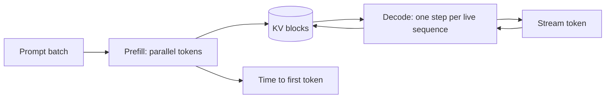
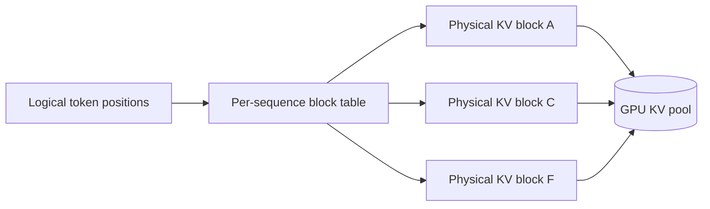
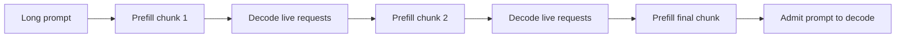

# 跨公司高频题深度答案：推理、服务与 GPU 性能

> 对应全量原题第一部分的 15 道服务题。数值估算注明了硬件和 dtype 假设；框架能力随版本变化，应以链接文档和实测为准。

## SERV-01｜Explain the prefill and decode phases. Why is prefill compute-bound and decode memory-bandwidth-bound?

**原题来源分组**：跨公司高频题 / 推理、服务与 GPU 性能 / 第 1 题。

### 回答

Prefill 一次处理 prompt 的全部 token，形成每层 K/V 并计算所有 prompt 位置的注意力；矩阵较大时 GPU 的 tensor core 更容易被充分利用，常呈计算受限特征。Decode 一轮通常仅为每个活动请求生成一个 token，但每层要读模型权重和历史 KV；batch 小时算术强度低，常呈权重或 KV 带宽受限。两者不是绝对标签：很长 prompt、不同 kernel、batch、量化和缓存命中会移动瓶颈。

容量规划拆开测 prefill tokens/s、decode tokens/s、TTFT、TPOT 和队列等待；混合流量下还要测长 prompt 抢占 decode 的尾延迟。

## SERV-02｜What is continuous (in-flight) batching and why did it replace static batching?

**原题来源分组**：跨公司高频题 / 推理、服务与 GPU 性能 / 第 2 题。

### 回答

静态 batching 等待一组请求凑齐并让所有序列走到相似进度，完成早的请求仍可能占着批次，长短请求相互拖累。Continuous batching 以 decode step 为调度边界，把新请求加入、完成请求移出、按 token/KV 预算重新形成活动批次，提高 GPU 利用率和总吞吐。它不是免费加速：更多并发意味着更大的 KV 占用和更长等待，超出容量后会抢占、驱逐或排队。

调度器至少记录请求状态、剩余 token、已分配 KV blocks、优先级、deadline 与取消状态；在 TTFT、TPOT、公平性之间做选择。验证时用不同 prompt/output 长度的混合工作负载比较，而不是只测固定长度批次。

## SERV-03｜How does PagedAttention work, and what problem of KV-cache fragmentation does it solve?

**原题来源分组**：跨公司高频题 / 推理、服务与 GPU 性能 / 第 3 题。

### 回答

PagedAttention 把每条序列的逻辑 KV 位置映射到固定大小的物理块，按需分配并维护 block table；不要求为未知最大长度预留连续大段显存。这样降低外部碎片和保留空间浪费，也便于共享公共前缀或 copy-on-write。块的最后一页仍有内部碎片；块太小则表和地址计算成本增加，太大则内部浪费增加。

它管理 cache 的布局、分配和 attention 访问，不改变给定模型每 token 的理论 KV 张量大小。容量收益应区分碎片减少、共享复用和模型结构/量化带来的字节减少。

## SERV-04｜What is speculative decoding? Why is output quality preserved, and when does it not help?

**原题来源分组**：跨公司高频题 / 推理、服务与 GPU 性能 / 第 4 题。

### 回答

Speculative decoding 用便宜的 draft model 或其他草稿机制先提出一段 token，再由目标模型一次并行验证；拒绝采样方案按恰当接受/修正规则保证目标模型的输出分布，而非简单接受草稿的全部结果。是否加速取决于草稿成本、目标并行验证成本、接受率、草稿长度及硬件并行效率。若 draft 与 target 差异大、输出高熵、草稿过长或批处理本来已把 GPU 用满，收益会下降甚至倒退。

看两个指标：目标模型调用次数减少多少，以及每个被接受 token 的真实成本；质量核验要比较输出分布/统计而非只比较单个随机样本。包含采样温度、top-p 等策略时，验证算法必须与目标分布匹配。

## SERV-05｜Explain prefix caching / prompt caching. When should you use it, and what invalidates a cached prefix?

**原题来源分组**：跨公司高频题 / 推理、服务与 GPU 性能 / 第 5 题。

### 回答

Prefix Cache 复用重复 prompt 前缀的预计算 KV，适合共享 system prompt、固定文档模板、多轮对话或大量相同上下文。缓存键应基于 token ID 序列而不是原始字符串，还应包含模型权重/适配器版本、tokenizer、RoPE/位置参数、注意力配置和租户访问边界。后缀变化不影响已经严格相同的前缀，但中间插入一 token 会使之后的位置依赖变化。

命中率要按“复用 token 数”和节省的 prefill 时间测，而不是仅看请求命中率；缓存占显存会挤压活动请求 KV，需有引用计数、淘汰策略和容量预算。动态时间戳、个性化提示或版本更新可能使预期命中消失。

## SERV-06｜Compare FP16, BF16, FP8, INT8, INT4 and FP4 for serving. What breaks at each step down?

**原题来源分组**：跨公司高频题 / 推理、服务与 GPU 性能 / 第 6 题。

### 回答

FP16 有较细的尾数但指数范围比 BF16 窄；BF16 更耐大幅度数值，推理质量接近 FP16 的情形常见，但仍需任务验证。FP8、INT8、INT4、FP4 逐步压缩权重或激活/KV 表示，理论字节下降，同时引入量化尺度、异常值处理、反量化、kernel 支持与模型质量风险。INT4 权重压缩不代表全链路显存恰好变四分之一：标尺、零点、未量化层、KV、工作区仍存在。

选择从硬件支持、权重/激活/KV 分别量化、校准数据和误差敏感层入手。比较 perplexity 之外，还要测工具 JSON、数学/代码、长上下文、安全拒答及特定行业任务；在真实 batch 和长度分布下看 TTFT/TPOT。较低 bit 如果反量化或 kernel 不佳，实际延迟可能反而增加。

## SERV-07｜Compare tensor, pipeline, data, sequence and expert parallelism. When do you combine them?

**原题来源分组**：跨公司高频题 / 推理、服务与 GPU 性能 / 第 7 题。

### 回答

Data parallel 复制模型并分担请求，适合模型能在单副本容纳且吞吐可横向扩展；tensor parallel 把层内矩阵分片，降低单卡权重占用但每层常有 collective 通信；pipeline parallel 把层分给不同设备，会引入流水线 bubble；sequence/context parallel 沿序列分担长上下文激活或 attention 负担；expert parallel 将 MoE 专家分布到设备，但有 token dispatch 的 all-to-all。

组合以模型是否放得下、互联带宽、batch 大小、延迟目标为依据。小 batch 延迟敏感服务倾向少跨卡通信；超大模型可能不得不 TP+PP，MoE 再加 EP，长上下文再考虑 CP。要画跨节点通信图，计算各并行度下每步通信量和 bubble，避免只报 GPU 总数。

## SERV-08｜Estimate the GPU memory needed to serve a 70B model: weights, KV cache, activations, fragmentation.

**原题来源分组**：跨公司高频题 / 推理、服务与 GPU 性能 / 第 8 题。

### 回答

先确定模型权重规模 P、权重 dtype/量化格式、层数 L、KV 头数 H_kv、头维 d_h、最大同时缓存 token 总数 T。权重近似 P×b_w；70B BF16 约 140 GB 十进制（约 130.4 GiB），单张 80 GB H100 装不下；INT4 裸权重约 35 GB，但量化元数据和未量化层要另算。KV 近似 2LH_kv d_h T b_kv；例如 80 层、8 KV 头、128 维、BF16，128k token 约 39.1 GiB，单并发已十分昂贵。

预算还包括 prefill 峰值激活、attention/通信工作区、CUDA graph、碎片和安全余量。单卡权重能放下并不代表满足目标并发。先写每个副本的显存等式与 p95 长度分布，再选 GQA/KV 量化、TP、分片部署和 admission control。

## SERV-09｜What are TTFT, TPOT, ITL and throughput, and how do they trade against each other?

**原题来源分组**：跨公司高频题 / 推理、服务与 GPU 性能 / 第 9 题。

### 回答

TTFT 是请求到首 token 的时间，通常包含排队、预处理、prefill 和首轮 decode；TPOT 是输出 token 间平均耗时的一种统计；ITL 是逐 token 的间隔分布，p95/p99 能看到抖动；throughput 可按输出 token/s、总 token/s 或请求/s，报数时必须说明定义。端到端完成时间粗略为 TTFT 加剩余输出 token 的间隔和，但不能用一个均值遮蔽流式体验。

增大 batch 往往提高总 token 吞吐，却可能使 TTFT 或 ITL 变差；chunked prefill 缓和长 prompt 对 decode 的阻塞；过高并发触发 KV 紧张与抢占。建立按 prompt/output 长度切片的 SLO，分别测空载与目标 QPS，避免只用离线最大吞吐选配置。

## SERV-10｜Do the roofline maths: how many tokens/sec can one H100 produce for a 70B model at batch size 1?

**原题来源分组**：跨公司高频题 / 推理、服务与 GPU 性能 / 第 10 题。

### 回答

这是一道需要先检查前提的 roofline 题。70B BF16 权重约 140 GB，不能完整常驻单张 80 GB H100；因此“单 H100、70B BF16、权重常驻”的 tokens/s 没有物理可行的数值。若只做带宽思想实验，H100 SXM 标称约 3.35 TB/s，140 GB 权重每步至少约 41.8 ms，对应约 24 token/s 的理想上界，还没计 KV、计算和通信，且假设本身不成立。

可行方案一是多卡分片，例如两卡各持约 70 GB 权重，理想总权重读取下界约 70 GB / 3.35 TB/s≈20.9 ms（约 48 token/s 上界），但每层 collective、KV 和负载不均会降速。方案二是能容纳的 4-bit 量化：裸权重约 35 GB，理想权重带宽上界约 96 token/s，实际受 scale、KV、kernel、输出采样等约束。计算这些值前应说明 H100 型号、显存、dtype、batch 和并行方案。

## SERV-11｜When would you choose vLLM vs SGLang vs TensorRT-LLM vs a custom stack?

**原题来源分组**：跨公司高频题 / 推理、服务与 GPU 性能 / 第 11 题。

### 回答

选 serving 引擎先写约束矩阵：模型架构与量化/LoRA 支持、GPU/互联、批处理和前缀复用形态、结构化输出、部署接口、运维生态、许可证/维护成本。vLLM 提供成熟的 PagedAttention、continuous batching、chunked prefill 和广泛的服务支持；SGLang 值得在共享前缀、复杂生成/结构化约束的工作负载实测；TensorRT-LLM 在 NVIDIA 栈和特定优化路径中有价值，但集成/编译/版本矩阵需评估；自研适用于特殊硬件、算法或极端 SLO，需承担 kernel 与调度维护成本。

不要凭框架名排绝对性能名次。固定模型、dtype、硬件、输出长度、QPS、并发、SLO 和精度验收，测 TTFT/TPOT/p99、吞吐、显存与稳定性；记录具体版本，因为能力变化快。

## SERV-12｜How would you cut LLM serving cost by 10x? Enumerate every lever and rank them.

**原题来源分组**：跨公司高频题 / 推理、服务与 GPU 性能 / 第 12 题。

### 回答

先建立成本分解：每百万输入/输出 token 的 GPU 时间、利用率、空转、模型副本、网络/存储和运维。按收益与风险排序通常先做流量治理和模型路由：简单请求用更小模型，重复前缀缓存，限制无用长上下文与过长输出；再调 continuous batching、admission control、prefill/decode 混合调度；最后评估量化、GQA/KV 精度、并行和更高效硬件。RAG 的正确检索有时比喂整库进长上下文便宜。

“10×”要建立基线和同质量约束，不能通过降低输出质量或拒绝更多请求制造节省。以每个手段的覆盖流量 f、单位节省率 s、质量回归、延迟变化测净收益；多个手段作用重叠，不能把理论倍数相乘。灰度发布并按任务切片监控错误率、用户满意度和安全指标。

## SERV-13｜Your p99 latency doubled after a deploy with no model change. Walk through the diagnosis.

**原题来源分组**：跨公司高频题 / 推理、服务与 GPU 性能 / 第 13 题。

### 回答

p99 翻倍但模型没变，先按 trace 把总延迟拆为入口队列、预处理、调度等待、prefill、decode、工具/网络、后处理；按模型、副本、请求长度、QPS、租户、缓存命中和节点切片比较部署前后。检查变化是否是流量形状而非平均 QPS：长 prompt、长输出或 burst 会改变 KV 压力和批次组成。再查新配置、batch 上限、block size、prefix cache 命中、量化 kernel、GC/CPU 饱和、GPU 时钟、H2D/网络与跨卡通信。

用同一请求回放或 canary 将配置差异缩小到一项，结合 GPU 利用率、HBM 带宽、KV blocks、preemption、队列长度与每段 p99 定位。不要先加机器：若是热点路由或错误缓存失效，扩容可能只掩盖根因。故障处理需有回滚阈值和对用户的降级策略。

## SERV-14｜What is chunked prefill, and why does it improve tail latency under mixed traffic?

**原题来源分组**：跨公司高频题 / 推理、服务与 GPU 性能 / 第 14 题。

### 回答

长 prompt 的 prefill 若一次占据 GPU 很久，会使已有流式 decode 请求的 token 间隔被拉长。Chunked prefill 把长 prompt 分为 token 块，在调度步中与 decode 交错执行，让每步工作量受 token budget 控制，改善混合流量的 ITL 和 p99。代价是更多调度切换/小块计算，单个长 prompt 的 TTFT 可能上升，且块大小影响算力利用率与公平性。

选择块大小时按目标流量做长短请求混合回放，记录 TTFT、ITL p99、吞吐、GPU 利用率；不能假设所有工作负载都提升。

## SERV-15｜Explain disaggregated prefill/decode serving and when it pays for itself.

**原题来源分组**：跨公司高频题 / 推理、服务与 GPU 性能 / 第 15 题。

### 回答

Prefill 偏向高并行计算，decode 偏向模型权重/KV 读取和低延迟持续调度。把两者分到不同 GPU 池，可分别优化批次、资源和扩缩容，避免长 prompt 抢占 decode；但 prefill 结束需要把每层 KV 转移或通过分布式缓存让 decode 节点可读取，引入网络带宽、传输延迟、失败恢复和缓存一致性成本。

盈亏点取决于 prefill/decode 流量比例、prompt 长度、KV 字节数、网络拓扑和 SLO。估算传输时间=KV 字节/有效网络吞吐，再加握手与排队；若短 prompt 占多数或网络瓶颈严重，分离可能更差。架构需要 admission、KV ownership、transfer ACK、失败时重算/回退和 trace 关联，不能只画两个 GPU 盒子。

## 原理与产品文档

- [NVIDIA H100 官方规格](https://www.nvidia.com/en-us/data-center/h100/)
- [PagedAttention 论文](https://arxiv.org/abs/2309.06180)
- [vLLM 文档](https://docs.vllm.ai/)
- [SGLang 项目](https://github.com/sgl-project/sglang)
- [TensorRT-LLM 文档](https://nvidia.github.io/TensorRT-LLM/)
