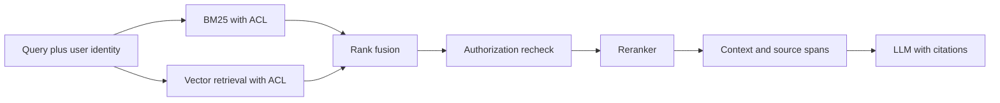
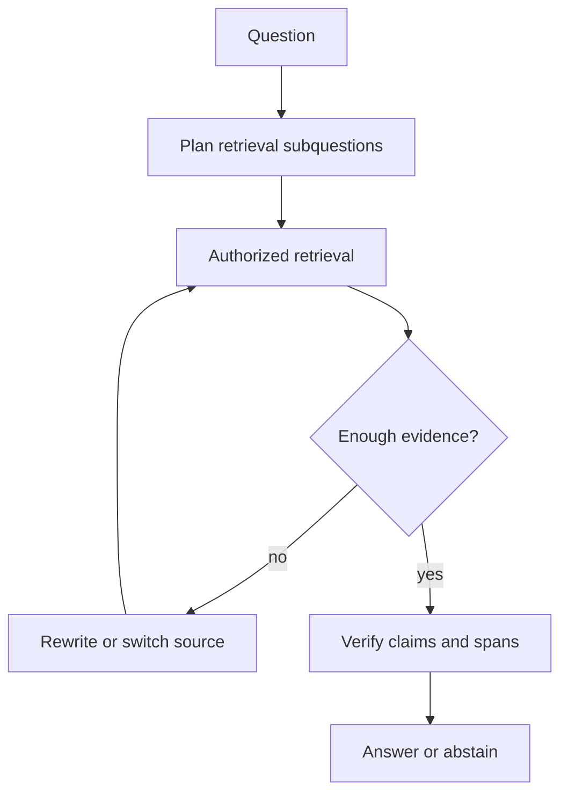
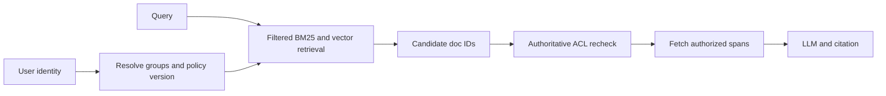
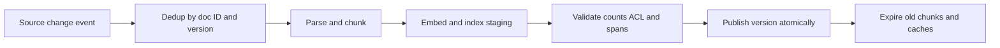

# 跨公司高频题深度答案：RAG 与检索

> 对应原题第一部分 12 道。答案分别讨论数据处理、召回、权限、精排、生成验证及线上维护；图中强调授权边界。

## RAG-01｜What chunking strategy would you use for a large technical documentation corpus, and why?

**原题来源分组**：跨公司高频题 / RAG 与检索 / 第 1 题。

### 回答

技术文档应以标题层级、段落、代码块、表格、API 端点和版本为语义边界，先解析成结构树，再按 token 预算切块；给块保留父标题、产品版本、路径、更新时间、ACL 和可引用的原文 span。固定长度切块是基线，不能把函数签名与解释、表头与表体拆散；过大块损害精确召回并增加 rerank/上下文成本，过小块丢失限定条件。可用 parent-child retrieval：检索小块，生成时回取经授权的父段落。

离线标注问题到证据 span，比较不同 chunk size/overlap 的 Recall@k、引用正确率和成本。按代码、表格、图文分别切片，避免用一套阈值覆盖所有文档。文档更新时以稳定 document ID + version 处理删除、重切与 ACL 变化。

## RAG-02｜How do you choose between a sparse retriever (BM25) and a dense retriever? When do you need both?

**原题来源分组**：跨公司高频题 / RAG 与检索 / 第 2 题。

### 回答

BM25 在设备号、错误码、型号、代码符号和罕见术语上强；Dense Retrieval 在同义改写、跨表达方式查询上强。二者分数通常不可直接相加，可从 RRF(d)=Σ_r 1/(k+rank_r(d)) 开始，再对融合候选做 cross-encoder 精排。RRF 只使用排名，会丢分数置信度；权重、召回深度和 rerank 数量应通过验证集调优。

验证精确 ID、同义问法、拼写错误、无答案及权限边界。若授权过滤只在 LLM 后发生，即使输出被遮盖，未授权内容仍可能进入模型或日志。另见 [样板深答](../01-deep-answer-samples.md#rag-002bm25-与-dense-retrieval-如何选择何时组合)。

## RAG-03｜What is a reranker, when should you use one, and what does a cross-encoder cost you?

**原题来源分组**：跨公司高频题 / RAG 与检索 / 第 3 题。

### 回答

Bi-encoder 将 Query 与文档分别嵌入，可预建文档索引并快速召回；cross-encoder 把 Query 与候选文档共同输入模型，显式交互 token，通常提高相关性判断但每个候选都需一次推理，不能像独立 embedding 那样直接做大规模 ANN。典型流程是 100～1000 个粗召回候选融合、去重、ACL 校验，再精排前几十至数百个，最后选有限上下文。

成本约为候选数 × 每对输入长度 × 模型计算，长文候选和高 QPS 会放大尾延迟。用相关性标签看 nDCG/MRR 增益；同时记录 p95/p99、预算、缓存命中与不同查询类型。对精确 ID 查询，粗排已确定时可减少或跳过 rerank；权限校验必须先于外部精排服务。

## RAG-04｜How would you evaluate the quality of a RAG pipeline: retrieval and generation separately?

**原题来源分组**：跨公司高频题 / RAG 与检索 / 第 4 题。

### 回答

RAG 至少拆成三层评估：检索是否找对证据（Recall@k、MRR/nDCG、ACL 命中）；上下文构建是否把关键 span 保留并放在模型可使用的位置（token 截断率、证据覆盖）；生成是否依据证据回答（答案正确性、逐主张支持率、引用定位、合理拒答）。整体用户满意度和任务完成率是结果指标，不能替代分层诊断。

造测试集时保存 query、用户身份、文档版本、允许访问的 gold spans、参考答案或可接受判据；对权限、时间敏感、多跳、无答案、冲突证据分桶。LLM judge 可做初筛，但需人工抽样校准偏差；做版本对照时固定语料快照和权限视图。若答案错而检索命中，应检查上下文压缩、prompt 和生成；若无证据，先修解析/索引/召回。

## RAG-05｜What is HyDE (hypothetical document embeddings) and when does it outperform standard dense retrieval?

**原题来源分组**：跨公司高频题 / RAG 与检索 / 第 5 题。

### 回答

HyDE 先让生成模型针对用户问题构造“假想答案文档”，再嵌入这段文本去检索真实文档；它不是把假想文本当事实，而是利用文档风格的表述缩小短 query 与长文 embedding 的分布差异。对描述含糊、词汇不一致、查询很短的语义检索可能有帮助；对设备编号、准确日期、罕见实体或生成模型容易编造的领域，可能把查询带偏。

将原 query 的稀疏/稠密召回与 HyDE 路径并行融合，并在 reranker 与原文证据上复核。设置生成超时、成本预算和失败 fallback；评估增量 Recall@k 与误召回，尤其测试假想文档错误实体导致的 semantic drift。最终答案只能依据真实、授权的文档 span。

## RAG-06｜How does agentic RAG differ from standard RAG, and when is the extra complexity justified?

**原题来源分组**：跨公司高频题 / RAG 与检索 / 第 6 题。

### 回答

标准 RAG 通常是固定的 query→retrieve→rerank→answer；agentic RAG 让控制器依据中间证据决定改写查询、切换索引、拆解多跳问题、调用结构化数据源或停止并拒答。适合跨多系统、多步验证、证据冲突的复杂问题；简单 FAQ 上多次模型/检索调用可能只增加延迟、成本和错误空间。

Runtime 必须设检索轮数、token/时间预算、去重条件和终止状态；每步保存 query、索引版本、候选及拒绝原因供复盘。以难题集的准确率/成本/p99 增益证明复杂度，而非因为用了 Agent 框架就默认更好。

## RAG-07｜What causes semantic drift in embedding search and how do you detect it?

**原题来源分组**：跨公司高频题 / RAG 与检索 / 第 7 题。

### 回答

“语义漂移”可能指查询被改写偏离原意，也可能指 embedding 模型/语料更新后相似度分布或召回语义发生变化。先固定一组 query→gold document 测试，记录 embedding 版本、向量归一化、索引版本、召回集合与人工相关性。升级模型时不能把新 query embedding 与旧文档 embedding 混用，除非明确验证空间兼容；需要双写/重建索引并灰度比较。

检测时看 Recall@k、近邻集合 Jaccard、向量范数/距离分布、查询类别与语言切片，也看用户点击/纠错。对已知术语、数字和 SKU，保留稀疏召回锚点。若 drift 来自数据更改，追踪文档版本、删除/ACL 事件和索引延迟；若来自 query rewrite，保留原 query 并约束关键实体。

## RAG-08｜Design permission-aware retrieval: users must never see content they can't access in the source system.

**原题来源分组**：跨公司高频题 / RAG 与检索 / 第 8 题。

### 回答

用户必须在源系统授权范围内检索。建索引时保存租户、文档 ID、ACL 版本及可见主体/组；查询前解析身份与组，检索时尽可能 pre-filter 以保证召回候选安全，再在返回原文和进入 reranker/LLM 前对源系统或可信 ACL 快照作授权复核。不能只在 prompt 写“不要泄露”，也不能只在最后隐藏引用：内容已经经过模型/外部服务。

ACL 撤销、组变更和缓存失效要定义传播上界；如果索引视图滞后且权限敏感，查询时必须 fail-closed。测水平越权、共享链接撤销、跨租户 cache 污染和多文档混合答案。

## RAG-09｜Compare HNSW, IVF-PQ and flat indexes. How do you pick, and what does recall@k cost in latency?

**原题来源分组**：跨公司高频题 / RAG 与检索 / 第 9 题。

### 回答

Flat 精确扫描全部向量，召回上界最清楚但内存与计算近似随 N 增长；HNSW 用多层近邻图加速搜索，调 efSearch 可换召回与延迟，图边带来内存开销与更新复杂性；IVF 先训练粗聚类，只探测若干倒排列表，nprobe 增大提升召回也增加扫描；PQ 把向量分段量化显著压缩内存，但距离有近似误差，常用重排原始向量补偿。

选型先确定 N、维度、更新率、内存预算、权限过滤选择性、目标 Recall@k 和 p99，再在真实查询上画 recall-latency-memory 曲线。过滤后的候选稀少会改变 ANN 行为；多租户/ACL 严格过滤时，要测试每个租户数据规模，不能拿全库无过滤 benchmark 作结论。

## RAG-10｜How do you handle tables, figures and multi-column PDFs in a retrieval pipeline?

**原题来源分组**：跨公司高频题 / RAG 与检索 / 第 10 题。

### 回答

复杂 PDF 先保留页面、版面坐标和阅读顺序，识别段落/多栏、表格、图、脚注及跨页关系。多栏不可直接按 OCR 文本行顺序拼接，否则会把不同列交错；表格要保存表头、单元格行列关系、单位、脚注与来源页，既可序列化为结构化文本，也可用专用表索引。图形可保留图像、图题、附近段落和经审核的视觉描述；不能把模型生成的图解当原文事实。

为每个 chunk 存 doc ID、页码、bbox、解析置信度、版本和 ACL，使答案可定位到原件。对扫描件用 OCR 质量门槛和人工抽检；当数值或单位不确定，明确拒答/展示原图。评测集合要按多栏、扫描、表格跨页、图例与数学公式切片，并计算字段级和引用级正确率。

## RAG-11｜How do you keep an index fresh when the underlying corpus changes continuously?

**原题来源分组**：跨公司高频题 / RAG 与检索 / 第 11 题。

### 回答

用源系统变更流或周期增量扫描获取新增、修改、删除、权限变更，按文档 ID 与版本生成幂等事件。流水线解析→切分→embedding→写入临时索引→校验→切换可查询版本；旧版本的 chunk 与向量要删除或 tombstone，防止过期内容与 ACL 泄漏。权限撤销需要更短传播路径，必要时查询时强制源 ACL 复核。

监控源水位、最大/分位索引滞后、失败死信、重试和文档版本差异；定期全量对账修复漏事件。只“重新 embedding 修改正文”不够，删除和 ACL 是正确性关键。

## RAG-12｜How do you attribute every claim in a generated answer to a specific retrieved span?

**原题来源分组**：跨公司高频题 / RAG 与检索 / 第 12 题。

### 回答

要把引用视为可验证的证据关系，不只是让模型在句尾随便放一个编号。检索输出应携带稳定 document/version ID、原文 span offset、页码或结构化单元格；生成时让模型输出主张—证据 ID 关系，再用校验器核对该主张是否被所引原文支持。数值、日期、否定、比较和跨文档合成尤其需要单独检查；引用存在不代表引用支持结论。

流程是候选召回→权限过滤→上下文组装保留 provenance→生成带 span ID 的草稿→拆成原子主张→支持/矛盾/缺证据校验→修正或拒答。若回答使用的是派生计算，记录计算输入与公式而不是假装原文直接包含最终数值。评估 claim support rate、citation precision、citation recall 与无证据拒答率，并允许用户跳转到具体原文位置。

## 参考

- [Faiss 索引类型与选型](https://github.com/facebookresearch/faiss/wiki/Faiss-indexes)
- [Lost in the Middle 论文](https://arxiv.org/abs/2307.03172)
- [RRF 原论文](https://doi.org/10.1145/1571941.1572114)
