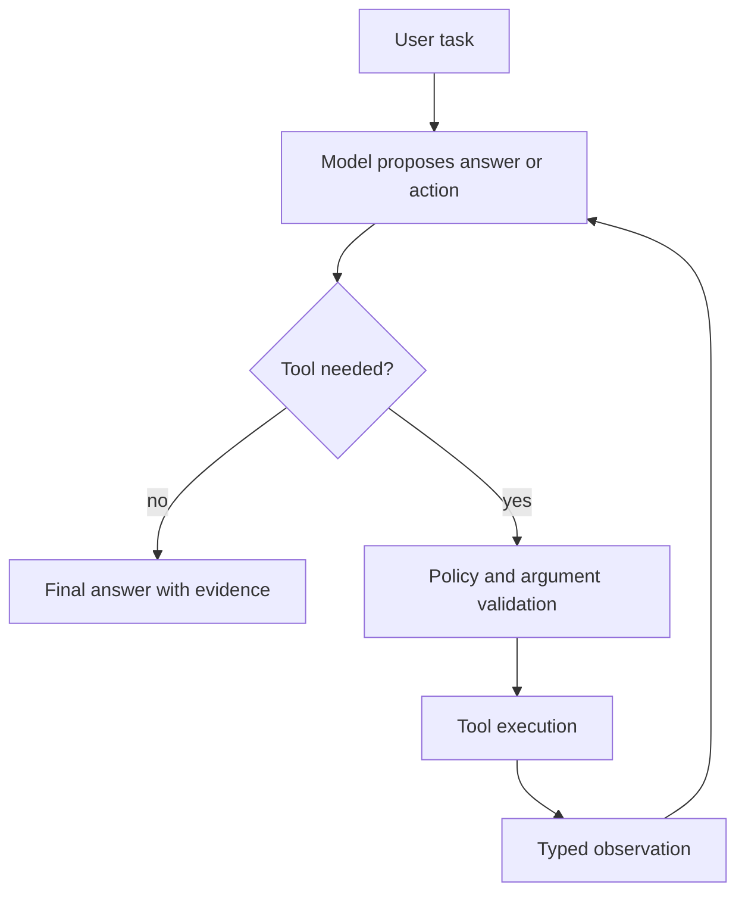
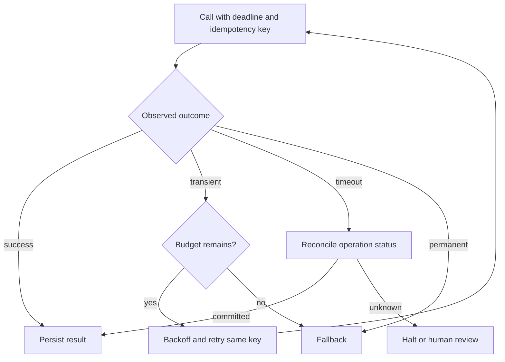
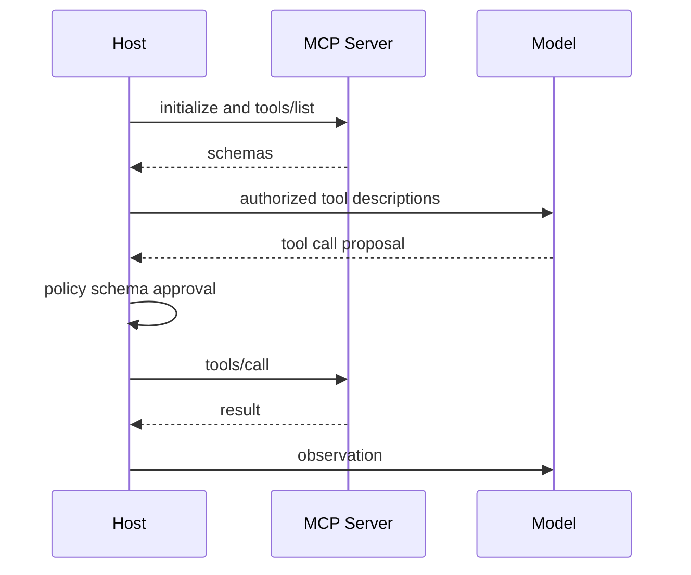
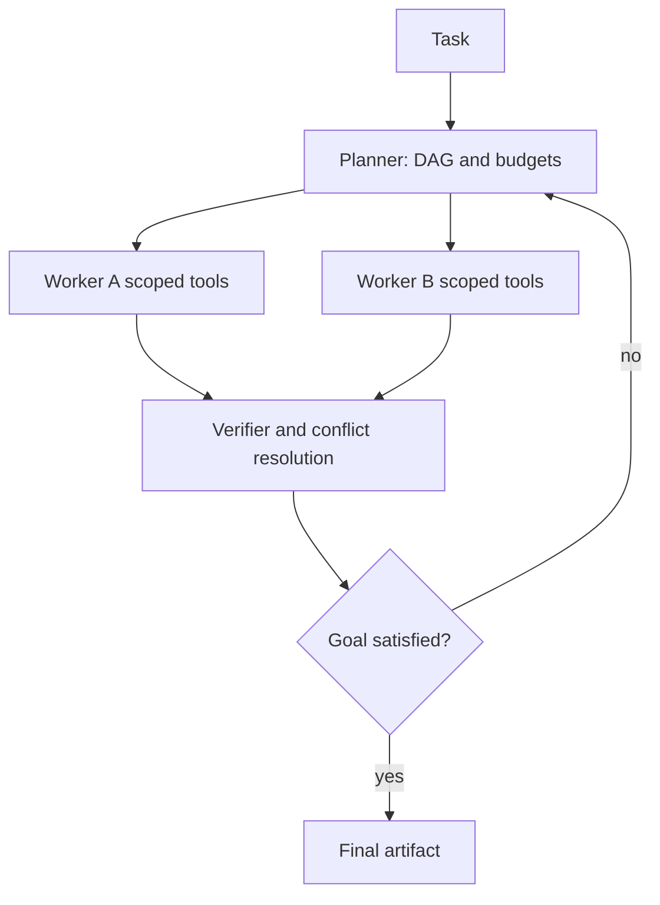
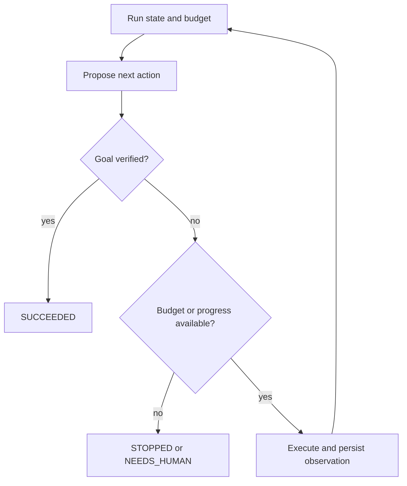
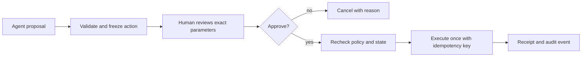

# 跨公司高频题深度答案：Agent 与工具调用

> 对应原题第一部分 12 道。每题从模型意图、Host/Runtime 硬约束、业务副作用与可观测性四层回答。相关源码级讨论参见主仓库 01～05 章节。

## AGENT-01｜Explain the ReAct pattern and what it solves over chain-of-thought alone.

**原题来源分组**：跨公司高频题 / Agent 与工具调用 / 第 1 题。

### 回答

ReAct 把“当前观察→推理/计划→外部动作→工具观察”组织为迭代循环，使模型能用外部世界的反馈修正下一步。相对只在内部推理，它可获取新事实、执行 API、核实假设；但一个模型写出“我要调用工具”不代表动作已发生，Runtime 必须校验、执行并返回结构化 observation。

生产循环需 step/token/time budget、重复动作检测、工具错误分类与副作用审批；不能无限“思考”。可观测 trace 记录模型决策、工具调用和证据，但敏感推理不必原样永久保存。

## AGENT-02｜How do you handle tool-call errors, timeouts and retries in an agentic loop?

**原题来源分组**：跨公司高频题 / Agent 与工具调用 / 第 2 题。

### 回答

先分类错误：参数错/权限拒绝属于不可原样重试；429/暂时性 5xx 可按 Retry-After、指数退避与 jitter 有限重试；超时属于“结果未知”，尤其是付款、发邮件、控制设备。对有副作用工具，为一次逻辑操作持久化 operation ID 和幂等键，让业务端原子去重并支持查询状态；重试沿用相同键。

记录 UNKNOWN、FAILED、SUCCEEDED 分离的状态、重试次数、下游响应和 trace。详见 [样板](../01-deep-answer-samples.md#agent-002tool-timeout错误和-retry-如何设计)。

## AGENT-03｜What is the difference between structured output and function calling?

**原题来源分组**：跨公司高频题 / Agent 与工具调用 / 第 3 题。

### 回答

Structured Output 的目标是让模型回答满足预期数据形状，例如 JSON schema；它本身不意味着执行外部动作。Function Calling 的目标是让模型给出工具名和参数，由宿主决定是否运行并把结果回填。两者都可能借助约束解码或 schema，但信任边界不同：结构正确不代表事实正确，参数合法不代表用户授权。

执行链路要有模型提议→schema 验证→语义/权限校验→副作用审批→工具执行→结构化 observation。模型输出 JSON 内的 URL、SQL 或设备 ID 仍是不可信输入。不要让模型生成的“调用成功”文本替代真实业务回执，也不要把调用意图直接视为用户授权。

## AGENT-04｜What is MCP (Model Context Protocol) and how does it differ from traditional function calling?

**原题来源分组**：跨公司高频题 / Agent 与工具调用 / 第 4 题。

### 回答

MCP 规范 AI 应用与 MCP Server 之间的能力发现和调用，包含 Tools、Resources、Prompts 等；Function Calling 通常是模型 API 表达工具调用意图的形式。Host 先通过 MCP client 发现 server 工具，把授权后的 schema 提供给模型；模型给出工具名/参数，Host 验证后调用 MCP tools/call，再把结果作为 observation 回到下一轮。MCP 不代替鉴权、审批、隔离或模型接口。

工具结果属于不可信数据，需限制大小和防间接 prompt injection。细节见 [样板](../01-deep-answer-samples.md#agent-004mcp-与-function-calling-有什么区别)。

## AGENT-05｜How many tools is too many? How do you design tool schemas an LLM can actually use correctly?

**原题来源分组**：跨公司高频题 / Agent 与工具调用 / 第 5 题。

### 回答

“多少工具太多”没有固定数字，关键是模型能否可靠区分相似工具，以及 schema token/选择错误/延迟是否超预算。工具按任务和用户权限做动态候选检索，避免把整个注册中心平铺进上下文；名称和描述要说明使用前提、互斥关系、输入单位、必填字段、返回值和副作用等级。把复杂业务动作封装成领域级工具，避免让模型拼装几十个脆弱的原子步骤。

用离线混淆矩阵评估工具选择准确率、参数正确率和拒用率；对同名近义工具做对比测试。运行时仍强制 schema、范围和策略校验，模型选择不是授权。工具版本变更应保留兼容期并对历史会话固定 schema 版本，否则复现和重试可能调用不同语义。

## AGENT-06｜How does multi-agent orchestration work, and when does it break down?

**原题来源分组**：跨公司高频题 / Agent 与工具调用 / 第 6 题。

### 回答

Multi-Agent orchestration 要先定义任务图、每个角色的权限与输入输出契约。一个 coordinator 分解目标、分配子任务、收集结果并验证，worker 不应默认共享全部内存或凭证。并行子任务需处理依赖、取消、幂等与合并冲突；串行交接需传递稳定的 artifact、假设和证据，而非让所有 agent 在长对话里互相猜。

它在任务不可独立、沟通成本高、共享资源竞争、循环委派和责任边界不清时失效。比较单 Agent 基线的成功率、token/时间成本和错误定位能力，只有净增益时才拆角色。

## AGENT-07｜Design memory for a long-running agent: what do you store, where, and how do you retrieve it?

**原题来源分组**：跨公司高频题 / Agent 与工具调用 / 第 7 题。

### 回答

长期 Agent 至少区分会话 transcript、当前任务状态、长期用户偏好/事实、外部证据和执行副作用。Transcript 保留可追溯事件；任务状态存目标、计划、已完成步骤、未解决问题、预算和 operation ID；长期记忆只保存经授权且有用途的信息，带来源、置信度、时间与失效规则。检索时先按用户/租户权限与任务类型过滤，再做语义/关键词召回和新鲜度排序，不能把旧模型总结当权威事实。

压缩上下文要保留未完成动作、关键约束、证据链接和错误状态，避免“摘要说成功但业务未提交”。写入可经过提议→验证→去重→版本化→删除/撤销；评估跨会话准确率、错误记忆污染、权限隔离和遗忘请求。

## AGENT-08｜How does an agent decide when to call a tool versus answer from its own knowledge?

**原题来源分组**：跨公司高频题 / Agent 与工具调用 / 第 8 题。

### 回答

是否调用工具由任务所需“外部事实的新鲜度、精确性和动作权力”决定。实时余额、设备状态、私有数据、订单提交必须通过授权工具；稳定的一般知识可直接解释，但不确定时应标明假设或查询。Runtime 可加入任务分类、工具必要性规则和强制校验：例如“需要设备实时状态”不能让模型直接编造状态；低风险常识请求则不必每次搜索。

模型在候选工具间选择后，Host 做可用性、权限与参数校验。评估工具调用的 precision/recall：该调用时没调用会幻觉，不该调用时调用会增加成本或泄露。还要测无工具可用、工具报错和结果冲突时的拒答/降级行为。

## AGENT-09｜What makes an agent loop terminate correctly? How do you bound cost and steps?

**原题来源分组**：跨公司高频题 / Agent 与工具调用 / 第 9 题。

### 回答

结束条件应基于任务完成谓词与真实证据：输出已生成且核验、所需副作用有业务回执、待处理步骤为空，或进入明确的失败/取消/待人工状态。不能只用模型一句“完成了”判定。Runtime 限定最大步数、模型 token、工具费用、墙钟时间、递归深度、重复动作和并行 fan-out；每轮扣预算并检查循环指纹。

预算耗尽应返回部分结果、未完成项和原因；业务写入处于 UNKNOWN 时不能宣称失败或成功。用任务级 eval 测成功、无穷循环、重复工具调用和平均/尾成本。

## AGENT-10｜How do you make an agent's actions reversible, or at least auditable, in a production system?

**原题来源分组**：跨公司高频题 / Agent 与工具调用 / 第 10 题。

### 回答

先把动作分为纯读、可补偿写、不可逆写。可补偿写记录前置状态、effect intent、operation ID、幂等键、执行结果和补偿动作；补偿是新事务，不能假装物理回滚已经发生。不可逆动作（支付、邮件、设备控制）需要更强审批和明确用户预览。所有副作用应由业务系统作为事实源，Agent transcript 仅保存意图和观察。

审计日志用结构化事件关联 user/tenant、授权策略版本、工具版本、参数摘要、批准人、业务回执及 trace ID；敏感参数加密/脱敏。恢复时先查询 operation 状态再决定重试或人工介入。要能回答“谁、何时、依据什么证据、通过什么权限、产生了什么效果”，而不只是保存模型自然语言。

## AGENT-11｜Design human-in-the-loop approval for an agent that takes consequential actions.

**原题来源分组**：跨公司高频题 / Agent 与工具调用 / 第 11 题。

### 回答

Human-in-the-loop 审批应发生在执行副作用之前，而不是执行后让人追认。Agent 生成结构化 action proposal：目标资源、具体参数、预期影响、来源证据、风险等级、有效期和幂等键；Host 冻结提案并让有权审批者查看 diff/预览。审批凭据绑定提案哈希、用户、动作和过期时间；批准后仍需重新检查授权与业务前置条件，避免 TOCTOU。

过期、参数变化、撤销权限都使批准失效。多租户平台应分离提案者、审批者与执行者身份，不把自然语言“同意”当万能凭证。

## AGENT-12｜Your agent drifts after a long run and confidently works on the wrong thing. Diagnose it.

**原题来源分组**：跨公司高频题 / Agent 与工具调用 / 第 12 题。

### 回答

先复现 drift 的时间点：比较初始目标、每轮计划、工具 observation、上下文压缩摘要和最后行动，找首次偏离。常见根因有中间文档的 prompt injection、长对话摘要丢掉硬约束、检索结果过期、工具错误被模型误解、子任务合并丢失目标或“继续”指令没有版本化目标。不能只通过重新提示“记住目标”解决。

用不可变 task spec 存目标、禁止事项、验收条件和当前版本；每步计划与它做一致性校验。工具结果标明来源和可信级别；阶段性 checkpoint 保留未完成/UNKNOWN 副作用。评测长任务时追踪目标一致率、偏离后恢复率与有害动作率，并保存可回放 trace 来定位第一处状态损坏。
