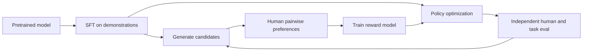
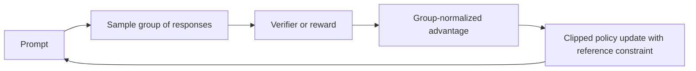
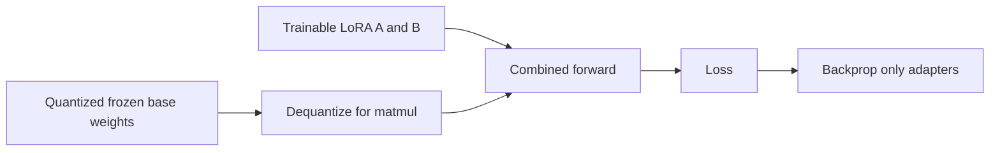
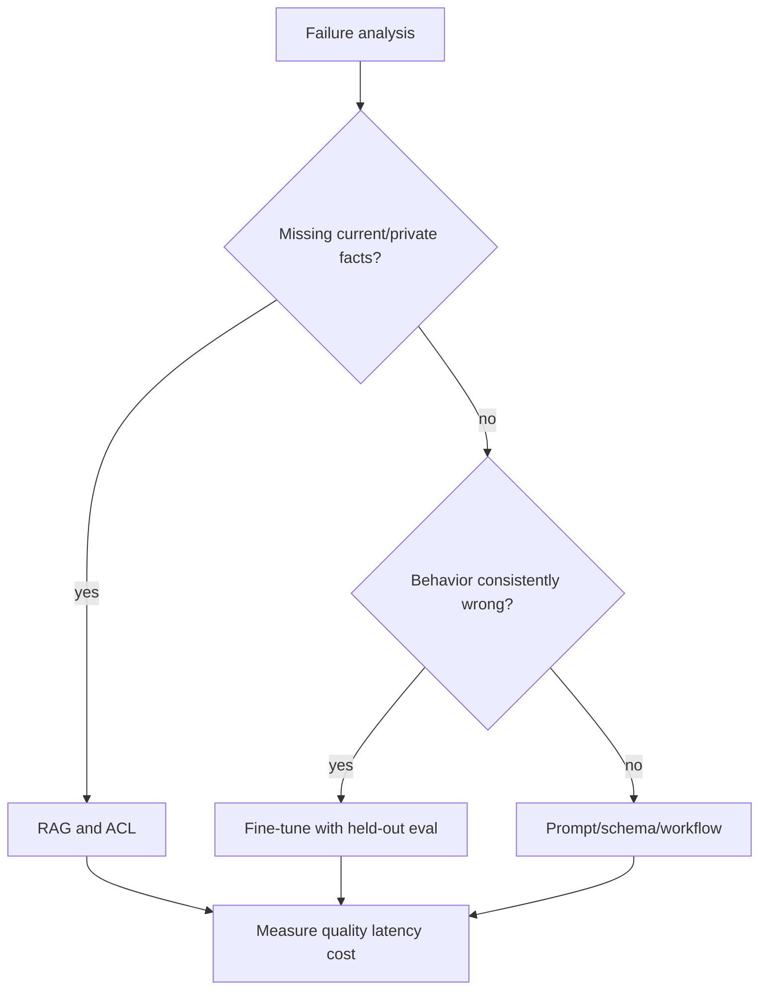
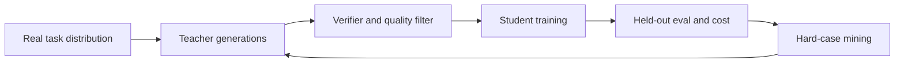

# 跨公司高频题深度答案：微调、后训练与对齐

> 对应原题第一部分 12 道。公式和显存数值明确标注假设，训练效果须以独立任务评测核验。

## TRAIN-01｜Walk me through RLHF end to end: reward model, policy optimisation, KL penalty.

**原题来源分组**：跨公司高频题 / 微调、后训练与对齐 / 第 1 题。

### 回答

典型 RLHF：先用 SFT 得到可遵循指令的初始 policy；收集同一 prompt 的多个候选及人类偏好；训练 reward model 预测偏好；从 SFT policy 采样输出，以奖励为目标并用相对参考模型的 KL 惩罚限制偏移，再用 PPO 等更新 policy。KL 太弱会过度利用 reward model 的漏洞，太强则学不到偏好。数据与采样分布、reward 标定、长度偏差、拒答偏差都会影响结果。

“人喜欢的分数上升”不等于真实任务成功。验收要同时看帮助性、事实性、拒答边界、安全、分群表现和 reward hacking。

## TRAIN-02｜What is DPO and why did it displace PPO-based RLHF at many labs? When is online RL still better?

**原题来源分组**：跨公司高频题 / 微调、后训练与对齐 / 第 2 题。

### 回答

DPO 直接用偏好对 (x,y_w,y_l) 优化 policy 相对参考 policy 对好答案的 log-prob 优势，避免显式 reward model 和在线 PPO rollout 的复杂训练环。常见损失可写为 -log σ(β[(log πθ(y_w|x)-log πref(y_w|x))-(log πθ(y_l|x)-log πref(y_l|x))])；β 控制与参考分布偏移的强弱。它工程上较简单，但训练结果受固定偏好数据覆盖与质量限制。

在线 RL 在策略持续探索可验证新轨迹、工具/长链路结果随策略改变、离线数据覆盖不足时更有价值；代价是 rollout、奖励与稳定性成本。DPO 也并非对所有 PPO-RLHF 的普遍替代。比较须固定基础模型、数据、计算预算和真实任务评测。

## TRAIN-03｜Explain GRPO and why dropping the value network matters at scale.

**原题来源分组**：跨公司高频题 / 微调、后训练与对齐 / 第 3 题。

### 回答

GRPO 对同一个 prompt 采样一组候选，用组内奖励的相对均值/标准差计算优势，再做带比率裁剪与参考模型约束的策略更新；无需另训一个逐状态 value/critic 网络，从而减少参数、显存和训练复杂性。它很适合数学/代码等可验证答案的多样采样，但组内奖励若全部相同，优势信号弱；组大小、奖励稀疏、长度偏差和采样分布会影响稳定性。

不要把“省了 value network”误说成没有任何额外成本：多条 rollout、验证器、参考模型和训练同步仍昂贵。

## TRAIN-04｜Explain the LoRA decomposition mathematically. Why does it work, and how do you choose the rank r?

**原题来源分组**：跨公司高频题 / 微调、后训练与对齐 / 第 4 题。

### 回答

LoRA 冻结原权重 W∈R[d_out,d_in]，在前向中加入低秩更新 ΔW=(α/r)BA，其中 A∈R[r,d_in]，B∈R[d_out,r]，r 远小于两边维度。可训练参数从 d_out×d_in 降至 r(d_in+d_out)，优化器状态随之下降。基础假设是任务适配所需的权重变化可在低秩子空间中近似；它不是说原模型本身低秩。

r 的选择是质量/显存/训练成本权衡：从较小 r 做验证，按层与任务误差、数据规模、目标模块（Q/V/MLP 等）逐步增加；高复杂任务可能需要更大 r 或更多模块。推理可将线性 LoRA 合并到权重，但多租户动态 adapter 管理和量化权重合并仍需考虑版本与精度。

## TRAIN-05｜How does QLoRA achieve its memory reduction, and what are the quantization trade-offs?

**原题来源分组**：跨公司高频题 / 微调、后训练与对齐 / 第 5 题。

### 回答

QLoRA 将冻结的基础权重以 4-bit 等低精度存储，前向计算时按需要反量化到计算 dtype，梯度只更新 LoRA adapter；经典方法使用 NF4、双重量化降低 scale 元数据，并用 paged optimizer 缓冲显存峰值。显存节省主要来自基础权重和可训练/优化器状态的减少；激活仍随 batch、序列长度和 checkpointing 策略增长。

评估要比全精度 LoRA 基线看最终质量、训练速度、量化误差和推理部署方式。4-bit 存储不等于全部计算都是 4-bit，也不保证任何任务无损。

## TRAIN-06｜Compare LoRA, prefix tuning, prompt tuning and full fine-tuning. When would you choose each?

**原题来源分组**：跨公司高频题 / 微调、后训练与对齐 / 第 6 题。

### 回答

全量微调更新所有权重、表达能力最大，但需要权重梯度、优化器状态和分布式训练成本，也更易在小数据上遗忘。LoRA 更新层内低秩矩阵，适合资源有限、多个任务 adapter 共用基座；prefix tuning 学可插入各层 attention 的前缀状态，prompt tuning 主要学输入端连续提示，参数更少但能力与稳定性依赖任务和模型。三者和“纯文本 prompt”不同，前两者都要训练。

决策先看是否需要改变模型内在行为、任务难度、数据量、训练/推理预算、多租户 adapter 切换与质量门槛。先建立 prompt/RAG 基线，再测轻量适配；若高复杂分布变化且资源充分，再考虑更大更新范围。比较时固定基础模型和评测集。

## TRAIN-07｜What is catastrophic forgetting and how do you mitigate it during fine-tuning?

**原题来源分组**：跨公司高频题 / 微调、后训练与对齐 / 第 7 题。

### 回答

灾难性遗忘是模型在新数据上优化后，旧任务或通用能力显著退化。原因可能是训练数据狭窄、学习率过大、更新步数过多、全量参数被强烈移动，或新数据目标与原行为冲突。诊断用训练前后多任务切片：旧领域、通用指令、拒答、安全、多语言、长上下文，与目标任务同时比较；不能只看目标集提升。

缓解包括混合通用/旧任务回放数据、较小学习率与早停、参数高效适配、正则/参考模型约束、分模块冻结和多任务训练。每种方案都有容量与冲突成本；最重要的是保留独立回归集和版本回滚路径。若目标是更新事实，RAG 往往比修改权重更可控。

## TRAIN-08｜Prompting, RAG or fine-tuning: give me your decision framework with cost and latency attached.

**原题来源分组**：跨公司高频题 / 微调、后训练与对齐 / 第 8 题。

### 回答

先判断问题性质：输出格式/角色可由 prompt 解决；需要经常变化、可追溯、按权限查询的外部事实选 RAG；需要稳定改变模型行为、术语、格式或领域推理，且有足够高质量样本时评估 fine-tuning。三者可叠加：微调提高遵循检索证据与调用工具能力，RAG 提供最新事实，prompt 控制具体任务。

列总拥有成本：标注/训练、索引/embedding、每请求检索和 rerank、输入 token、版本发布与回滚。RAG 会加检索延迟，长上下文会加 prefill，微调有前期训练和多模型维护成本。以真实失败集和目标 QPS 做比较。

## TRAIN-09｜Do the GPU memory maths for full fine-tuning a 7B model in bf16 with Adam. Now with LoRA.

**原题来源分组**：跨公司高频题 / 微调、后训练与对齐 / 第 9 题。

### 回答

7B 参数 BF16 基础权重约 14 GB 十进制。全量 Adam 训练需另存梯度（若 BF16 约 14 GB）、FP32 master 权重（约 28 GB，视实现）、一阶/二阶矩各约 28 GB；仅这些长期状态可达约 112 GB，若梯度按 FP32 则更高。再加激活、attention、中间工作区、通信、碎片，单卡实际需求明显超过 112 GB。不同优化器/混合精度/FSDP/ZeRO 策略会改变状态位置，不能死记一个数字。

LoRA 冻结 7B 基座，基础权重仍约 14 GB（QLoRA 可更低），但只为 adapter 存梯度和 Adam 状态；若 adapter 有 P_a 参数，训练状态粗略按 P_a 的权重、梯度和两个 FP32 矩计算，且激活仍可能很大。应写出目标模块、rank、batch、seq length、activation checkpointing 和设备分片策略，再算可行性。

## TRAIN-10｜What is RLVR (RL with verifiable rewards) and where does it beat a learned reward model?

**原题来源分组**：跨公司高频题 / 微调、后训练与对齐 / 第 10 题。

### 回答

RLVR（verifiable rewards）用程序、单元测试、数学答案检查器、形式验证或受控环境的最终状态给奖励，适合有客观可验证终点的任务；相对学习型 reward model，它减少了对偏好模型拟合误差的依赖，也能较低成本扩展 rollout。代码通过测试并不保证高质量或安全：测试覆盖不足、作弊读取答案、硬编码和环境漏洞会产生 reward hacking。

训练时隔离测试与训练信息，设计多样/隐藏评测、过程约束和失败追踪；对不可判定的解释质量、审美、对话体验，仍可能需要人类偏好或 learned reward。验收看新题泛化、测试外的正确率、解题成本和无效长推理，不只看训练 reward。

## TRAIN-11｜Explain reward hacking in RLHF and how labs address it.

**原题来源分组**：跨公司高频题 / 微调、后训练与对齐 / 第 11 题。

### 回答

Reward hacking 是 policy 学到“让奖励高”却不满足真实目标的策略，例如输出很长迎合 judge、利用格式漏洞、让代码只通过公开测试、在模拟环境里操纵观测。成因是 proxy reward 与人类目标不完全一致，策略优化越强越容易放大偏差。诊断看 reward 与独立人工/隐藏任务指标的分叉、异常长度、模板化回答、罕见高分样本和对抗测试。

防护不是单一 KL：改进奖励数据覆盖，使用多独立评委/规则与人类审查，隐藏测试，限制环境访问，做分布外评测与早停，并在生产中监控目标指标。KL 限制偏移速度，却不能保证参考模型本身正确，也不能消除奖励函数漏洞。

## TRAIN-12｜What is distillation, and how do you build a strong small model from a large one?

**原题来源分组**：跨公司高频题 / 微调、后训练与对齐 / 第 12 题。

### 回答

蒸馏让大模型教师产生软概率、示范答案、推理轨迹或偏好反馈，小模型学生在高质量过滤后的数据上学习。流程是定义目标任务与成本约束→采样覆盖真实分布的问题→教师生成多个候选→用验证器/人工筛选→学生 SFT/偏好训练→独立评测→对失败切片再采样。软 logits 蒸馏可保留类别间关系，但并非所有 API 都提供；只学最终答案更易丢掉隐含过程和鲁棒性。

控制合成数据污染、教师幻觉、训练/测试泄漏和重复模板。学生能力受容量限制；比较同等延迟/成本下质量，而非只对比参数。

## 原论文

- [DPO](https://arxiv.org/abs/2305.18290)
- [LoRA](https://arxiv.org/abs/2106.09685)
- [QLoRA](https://arxiv.org/abs/2305.14314)
- [DeepSeekMath / GRPO](https://arxiv.org/abs/2402.03300)
