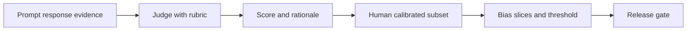
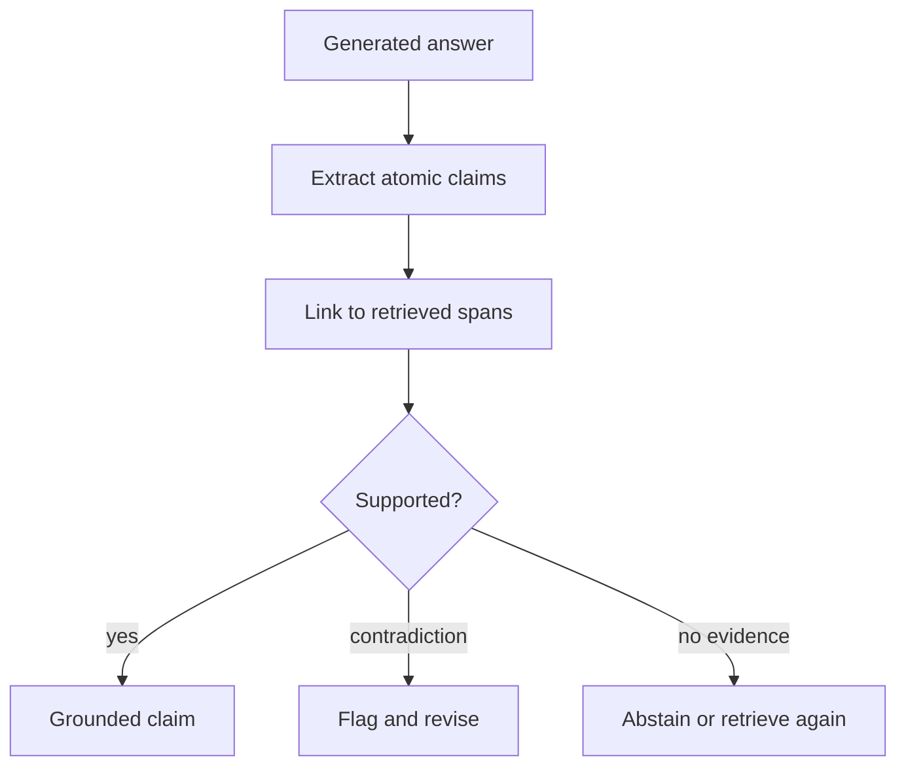
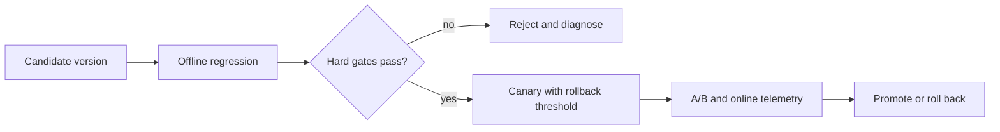
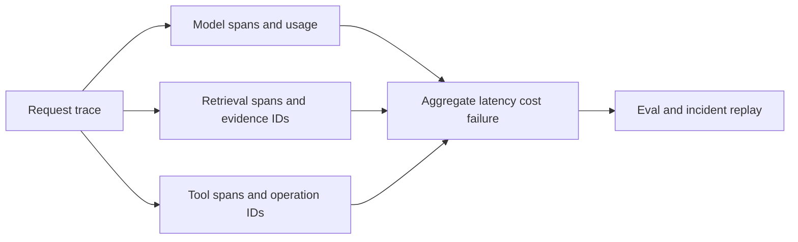
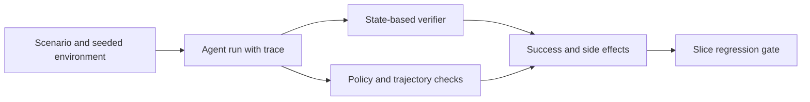

# 跨公司高频题深度答案：评测与可观测性

> 对应原题第一部分 10 道。关键是把离线分层诊断、在线用户效果、权限/安全硬门禁和可回放 trace 连成发布闭环。

## EVAL-01｜Design an LLM-as-judge evaluation. What are its known biases and how do you correct for them?

**原题来源分组**：跨公司高频题 / 评测与可观测性 / 第 1 题。

### 回答

先规定评分维度：正确性、证据支持、安全、格式和任务完成，分别给 rubric、正反例、分值定义。对同一候选答案使用盲评与顺序交换，减少位置偏差；pairwise 比绝对分有时更稳，但也会受长度、语言风格、模型自偏好与提示污染影响。选少量专家标注的校准集，测 judge 与人工一致率、分桶误差和重复打分方差，不把 judge 分数当真值。

避免把参考答案泄漏给候选模型；定期更换隐藏测试和抽样人工复核。对于事实性，最好让 judge 按证据逐主张核对，并允许“不足以判定”。

## EVAL-02｜How do you build an eval set when there is no labelled ground truth and experts are expensive?

**原题来源分组**：跨公司高频题 / 评测与可观测性 / 第 2 题。

### 回答

先从真实日志抽样，不只从演示成功案例选题；按任务类型、语言、用户群、风险等级、文档质量和失败模式分层。用少量专家制定评分标准和种子 gold set，再用弱标注/合成扰动扩展：同一事实的同义问法、权限变化、冲突文档、过期数据和无答案。合成样本不能直接当真实分布，要留人工审核和数据来源标签。

选择主动学习：找模型分歧大、置信度低、线上影响大的样本给专家标注。保存测试数据的版本、来源、授权、文档快照和标注争议；将公开开发集与隐藏回归集隔离，避免开发者不断针对固定题优化。按每条标注的边际收益评估标注预算。

## EVAL-03｜How do you detect and measure hallucinations in a production RAG system?

**原题来源分组**：跨公司高频题 / 评测与可观测性 / 第 3 题。

### 回答

RAG 幻觉分为“检索无证据却编答案”、“证据存在但模型误读”和“引用看似存在却不支持主张”。先把答案拆成原子主张，逐条与授权的 source span 做支持/矛盾/无证据判定，并抽样人工校准；同时记录检索 gold recall、context 截断与拒答率。自信语气和引用数量不是可靠检测信号。

线上采样需覆盖长尾、低频实体、过期文档、多跳和权限切片。度量可报不支持主张率、严重错误率、引用精确率和合理拒答率，不能仅给一个“幻觉百分比”而不说明分母与审核标准。

## EVAL-04｜Design the regression gate that decides whether a prompt or model change ships.

**原题来源分组**：跨公司高频题 / 评测与可观测性 / 第 4 题。

### 回答

发布门禁是版本化实验：固定数据快照、prompt/model/retriever/工具版本与随机种子策略，在隐藏回归集上比较旧版与候选版。核心指标设硬阈值：安全/越权/业务副作用错误零容忍或极低容忍；任务成功、事实性、工具正确率、p95/p99 与成本采用允许的统计区间。对重大子群不能被整体均值掩盖；做配对比较和置信区间，不以微小噪声改进通过发布。

生产灰度监控失败与用户反馈，触发回滚时保留样本与 trace。门禁规则本身要版本化，避免团队临时改阈值放行。

## EVAL-05｜Why do benchmark scores improve while users say the system got worse? Enumerate the reasons.

**原题来源分组**：跨公司高频题 / 评测与可观测性 / 第 5 题。

### 回答

Benchmark 提升而用户体验下降，可能因为测试集污染或过拟合、测试任务权重与真实流量不符、长尾严重失败被均值掩盖、离线单轮与线上多轮/工具状态不同、延迟/成本/稳定性变差、拒答策略或引用可信度变化。先按用户任务、会话长度、地区/语言、付费层级和失败严重度拆分线上反馈，再回放对应 trace。

建立从用户投诉→可复现 case→具体链路（检索、模型、工具、策略、UI）→新回归样本的闭环。在线 A/B 测任务完成、纠错率、重试、放弃率、用户满意度与尾延迟。不要用更多主观 judge 分数解释真实用户反对的行为，先确认评测目标是否错位。

## EVAL-06｜What is benchmark contamination and how do you guard against it?

**原题来源分组**：跨公司高频题 / 评测与可观测性 / 第 6 题。

### 回答

污染包括训练语料直接包含测试题/答案、近重复改写、公开解析/代码被学到，也包括开发过程反复看隐藏集并调 prompt 的“评测过拟合”。文本完全匹配只是最低层；还应做规范化、近重复、语义相似、代码 AST/测试样例重合，以及题目发布时间与训练数据时间戳审计。公开 benchmark 难以彻底证明无污染，因此要用新题、私有题和真实任务。

对泄漏风险分层标注，报告排除疑似污染样本前后的分数，保留可复现的数据 provenance。对模型供应商不可见训练集时，避免宣称绝对无污染，使用动态生成且人工审核的 held-out 任务和过程度量。

## EVAL-07｜What observability does a production LLM system need: traces, spans, costs, feedback?

**原题来源分组**：跨公司高频题 / 评测与可观测性 / 第 7 题。

### 回答

Trace 至少串起 user request、模型调用、prompt 版本、输入/输出 token、模型/参数、检索 query/索引版本、候选 doc IDs、工具调用/参数摘要、授权决策、重试、业务 operation ID 和最终响应。每段记录开始/结束、状态、错误分类、成本与父子 span；同一会话可跨异步队列传播 trace ID。原文证据与敏感数据可保留指针、哈希或受控抽样，不应把 PII 全量灌进日志。

以 SLO 和故障定位需求定义抽样：错误/高风险全采，成功流量按比例；控制存储成本和留存期限。只记录最终回答无法定位检索与工具失败。

## EVAL-08｜How do you manage prompt versioning and rollbacks in production?

**原题来源分组**：跨公司高频题 / 评测与可观测性 / 第 8 题。

### 回答

Prompt 是可发布配置而不是散落代码中的字符串。保存模板、变量 schema、版本号、所有者、目标模型、示例、风险等级及评测结果；每次请求的 trace 记录精确 prompt 版本和模型/工具 schema 版本。改动走 code review、离线回归、灰度、线上指标门禁；回滚恢复整套兼容配置，不只恢复提示词正文。

缓存键、摘要格式和工具参数可能随 prompt 变更，回滚时要考虑会话中已有状态与旧版是否兼容。敏感 system prompt 不应直接写入开放日志；用哈希与受控存储保证可复现。实验期间按用户稳定分桶，避免同一会话跨版本导致难以解释。

## EVAL-09｜Design online evaluation: what do you log, what do you sample, and what do you A/B?

**原题来源分组**：跨公司高频题 / 评测与可观测性 / 第 9 题。

### 回答

线上评测先定义最小化日志：任务类型、模型/检索/工具版本、匿名用户/租户标识、耗时、token、成本、结果状态、引用/反馈指针。错误、高成本、高风险与新版本流量提高抽样比例；人工审查应基于授权和数据留存政策。A/B 以用户或会话稳定分桶，预注册主要指标和护栏指标，避免窥探中途结果反复调阈值。

测用户任务完成、重新提问/纠错、转人工、引用点击、严重错误、权限事件、TTFT/TPOT/p99 和单位任务成本；对样本量和异质性作功效分析。在线隐性反馈有偏差，例如点击不等于正确；用抽样专家标注和投诉回访校准。

## EVAL-10｜How would you evaluate an agent, as opposed to a single model response?

**原题来源分组**：跨公司高频题 / 评测与可观测性 / 第 10 题。

### 回答

Agent 要评估整条轨迹与最终外部状态，而非只评判最后一句话。任务集给出初始环境、用户目标、允许动作与验收谓词；运行后检查文件/数据库/工单等真实状态、是否越权、重复副作用、是否按预算结束。指标包括成功率、部分成功、时间/步骤/token/工具费用、无效循环、恢复率、人工介入比例与严重错误。

工具返回应可模拟超时、429、丢响应、权限拒绝和状态冲突。评测使用确定性环境与多随机种子，区分模型能力、Runtime 容错和工具可靠性。回放时避免再执行不可逆动作，采用沙箱或记录的 observation。
