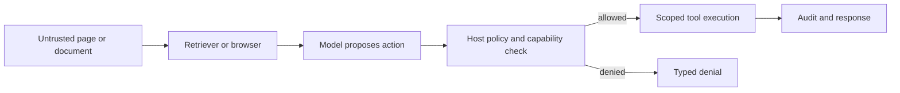
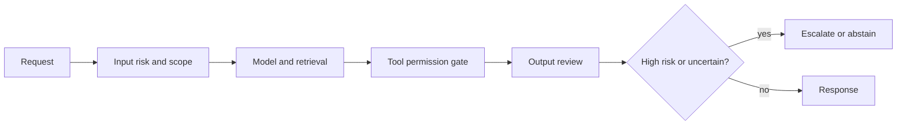
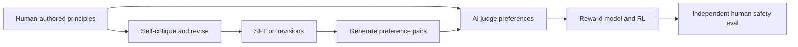
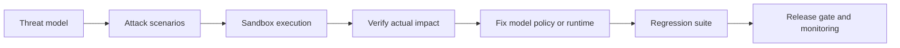

# 跨公司高频题深度答案：安全与负责任 AI

> 对应原题第一部分 10 道。OWASP 题按 2025 版官方目录回答；权限与副作用是 Runtime/业务系统的硬边界。

## SAFE-01｜What is prompt injection (direct and indirect), and what is your layered defence?

**原题来源分组**：跨公司高频题 / 安全、Security 与负责任 AI / 第 1 题。

### 回答

直接注入来自用户输入，间接注入藏在网页、邮件、仓库文件或检索片段等低信任数据中，试图让模型把“数据”当成更高优先级的指令。防线要跨多层：标记内容来源和信任级别、把外部文本限定为引用数据、工具权限最小化、参数/目的地校验、敏感写入审批、出站网络限制和结果审计。单靠“忽略恶意指令”的 system prompt 无法提供硬保证。

测试应覆盖“网页要求读取私有文件再发送到外域”的完整链路，并验证即使模型被诱导，Host 仍阻断越权读和外传。

## SAFE-02｜Walk me through the OWASP Top 10 for LLM applications and which ones actually bite in practice.

**原题来源分组**：跨公司高频题 / 安全、Security 与负责任 AI / 第 2 题。

### 回答

先声明版本：OWASP 2025 LLM Top 10 依次为 Prompt Injection、Sensitive Information Disclosure、Supply Chain、Data and Model Poisoning、Improper Output Handling、Excessive Agency、System Prompt Leakage、Vector and Embedding Weaknesses、Misinformation、Unbounded Consumption。它是风险分类，不是每项都能靠一个过滤器修复。

落地优先按系统威胁模型排序：有工具的 Agent 重点查注入+过度代理权+输出处理；企业 RAG 重点查 ACL/敏感信息/向量与索引污染；开放 API 重点查无限资源消耗、配额和成本。给每项映射一个攻击路径、受保护资产、硬控制和测试。版本名称会变化，面试时不要背旧版编号混用；参考 [OWASP 2025 官方清单](https://genai.owasp.org/llm-top-10/)。

## SAFE-03｜What is the difference between jailbreaking and adversarial prompting?

**原题来源分组**：跨公司高频题 / 安全、Security 与负责任 AI / 第 3 题。

### 回答

Adversarial prompting 是广义的对抗性输入设计，目标可包括误分类、错误推理、泄露或越权；jailbreak 特指诱导模型绕过行为/安全边界的一类攻击。在 LLM 应用里二者与 prompt injection 有交叉：直接恶意提示可能是 jailbreak，外部文档中的恶意指令是间接 injection。判断重点是攻击者控制了哪个输入面、希望改变哪条安全边界，而非争论术语标签。

模型层拒答只是一个控制点；工具与数据授权必须由代码执行。评测应区分“模型给了不应给的文本”和“系统实际读到/写出不应触及的数据或资源”，后者风险更高。记录攻击成功率时要说明攻击预算、目标和评委判据。

## SAFE-04｜Design guardrails for a consumer-facing assistant. Input filters, output filters, or both?

**原题来源分组**：跨公司高频题 / 安全、Security 与负责任 AI / 第 4 题。

### 回答

面向消费者的 guardrails 应由入口、模型/检索、工具执行、出口以及申诉/人工复核组成。入口识别风险类型和用户年龄/地区等必要上下文；出口核查事实主张、PII、禁用内容与格式；有外部动作时，权限、速率和审批是 Runtime 硬约束。单独前置过滤会漏掉在工具结果中出现的恶意内容；单独后置过滤无法阻止已经执行的副作用或敏感数据流向下游。

按风险严重度测漏报与误杀、不同群体的公平性、响应延迟和用户申诉恢复；策略应版本化并可回滚。

## SAFE-05｜What is Constitutional AI and how does it differ from RLHF? What is RLAIF?

**原题来源分组**：跨公司高频题 / 安全、Security 与负责任 AI / 第 5 题。

### 回答

Constitutional AI 用一组明确原则指导模型自批评和改写，再用 AI 依据原则产生偏好反馈，训练偏好模型与 policy；RLAIF 是从 AI Feedback 做强化学习的阶段。传统 RLHF 的偏好主要由人工比较采集；Constitutional AI 可减少逐样本人工标注需求，并让规则可表达，但原则选择、模型评判偏差与真实社会价值仍需人类治理。

它不是“完全没有人类监督”，也不自动解决 prompt injection、越权工具调用或偏见。需要独立红队、帮助性与安全性同时评测。

## SAFE-06｜How do you prevent an agent with tool access from exfiltrating data via a malicious web page?

**原题来源分组**：跨公司高频题 / 安全、Security 与负责任 AI / 第 6 题。

### 回答

威胁模型：Agent 访问恶意网页，网页内容命令它搜索私有文档并通过 URL、邮件或工具参数外传。网页是低信任数据，不能因为经浏览器工具返回就升级成指令。Host 将网页文本与用户请求分离，禁止其扩展授权目标；私有数据读取按当前用户和任务范围授权；外发工具对域名、目的地、数据类别与规模作硬策略校验。高风险跨域动作要求人类审批确切参数。

在沙箱中测试多步链：恶意网页→模型提出私有读取→工具结果→外发请求。记录每一步拒绝原因，确保日志和遥测也不带敏感原文。允许模型读网页不等于允许它按照网页命令调用其他工具。

## SAFE-07｜How do you handle PII in prompts, logs and training data?

**原题来源分组**：跨公司高频题 / 安全、Security 与负责任 AI / 第 7 题。

### 回答

PII 处理先做数据流盘点：用户输入、RAG 文档、prompt、供应商请求、trace、训练集和备份分别存什么、留多久、谁能访问。原则是最小化：非必要字段不发送；必要字段在授权与用途下传递；日志尽可能记录掩码、引用 ID 或摘要，并保留受控原文用于故障排查。脱敏要考虑结构化标识、自由文本和多模态中的隐含个人信息。

训练集需要来源、同意/使用依据、删除与版本追踪，防止“删了线上记录却还在微调数据中”。多租户索引和缓存要以权限范围隔离；开发、评测、客服抽样访问应审计。具体合规义务因司法辖区和数据类型而异，工程方案应由法务/隐私团队核定。

## SAFE-08｜What is mechanistic interpretability and why do labs invest in it?

**原题来源分组**：跨公司高频题 / 安全、Security 与负责任 AI / 第 8 题。

### 回答

Mechanistic interpretability 试图从模型内部激活、特征、回路等机制理解具体计算如何形成行为，而不是只观察输入输出相关性。典型实验会提出可证伪假设，定位候选特征/神经元或注意力路径，通过激活干预、消融与跨样本复现测试其因果作用。它能帮助研究能力、安全行为和潜在欺骗/错误模式，但“找到相关特征”不等于完全解释模型。

评估解释要看忠实度、稳定性、因果干预效果以及是否跨分布泛化。模型内部表征可分布式且依上下文变化，不能把可视化的少数节点当完整安全证明。生产风险控制仍依赖外部权限、监测和评测。

## SAFE-09｜How would you audit a deployed model for differential performance across user groups?

**原题来源分组**：跨公司高频题 / 安全、Security 与负责任 AI / 第 9 题。

### 回答

审计不同用户群性能要先定义合法、必要且可使用的群组维度，并保护敏感属性。对同一任务构造按群体分层且质量可比的数据集，报告正确率、严重错误、拒答、误报/漏报、校准、延迟和申诉结果；同时控制任务难度、语言、设备、访问渠道等混杂因素。整体均值可能掩盖小群体风险，小样本要给置信区间且避免泄露身份。

找到差异后先追溯数据覆盖、检索语料、标注、模型行为和 guardrail 阈值，再试针对性改进并在所有群体回归，防止此消彼长。上线持续监测分群指标和漂移；对高风险决策保留人工复核与纠错路径。

## SAFE-10｜Design a red-teaming programme for a model you are about to release.

**原题来源分组**：跨公司高频题 / 安全、Security 与负责任 AI / 第 10 题。

### 回答

红队计划从资产与威胁模型开始：模型直接有害输出、检索泄露、工具越权、跨租户、提示注入、滥用成本和供应链。定义攻击者控制的输入面与预算、攻击成功判据和风险等级，准备多轮、间接、多模态、语言变体与长上下文场景。红队既要人工探索，也要自动变体，但自动攻击成功需独立核实。

每个发现记录最小复现、业务影响、根因、责任控制层和修复回归；安全门禁对越权副作用设置硬阈值。发布后保留反馈、事件响应与重新评估，避免把一次红队通过当长期安全证明。

## 参考

- [OWASP 2025 LLM Top 10](https://genai.owasp.org/llm-top-10/)
- [Constitutional AI 原论文](https://arxiv.org/abs/2212.08073)
