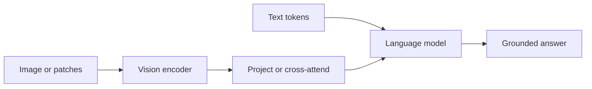
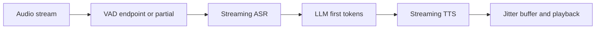
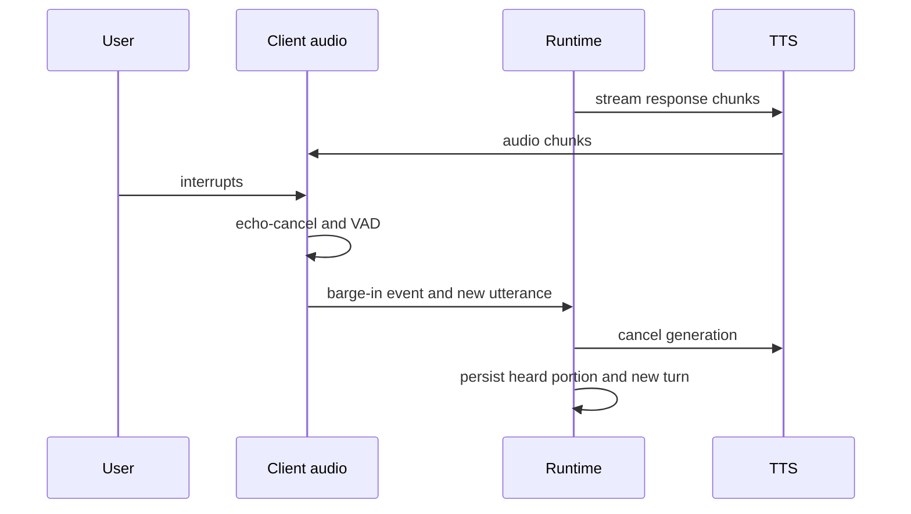
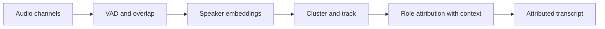
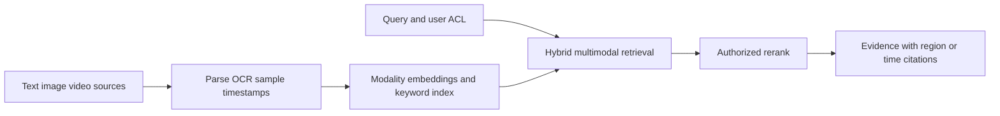

# 跨公司高频题深度答案：多模态、语音与 Voice AI

> 对应原题第一部分 10 道。图示音视频数据流、实时链路和插话时序；模型质量与系统延迟分别评估。

## MM-01｜How do vision-language models get images into an LLM: projector, cross-attention, or native tokens?

**原题来源分组**：跨公司高频题 / 多模态、语音与 Voice AI / 第 1 题。

### 回答

视觉编码器将图像切为 patch 并产生视觉特征，projector 把特征映射到语言模型隐藏维，作为可与文本交互的 token；另一类在 LLM 层使用 cross-attention 访问独立视觉特征；“native tokens”强调在统一序列/表示中训练多模态 token，具体实现仍各异。对比应看 token 数、分辨率、计算、空间定位、训练数据和对齐目标，而非只用接口名称判断能力。

图像会带 OCR 文本和隐藏指令，进入 Agent 时仍是不可信输入。对高分辨率图需要控制 patch 数和局部裁剪，否则细小文字/物体可能丢失。

## MM-02｜What changes when you move from images to video?

**原题来源分组**：跨公司高频题 / 多模态、语音与 Voice AI / 第 2 题。

### 回答

视频比图像多了时间轴、帧间运动和同步信息。简单均匀抽帧会漏掉瞬时事件；全帧高分辨率输入又使 token 数、带宽和延迟迅速膨胀。系统通常做镜头切分、关键帧/事件采样、时间戳编码，必要时加入音频与 ASR，并在长视频中分层总结与检索。时序关系（先后、因果、对象跟踪）不能仅靠对单帧分别做 caption 解决。

评测区分静态画面理解、动作识别、时间定位、多镜头关联和音视频对齐；引用应能回到时间范围/帧，而非只给视频文件名。流式视频还要处理帧乱序、掉帧和实时计算预算。

## MM-03｜Budget the latency for a real-time voice agent: VAD, ASR, LLM, TTS, network. Where does the time go?

**原题来源分组**：跨公司高频题 / 多模态、语音与 Voice AI / 第 3 题。

### 回答

把端到端体验拆成音频采集/网络、VAD 判断话轮、流式 ASR 首片、LLM 首 token、TTS 首音频块和播放缓冲。总首响应延迟近似各段关键路径之和，但流水线可重叠：ASR 部分转写即可触发意图/检索，LLM 未完成时 TTS 可按句分块。必须防止早启动基于错误转写造成无法撤回的语音。

给每段 p50/p95/p99 和网络抖动预算，并测“用户说完到首个有用语音”的感知延迟。降低 VAD 静音阈值可加速但容易截断，过小 TTS 块可降低首音延迟却损害韵律。

## MM-04｜Design barge-in / interruption handling for a voice agent.

**原题来源分组**：跨公司高频题 / 多模态、语音与 Voice AI / 第 4 题。

### 回答

Barge-in 指用户在 Agent 讲话时插话。客户端要同时播放与采集，借助回声消除避免把自身 TTS 当用户语音；VAD/ASR 识别新讲话后，应迅速停止播放、取消未播放音频队列、向 TTS 和 LLM 发送 cancellation，并把实际已播出文本与未播出文本分开记录。否则下一轮上下文会误以为用户已经听到了完整答案。

若已触发业务工具，取消语音不能假装撤销工具；副作用状态独立核对。测试误触发、重叠说话、低信噪比和高网络抖动。

## MM-05｜Cascaded ASR+LLM+TTS versus native speech-to-speech: argue both sides.

**原题来源分组**：跨公司高频题 / 多模态、语音与 Voice AI / 第 5 题。

### 回答

级联 ASR→LLM→TTS 模块可分别替换、调试、审计文本与术语，便于企业权限和工具调用；缺点是 ASR 错误向后传播、跨模块延迟及情感/声学信息丢失。原生 speech-to-speech 可更自然地利用韵律与端到端流式交互，但文本可解释性、工具参数验证、精确转写及可控发音可能更难。也可采用混合结构，用原生音频体验加结构化文本监督和业务工具边界。

选择时比较首音延迟、插话恢复、专有名词、跨语言、可审计性、成本与隐私。业务动作仍需结构化意图、授权和回执；不能让无法解释的音频输出直接驱动副作用。

## MM-06｜How do you evaluate ASR quality beyond WER, and TTS quality when there is no single correct output?

**原题来源分组**：跨公司高频题 / 多模态、语音与 Voice AI / 第 6 题。

### 回答

WER=(替换+删除+插入)/参考词数，语言/分词方式不同会影响比较；要同时看 CER、实体/金额/日期正确率、关键词召回、标点/说话人归属、流式首字延迟与 final 修订次数。对中文或混合语言，不应仅用英文单词级 WER。TTS 无唯一标准输出，可做人工 MOS/偏好、可懂度、发音正确性、韵律自然度、说话人一致性和首音/整体延迟。

评测切片包括口音、噪音、电话编码、重叠语音、代码切换和专业术语；特别统计导致下游工具错误的“关键槽位”识别。自动语音指标不能替代人听与真实对话任务完成率。

## MM-07｜How do you handle code-switching and accents in a production ASR system?

**原题来源分组**：跨公司高频题 / 多模态、语音与 Voice AI / 第 7 题。

### 回答

Code-switching 与口音挑战来自训练分布、发音差异、音素覆盖、语言模型偏置和文本规范化。系统采集经授权的多口音/混语数据，标注语种跨度、借词和专名；选择覆盖多语种的声学/语言模型，词表包含不同文字体系与罗马转写，必要时做领域词注入。解码不能过度强制单语，否则会把混语内容“自动翻译”或幻听。

评估按语言切换点、口音、人群、信噪比和关键实体分桶，不只看整体 WER。给低置信度槽位添加确认或回读流程；例如金额和设备号在执行动作前要求二次确认。

## MM-08｜Explain streaming TTS chunking and jitter-buffer sizing.

**原题来源分组**：跨公司高频题 / 多模态、语音与 Voice AI / 第 8 题。

### 回答

Streaming TTS 先生成可播放的小块以降低首音时间；块太小会破坏跨块韵律、音素边界和编码效率，太大则增加首音延迟。应在句法边界、停顿或足够的文本上下文处分块，让声学模型提前规划语调；合成输出带 sequence number 与时间戳，客户端 jitter buffer 平滑网络抖动并保证连续播放。

缓冲大小取决于网络抖动分布和目标断续率，可动态调节：网络稳定时小缓冲降延迟，抖动增大时扩缓冲防卡顿。监控首音时间、buffer underrun、重排/丢块、尾部音频取消响应和插话打断延迟。不能只报 TTS 实时因子而忽略端到端体验。

## MM-09｜Design a diarisation system and explain how you attribute roles, not just clusters.

**原题来源分组**：跨公司高频题 / 多模态、语音与 Voice AI / 第 9 题。

### 回答

Diarisation 先做 VAD 分段、提取说话人 embedding、聚类或在线跟踪，解决“谁在何时说话”；重叠语音需要允许同一时间多说话人。聚类标签 speaker A/B 不是业务角色。角色归属（医生/患者、客服/客户）还要结合开场身份、声道、对话内容、日程或已授权元数据，并记录置信度及人工纠错。

评估 DER、角色准确率、重叠段表现和由角色错误引起的摘要/行动项错误。电话声道变换和短语音段会降低稳定性；不能把未经确认的声纹身份用于高风险鉴权。

## MM-10｜How would you build multimodal retrieval over images, video and text in one index?

**原题来源分组**：跨公司高频题 / 多模态、语音与 Voice AI / 第 10 题。

### 回答

先统一可检索单元：文本段、图片区域、视频时间片，每条带类型、位置、时间戳、来源 ID、版本和 ACL。多模态 embedding 可把不同模态投到共享空间，但文本精确术语与 OCR、视频时序仍可能需要专门索引；可采用共享向量召回加模态专用 BM25/OCR/时序检索，再融合与 cross-modal rerank。查询结果要回到原图片区域或视频时间窗供模型验证。

测试跨模态召回、时间定位、OCR 误读、权限隔离和增量更新。一个统一向量索引是实现选项，不保证所有模态检索质量最佳。
