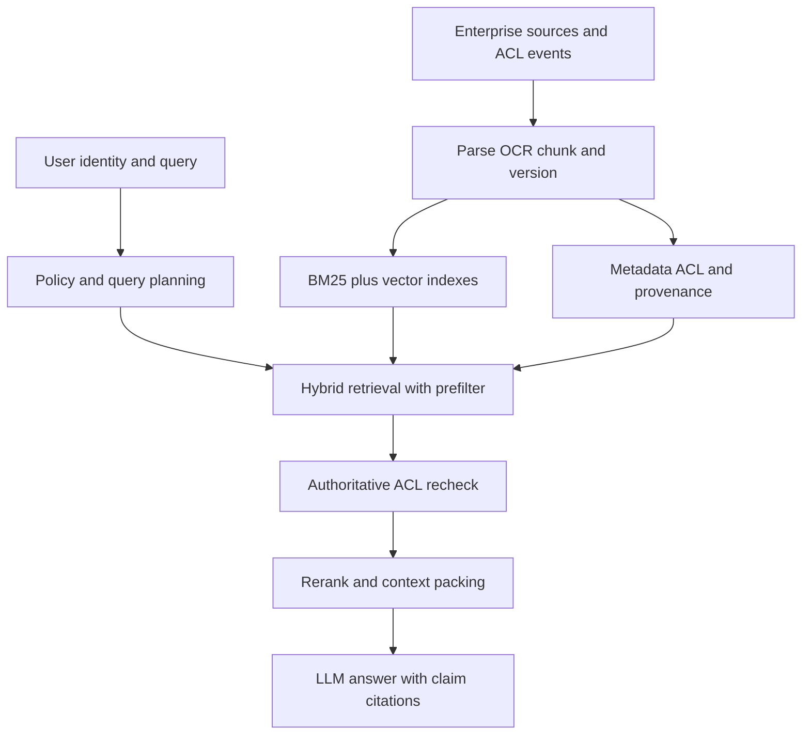
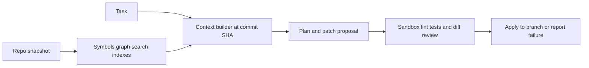
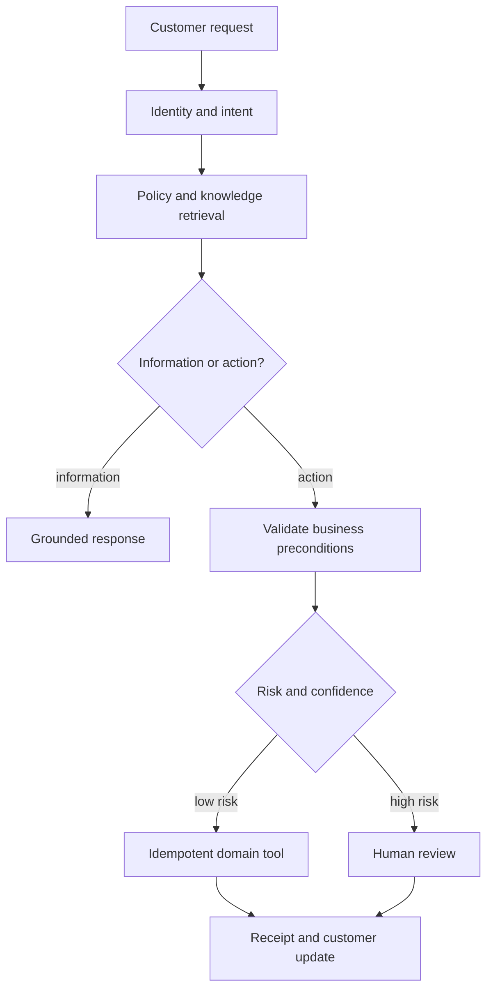
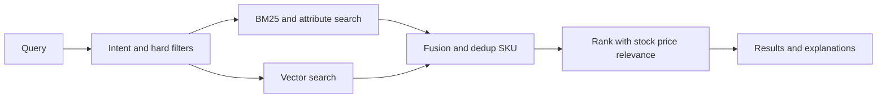
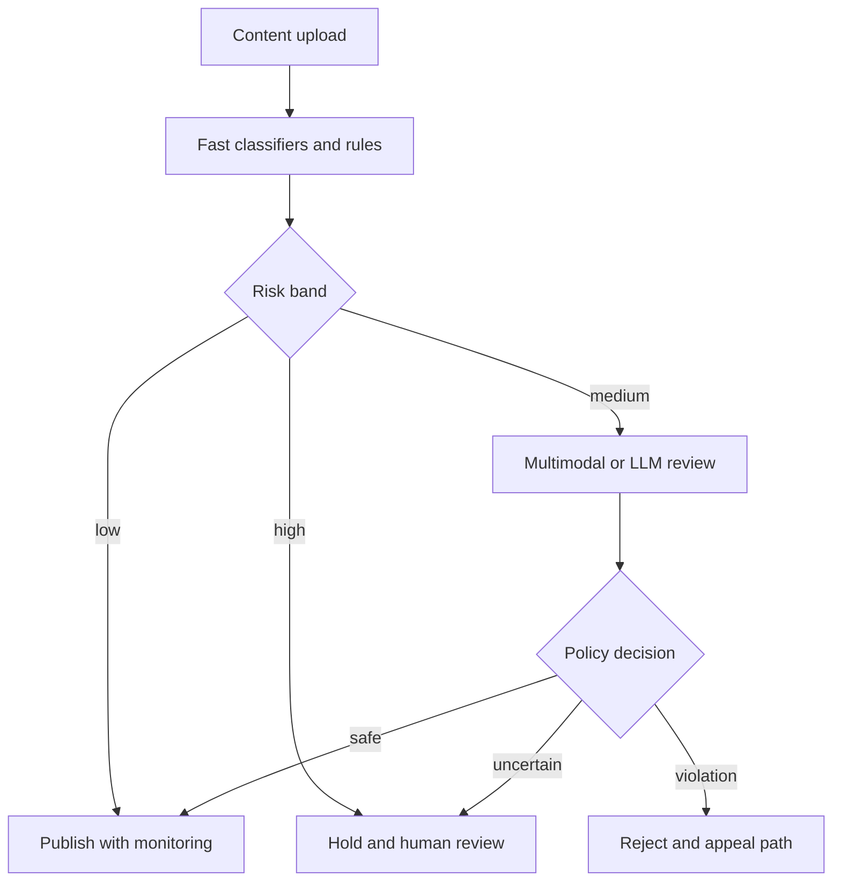
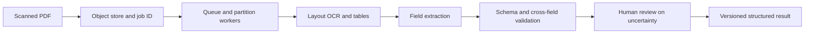
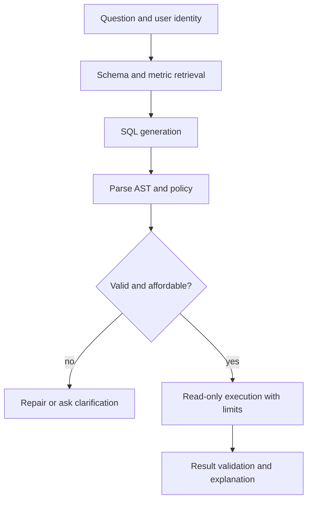
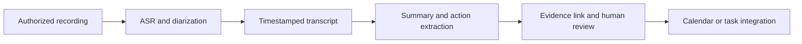
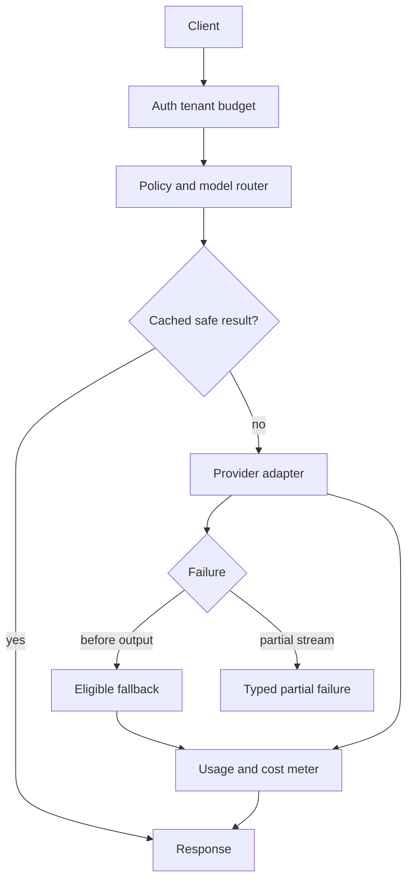
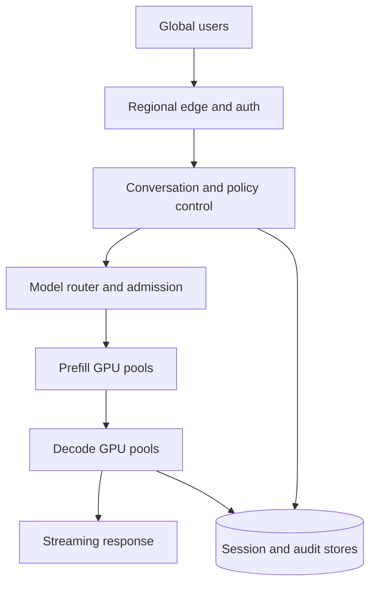

# 跨公司高频题深度答案：AI 系统设计

> 对应原题第一部分 10 道。各题先明确规模与 SLO，再给数据流、授权与失败路径，并定义可验收的指标。

## SYS-01｜Design an enterprise RAG assistant over 10M documents with per-user permissions.

**原题来源分组**：跨公司高频题 / AI 系统设计 / 第 1 题。

### 需求与容量假设

先问 1000 万是文档数还是页/块数、平均长度、更新率、租户数量、QPS、权限模型、p95 SLO。假设每文档切成 c 个块、embedding 维度 d、每维 b 字节，裸向量约 10^7×c×d×b；c=10、d=768、FP16 时约 154 GB 十进制，尚未计 ANN 图/倒排、元数据、冗余与副本。需要分片与生命周期管理，不能把 10M 文档等同于 10M 向量。

索引更新必须处理删除与 ACL 撤销，查询时 fail-closed；候选进入外部 reranker/模型前必须授权。用 gold span 测 Recall@k、越权零泄露、引用支持率、增量索引水位和 p99；长尾权限过滤需单独测召回。缓存键绑定用户/组与 ACL 版本，避免跨租户污染。

## SYS-02｜Design a code assistant: repo indexing, context assembly, edit application, evaluation.

**原题来源分组**：跨公司高频题 / AI 系统设计 / 第 2 题。

### 架构与关键路径

仓库接入通过 webhook + 定期全量对账处理提交，解析语言/符号/依赖/测试，构建文件树、AST/符号索引、BM25 与语义索引，记录 commit SHA 和权限。用户提问时先确定目标分支与 commit，按路径/符号/关键词/语义召回，压缩为带行号与版本的上下文。生成变更时让 Agent 输出可审查 patch，而不是自由覆盖文件；应用前检查基线 SHA、语法、权限、冲突与路径范围。

评测用隐藏任务集与真实仓库：patch 可应用率、测试通过率、真实行为修复率、回归率、无关文件触碰率、token/时间成本。多文件修改需保留依赖图与回滚；执行测试使用沙箱、资源配额和网络限制。模型可建议代码，但最终事实是工作树 diff 与测试/人工审核。

## SYS-03｜Design a customer-support agent that can take real actions, with escalation to humans.

**原题来源分组**：跨公司高频题 / AI 系统设计 / 第 3 题。

### 权限与状态设计

支持 Agent 的工具面应是领域动作：查订单、验证身份、改地址、退款提案、创建工单等，每个动作有输入 schema、授权、幂等键、风险等级和可查询业务回执。知识性问答走授权 RAG；账户变更先核验用户与订单状态；高金额/不可逆动作进入人工审批；低置信度或冲突证据转人工，并传递摘要、证据和待解决问题。

事件状态至少有 PROPOSED、APPROVAL_PENDING、EXECUTING、SUCCEEDED、FAILED、UNKNOWN；超时要查状态，不能重复退款。SLO 包括解决率、重复动作率、转人工率、等待时间与 CSAT；以抽样人工审核校准模型答案。

## SYS-04｜Design semantic search over a large product catalogue.

**原题来源分组**：跨公司高频题 / AI 系统设计 / 第 4 题。

### 数据与查询路径

商品目录含标题、品牌、型号、属性、类目、价格、库存、地区和图像。接入时清洗变体/SKU、单位和同义词，建立关键词倒排、结构化属性过滤和向量索引；query 分类提取硬约束（尺寸、价格、地域、可售），先过滤再混合召回，精排结合语义相关、可售性、质量、个性化和业务目标。业务目标应受相关性底线约束，不能让付费排序压倒用户意图。

目录更新需库存/价格快速同步并对索引版本对账。离线测 Recall@k、NDCG、属性约束违反率和长尾/新商品；在线测点击、加购、转化、退货与零结果率。用曝光偏差校正日志训练，避免热门商品进一步吞噬长尾。

## SYS-05｜Design a content-moderation system combining classifiers and LLMs.

**原题来源分组**：跨公司高频题 / AI 系统设计 / 第 5 题。

### 多层审核与运营闭环

上传先跑文件/元数据规则和轻量分类器，按风险分数分流：低风险放行，中风险用更强多模态模型/LLM 审核，高风险暂缓与人工复核。图像、文字、OCR、音视频片段要联合考虑上下文；LLM 用于复杂语义解释，但不能以生成自由文本作为唯一可审计判据。政策有地区/年龄/产品差异，必须版本化。

按类别测 precision/recall、严重违规漏报、误杀、申诉纠正率、群体差异和审核延迟；在线漂移需抽样已放行内容。保留证据片段和政策版本，形成用户申诉与标注回流。对新模型灰度时设置严重安全回归硬门禁。

## SYS-06｜Design a document-intelligence pipeline: scanned PDFs in, structured fields out, at 10M documents.

**原题来源分组**：跨公司高频题 / AI 系统设计 / 第 6 题。

### 规模与数据契约

1000 万扫描 PDF 先算平均页数、每日增量、OCR 秒/页、峰值吞吐和存储副本；例如平均 5 页就是 5000 万页，处理时间下界由有效页/秒决定。原件进入不可变对象存储，任务队列驱动病毒检查、版面/OCR、表格与字段候选抽取、规则/模型验证、人工复核、结构化结果发布。每阶段以 document ID + version 幂等，失败进死信队列，支持从某阶段重跑。

字段要保存值、页码/bbox、置信度、模型版本、原文裁片；总体验收看字段级准确率、关键金额/日期严重错误率、复核比例、每页成本和 SLA。不能只测 OCR 字符正确率而忽略字段关系、表格跨页与业务校验。

## SYS-07｜Design a Text-to-SQL system over a warehouse with thousands of tables.

**原题来源分组**：跨公司高频题 / AI 系统设计 / 第 7 题。

### Schema 与安全边界

上千张表不能把全部 DDL 塞给模型。先建立语义层：表/列业务别名、关系、主外键、口径、指标定义、行级权限和样例查询；问题进来后识别域与实体，检索少量相关表/字段并构造候选 join path。模型产出受限 SQL AST，解析器验证只读、允许表/列、行级授权、limit、成本估计与参数绑定；执行在只读隔离账户和时间/扫描预算下，结果二次脱敏并附 SQL 与口径解释。

模糊指标先问清时间范围/口径；权限复杂时数据库 RLS 是最后防线，模型提示不构成授权。评测执行正确率、语义口径、越权拦截、超大扫描拒绝、空结果解释和跨表连接错误。

## SYS-08｜Design a meeting assistant: recording, diarisation, summary, action items, integrations.

**原题来源分组**：跨公司高频题 / AI 系统设计 / 第 8 题。

### 实时链路与人工确认

录制前取得授权并明确保留期限；音频流进 VAD、ASR、说话人分离/角色映射，生成带时间戳的转写，再做议题摘要、决定和行动项抽取。行动项包含负责人、事项、截止时间、来源时间片和置信度；写入日历/任务系统前由用户确认，避免模型把讨论中的假设当已承诺任务。迟到音频块或 ASR 修订应能更新草稿，不应重复创建任务。

指标除了 WER，还包括人物/角色正确率、决定/行动项 precision、引用到原音频准确率、首摘要延迟和用户修改率。分租户密钥与权限，支持删除录音及其派生数据。

## SYS-09｜Design an LLM gateway: routing across providers, failover, caching, budgets and rate limits.

**原题来源分组**：跨公司高频题 / AI 系统设计 / 第 9 题。

### 路由与失败路径

Gateway 接统一 API，做身份鉴权、租户预算、token 预测和速率限制，再按任务复杂度、隐私/驻留、上下文长度、质量基线、价格与延迟 SLO 选择模型。每次请求持久化 route decision、模型/参数、提示词版本、成本和 trace；流式请求中途失败是否可切换提供商要谨慎，部分输出可能已交给用户，自动重放也可能重复工具动作。缓存仅用于明确可重用的纯读请求，键需纳入授权和模型版本。

压测按租户突发与混合输出长度，看 p99、429、预算超支、故障切换成功率和质量回归；服务端独立核算实际 token，不能只信客户端声明。

## SYS-10｜Design the serving stack for a consumer chat assistant at hundreds of millions of users.

**原题来源分组**：跨公司高频题 / AI 系统设计 / 第 10 题。

### 多区域架构与容量

数亿用户并不意味着同时在线数亿；先给 DAU、峰值并发、平均输入/输出 token、模型组合、目标 TTFT/TPOT 和地区/隐私约束。入口层做会话路由、鉴权与速率限制；控制层维护模型路由、预算、版本与评测；推理层按区域和模型分 GPU 池，continuous batching、KV 管理和弹性扩容；数据层存会话事件、用户权限、检索索引和审计。请求有状态但 GPU 实例可变：会话 transcript 与生成检查点应可恢复。

算容量先用峰值输出 token/s 除以在目标 SLO 下每 GPU 的可持续输出 token/s，再加冗余；还要单独算 prefill 峰值、KV 总 token、缓存命中与跨区故障。长输出会占 decode 槽，长 prompt 冲击 TTFT；用优先级、限额、降级小模型和排队保护 SLO。故障演练覆盖 GPU 节点失联、重复请求、部分流输出和跨区切换，不能把一次回答的状态放在单机内存当唯一事实。
