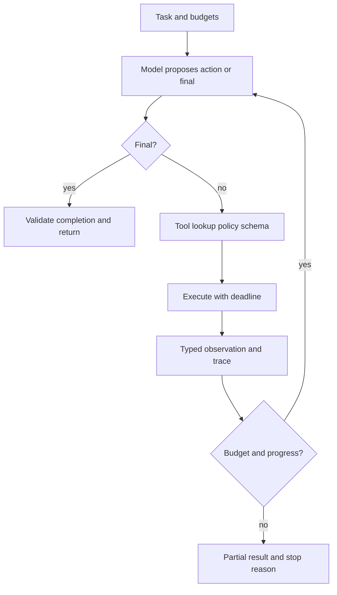

# 跨公司高频题深度答案：编码与数据结构

> 对应原题第一部分 12 道。示例代码展示关键语义；生产实现还需参数验证、并发、资源限制和完整测试。伪代码明确复杂度与边界。

## CODE-01｜Implement scaled dot-product attention with a causal mask, from scratch, in NumPy or PyTorch.

**原题来源分组**：跨公司高频题 / 编码与数据结构 / 第 1 题。

### 实现思路与边界

输入 Q、K、V 形状 [B,H,S,D]。先做 scores=Q@K.transpose(-1,-2)/sqrt(D)，对 j>i 位置用布尔 mask 填 -inf，softmax 在最后维，再乘 V。数值上在 softmax 前按行减最大值；完全被 mask 的行要特别处理，避免全 -inf 产生 NaN。复杂度时间 O(BHS²D)、分数矩阵空间 O(BHS²)。

```python
def causal_attention(q, k, v):
    import math, torch
    s = q @ k.transpose(-1, -2) / math.sqrt(q.size(-1))
    n_q, n_k = q.size(-2), k.size(-2)
    # 本基线仅处理等长 prefill；decode 需加入绝对位置偏移。
    assert n_q == n_k
    mask = torch.triu(torch.ones(n_q, n_k, dtype=torch.bool, device=q.device), 1)
    p = torch.softmax(s.masked_fill(mask, float("-inf")), dim=-1)
    return p @ v
```

测试第 i 个位置不受未来 token 改动影响、行概率和接近 1、dtype 与设备一致。decode 若 Query 长度为 1，mask 不能简单用这个等长三角矩阵，应依据 query 的绝对位置。


## CODE-02｜Implement multi-head attention, then convert it to grouped-query attention.

**原题来源分组**：跨公司高频题 / 编码与数据结构 / 第 2 题。

### 实现思路与边界

MHA 将 X 投影到 Q/K/V，再 reshape Q 为 [B,Hq,S,D]、K/V 为 [B,Hkv,S,D]；MHA 令 Hkv=Hq，GQA 令 Hq 是 Hkv 的整数倍，每个 KV 头服务 group_size=Hq/Hkv 个 Q 头。可用框架的 grouped attention kernel；参考实现可用 repeat_interleave 扩 K/V，但这会物化复制，不能用于高效服务。

```python
def gqa_reference(q, k, v):
    # q [B,Hq,Sq,D], k/v [B,Hkv,Sk,D]
    import math, torch
    groups = q.size(1) // k.size(1)
    assert q.size(1) % k.size(1) == 0 and k.shape == v.shape
    k = k.repeat_interleave(groups, dim=1)
    v = v.repeat_interleave(groups, dim=1)
    scores = q @ k.transpose(-1, -2) / math.sqrt(q.size(-1))
    return torch.softmax(scores, dim=-1) @ v
```

这里省略了 causal/padding mask，正式实现需添加且处理 Sq≠Sk 的 decode 偏移。测试 Hq=Hkv 时与 MHA 相同、组映射正确、KV 缓存物理上仅存 Hkv 头。


## CODE-03｜Implement a KV cache and single-step decode.

**原题来源分组**：跨公司高频题 / 编码与数据结构 / 第 3 题。

### 实现思路与边界

预填充按层保存 K/V 形状 [B,Hkv,S,D]。单步解码先对新 token 做本层 Q/K/V 投影和位置变换，将新 K/V 追加到层级 cache，再让 Q 对全部已缓存 K/V 做 attention。接口需要显式包含 layer、sequence、当前位置、cache 容量和是否取消；真实 serving 不应反复 torch.cat 复制全部历史，应预分配或按块写入。

```python
def decode_step(q_new, k_new, v_new, cache):
    # 参考语义；cache 持有本层已有 K/V 和长度。
    pos = cache.length
    cache.write(pos, k_new, v_new)
    k_all, v_all = cache.view_valid(pos + 1)
    weights = (q_new @ k_all.transpose(-1, -2)) / (q_new.size(-1) ** 0.5)
    return weights.softmax(dim=-1) @ v_all
```

测试与对整个前缀做无 cache 前向的最后位置输出近似相等；检查 RoPE 位置、GQA 组映射、batch 中不同长度、越界和释放。


## CODE-04｜Implement BPE training and encoding from scratch.

**原题来源分组**：跨公司高频题 / 编码与数据结构 / 第 4 题。

### 实现思路与边界

训练维护符号序列与词频，反复统计相邻 token 对频次，选最高频对合并并记录顺序，直到达到目标词表。编码需要与训练相同的预分词和字节映射，按合并优先级应用；解码必须能无损恢复字节。朴素实现每轮重扫语料，成本高；优化可增量更新受影响邻接对，并用堆管理候选，注意过期计数。

```text
vocab ← base byte symbols
repeat until target_size:
    counts ← weighted adjacent-pair counts across corpus
    pair ← argmax(counts) with deterministic tie-break
    replace every non-overlapping occurrence of pair
    append pair to merge_table
encode(text):
    pretokenize; map to bytes; apply merges in learned order
```

边界测试包括连续重复字符（合并不能重叠）、UTF-8 非拉丁文字、数字串、代码空白、未知字节与确定性 tie-break。若跨词边界禁止合并，统计与编码也必须一致。


## CODE-05｜Implement top-k, top-p and temperature sampling over a logits vector.

**原题来源分组**：跨公司高频题 / 编码与数据结构 / 第 5 题。

### 实现思路与边界

先按温度缩放 logits；T=0 单独走 argmax，不能除零。屏蔽禁止 token 后做稳定 softmax；top-k 只保留最大 k；top-p 先降序排序，保留累计概率首次达到 p 的候选（务必包括跨过阈值的 token），再归一化采样。若同时设置 k/p，顺序要明确并在测试中固定。

```python
def sample(logits, temperature=1.0, top_k=None, top_p=None):
    import torch
    if temperature == 0:
        return int(torch.argmax(logits))
    z = logits.float() / temperature
    if top_k is not None:
        cutoff = torch.topk(z, top_k).values[-1]
        z = z.masked_fill(z < cutoff, float("-inf"))
    if top_p is not None:
        vals, idx = torch.sort(z, descending=True)
        probs = torch.softmax(vals, dim=-1)
        remove = (probs.cumsum(-1) - probs) >= top_p
        vals = vals.masked_fill(remove, float("-inf"))
        z = torch.full_like(z, float("-inf")).scatter(0, idx, vals)
    return int(torch.multinomial(torch.softmax(z, dim=-1), 1))
```

补充校验 k>0、0<p≤1、至少保留一个 token、NaN/all -inf、随机种子复现。


## CODE-06｜Implement an LRU cache with O(1) get/put, then add TTL.

**原题来源分组**：跨公司高频题 / 编码与数据结构 / 第 6 题。

### 实现思路与边界

用哈希表 key→双向链表节点，链表头是最近使用，尾是最久未用；get 命中移到头，put 更新或插头，容量满时删尾，均摊 O(1)。TTL 额外存 expires_at：get 时按单调时钟判断过期并删除；put 时重置过期时间。只在访问时惰性删除会让冷过期项占容量，可加入最小堆或时间轮主动清理，但堆的更新/清理不再严格 O(1)，需区分接口时间复杂度与后台维护成本。

```text
get(k): node=map[k]; if missing or expired -> remove/return miss
        move_to_front(node); return node.value
put(k,v,ttl): update/insert with expiry; move_to_front
              while live capacity exceeded: evict tail
```

测试容量 0/1、同 key 覆盖、过期边界、时间跳变与并发。多线程需锁或分片；不要用墙钟倒退影响 TTL 判断。


## CODE-07｜Implement a token-bucket rate limiter, then make it distributed.

**原题来源分组**：跨公司高频题 / 编码与数据结构 / 第 7 题。

### 实现思路与边界

Token bucket 维护容量 C、当前 tokens、补充速率 r（token/s）和 last_refill。请求消耗 cost 时先按 elapsed×r 补充至上限，再原子判断/扣减；瞬时 burst 最多 C，长期速率约 r。LLM API 可用预计输入+最大输出 token 预留，完成后按实际用量结算；否则大量长输出请求会绕过“每请求一次”的限速。

```text
refill(now): tokens=min(C, tokens+(now-last)*r); last=now
allow(cost): refill(now); if tokens>=cost: tokens-=cost; allow
             else: reject with retry_after=(cost-tokens)/r
```

分布式实现使用 Redis Lua 或单键原子事务维护桶状态，时间来源和跨区一致性要定义；单机本地桶只能限制各实例，不能限制全局租户。测试并发扣减、时钟、突发、失败退款与租户隔离。


## CODE-08｜Write an async batch processor over an API with concurrency limits, retries with jitter and error isolation.

**原题来源分组**：跨公司高频题 / 编码与数据结构 / 第 8 题。

### 实现思路与边界

用 bounded queue 加 semaphore 限制真实 in-flight 数，任务结果按文档 ID 独立记录；429 遵循 Retry-After，5xx/网络暂时失败有限指数退避+full jitter，400/401 不原样重试。每个任务设 deadline、attempt budget 和幂等/可重放约束，避免 50,000 文档中的少数坏样本拖垮全批次。若 API 有全局 token/min 配额，semaphore 之外仍需 token bucket。

```python
async def process_one(doc, sem, client):
    async with sem:
        for attempt in range(4):
            try:
                return await client.analyze(doc, timeout=30)
            except RateLimited as e:
                delay = e.retry_after
            except TransientError:
                delay = min(8, 2 ** attempt) * random.random()
            await asyncio.sleep(delay)
        raise Exhausted(doc.id)
```

这是调用骨架，需实现异常类型、失败持久化、checkpoint 与取消传播。测试 429 风暴、个别文档永久失败、进程重启和结果顺序，不可把整个批次一个 try/except。


## CODE-09｜Write a streaming SSE/JSON parser that handles arbitrary chunk boundaries.

**原题来源分组**：跨公司高频题 / 编码与数据结构 / 第 9 题。

### 实现思路与边界

SSE 是流式字节协议，网络 chunk 可以在 UTF-8 字符、行、JSON token 或事件边界任意切开。增量解码 UTF-8；缓冲未完成的行，按空行结束一个 SSE event；逐行解析 field（data/id/event/retry），多个 data 行以换行拼接；直到完整事件才对其 data 做 JSON 解析。处理 CRLF、注释行、空数据、末尾未闭合事件和特殊结束标记。

```text
bytes → incremental UTF-8 decoder → line buffer
      → SSE event accumulator → complete data field
      → JSON parser → typed event
```

不能对每个网络 chunk 调 json.loads，也不能简单用字符串 split 两个换行而忽略 CRLF 与多行 data。设置单事件最大字节数防资源耗尽；重连时按 last event ID 去重，业务动作仍需幂等。


## CODE-10｜Implement a text chunker with overlap that never splits a semantic unit.

**原题来源分组**：跨公司高频题 / 编码与数据结构 / 第 10 题。

### 实现思路与边界

先解析语义单元（标题、段落、句子、代码块、表格行），逐单元累计 token；加入下一单元会超预算时输出当前块，再从末尾取若干完整单元作 overlap。若单个语义单元本身超过预算，必须定义降级规则：代码按语法节点/行、表格按表头+行、长段按句子，仍过长才按 token 边界切，并标记这种例外。不能承诺“绝不拆语义单元”同时又保证任何输入都不超长。

```text
parse → semantic units → pack until token budget
                      → overlap whole units → next chunk
                      → attach title/path/span/version/ACL
```

测试空文档、超长代码块、Unicode、重复 overlap、边界 token 计数与可逆 span 定位；评估检索 Recall@k 和引用质量，不以块数少作为唯一目标。


## CODE-11｜Implement cosine similarity search over embeddings, then explain why you would not ship it.

**原题来源分组**：跨公司高频题 / 编码与数据结构 / 第 11 题。

### 实现思路与边界

对矩阵 X 逐行求 L2 范数，query q 求范数，再计算 Xq/(||X_i||||q||)；零向量需定义返回负无穷或跳过，不能产生 NaN。若 X 与 q 已规范化，余弦排序等价点积排序。朴素 top-k 扫描每个向量，时间 O(Nd)，内存存储 O(Nd)，用于小规模正确性基线。

```python
def topk_cosine(x, q, k):
    import numpy as np
    x = np.asarray(x, dtype=np.float32)
    q = np.asarray(q, dtype=np.float32)
    norm = np.linalg.norm(x, axis=1) * np.linalg.norm(q)
    score = np.divide(x @ q, norm, out=np.full(x.shape[0], -np.inf), where=norm>0)
    return np.argsort(-score, kind="stable")[:k]
```

生产数据量大时全扫描的延迟/内存和更新压力不可接受，需 ANN、分片、量化、过滤和 rerank；然而 ANN 有召回误差，应保留 exact baseline 做校准。


## CODE-12｜Implement a minimal agent loop with tool dispatch, error handling and a step budget.

**原题来源分组**：跨公司高频题 / 编码与数据结构 / 第 12 题。

### 实现思路与边界

最小 loop 要区分模型提议、宿主校验、工具执行和最终答案，维护 step/time/token 预算与结构化状态。工具注册表按精确名称查找，参数经 schema 与权限校验；执行结果包装为 observation，带错误类型和 call ID，再进入下一轮模型。对有副作用调用加幂等键，超时进入 UNKNOWN 并核对业务状态；循环检测重复同参数工具调用。



测试未知工具、坏参数、权限拒绝、429、响应丢失、重复动作、模型永不终止和用户取消。模型文本“已执行”不等于工具成功。
