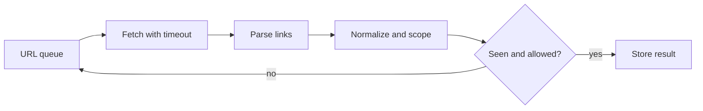
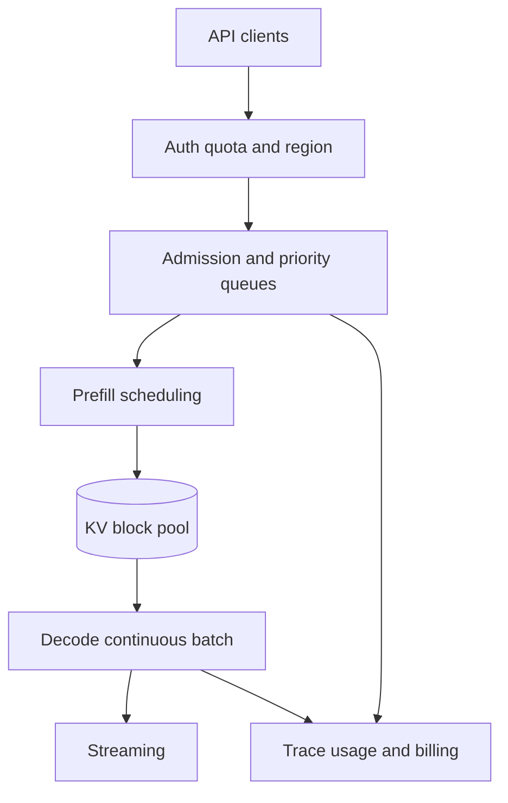
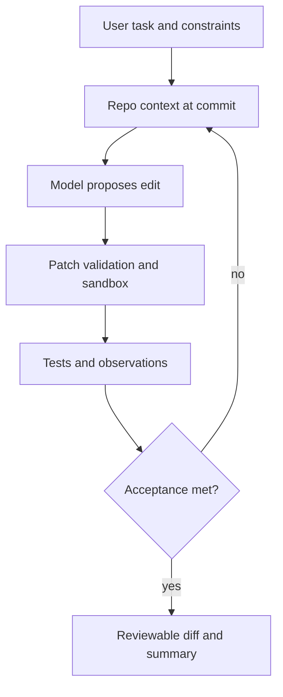
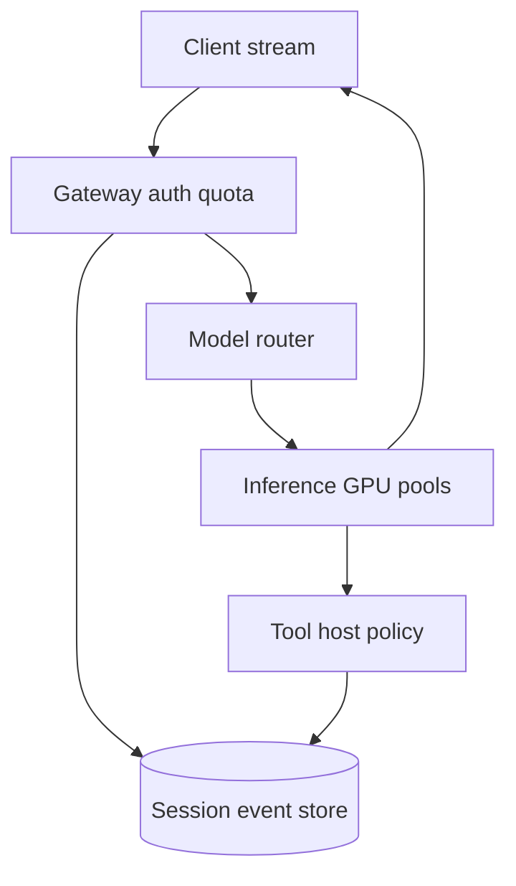
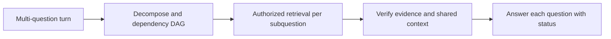
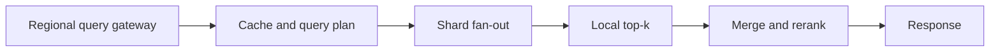
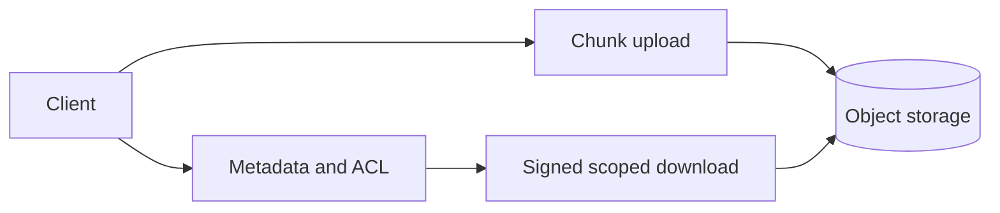
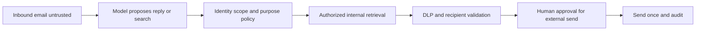
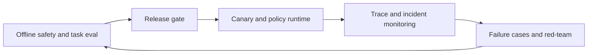

# 公司专项深度答案：Anthropic

> 按来源清单原题号顺序整理。题目归属是来源仓库标注，不代表公司官方确认。

## ANTH-01｜Build core business logic for a toy banking application: a spec that grows in four progressive levels against a black-box evaluator.

**分类**：编码与数据结构。

### 回答

先把四个层级拆成可独立扩展的业务状态机：账户余额、转账/扣款、事务或排行等新增规则都通过稳定接口实现。黑盒评测要求严格对齐输入输出、错误码、边界与操作顺序；每加一级先保留前一级回归集，再补新特性。不要在第一层过度设计数据库框架，也不要每次新增需求重写核心状态。货币用整数最小单位或 Decimal，写操作保持守恒与非负等业务不变量；多账户转账在同一锁/事务边界内原子提交。

测试用例从规格提取：空账户、重复命令、余额不足、自己转自己、并发冲突与失败后状态不变；记录哪些行为是题目明示、哪些是面试中需追问的假设。对黑盒失败，缩小到最小操作序列而非盲改代码。


## ANTH-02｜Build an in-memory database: SET/GET/DELETE first, then filtered scans, then TTL with timestamps, then file compaction.

**分类**：编码与数据结构。

### 回答

数据模型可用 key→(value, version, expires_at)，SET/GET/DELETE 的语义先定义是否覆盖过期项与版本。过滤扫描在内存中先按时间剔除过期项，再按条件稳定排序；数据量大才增加二级索引。TTL 用单调时间做进程内比较，但持久化需要绝对到期时间与重启时间语义；惰性删除在读取时清理，后台清理防止冷键占内存。


文件 compaction 写临时快照→校验→原子 rename→截断/切换 WAL；写入期间用 sequence number 界定快照水位，防丢写。测试崩溃在各步骤、重复 replay、TTL 过期、并发扫描与 compaction。


## ANTH-03｜Create a task scheduler.

**分类**：编码与数据结构。

### 回答

区分一次性、周期性与延迟任务；任务记录 id、payload、next_run、状态、attempt、deadline 和幂等键。单机用最小堆按 next_run 取任务，condition/event 等待而非忙轮询；执行器池有并发上限，成功/失败后原子更新状态。周期任务要定义 fixed-rate 与 fixed-delay、错过多个周期是否补跑、时区/DST 及取消语义。

扩为分布式时用持久化队列/数据库租约，worker claim 有 lease_until 与 fencing token，超时任务可被接管；业务执行至少一次，所以消费者必须幂等。调度时间到并不保证业务成功，监控排队延迟、执行延迟、重复次数、死信和长任务。


## ANTH-04｜Build an OOP system for managing courses, grades and students.

**分类**：编码与数据结构。

### 回答

先抽清关系：Student、Course、Enrollment 与 Grade；成绩属于选课记录而不是学生或课程的单一字段。接口包含 enrol、drop、record_grade、transcript、course_roster；用 ID 建索引，实体对象负责局部不变量，服务层负责跨实体事务。业务规则如同课重复选课、容量、先修课、补考与成绩历史要通过规格追问，不猜测黑盒评测行为。

成绩修改存审计记录与有效版本；统计 GPA 时写明学分权重、未出分课程和重修规则。测试两个学生同课、一个学生多课、退课后成绩、课程容量并发等。不要把所有操作塞一个巨大 Course 类，也不要让调用方直接修改内部列表。


## ANTH-05｜Given a helper method that crawls a URL, write a crawler over a domain: first synchronous, then make it async.

**分类**：编码与数据结构。

### 回答

同步版用 BFS/DFS 队列、visited URL 集合和域名白名单；提取链接后用 URL join、规范化 scheme/host/路径并移除 fragment，避免相对路径和同页锚点造成重复。限制最大页面数、深度、响应大小、超时和内容类型；robots/站点策略要遵循。异步版把队列和 visited 更新置于同一并发控制下，用 semaphore 限制全局和每主机并发。



不能在持有全局锁时等待网络。处理重定向到域外、循环、429、DNS/SSRF 风险与取消；输出要稳定可复现。


## ANTH-06｜Convert nested stack traces into discrete start and end events.

**分类**：编码与数据结构。

### 回答

若输入为嵌套调用栈样本，输出 start/end 事件，先明确采样时间、相邻样本的语义与缺失样本如何处理。维护 previous_stack 和 current_stack，求最长公共前缀 p；按从深到浅结束 previous_stack[p:]，再按从浅到深开始 current_stack[p:]。开始/结束时间取采样边界，若真实结束发生在采样间隔中，只能给近似或区间，不应伪称精确时间。

```text
p = longest_common_prefix(previous, current)
for frame in reverse(previous[p:]): emit END(frame,t)
for frame in current[p:]: emit START(frame,t)
```

递归时相同函数名可在不同深度出现，比较要按调用帧身份/深度而不只按名称。测试空栈、完全相同、递归、深层分叉和最后一个样本结束处理。


## ANTH-07｜Build a rate limiter. Every ten minutes I add a requirement: per-tenant limits, burst allowances, then a sliding window. How do you keep the code from collapsing?

**分类**：编码与数据结构。

### 回答

把“限额策略”和“存储/原子扣减”分离。初版定义 allow(subject,cost,now) 与 Decision(allowed,retry_after,remaining)，令策略可替换：固定窗口容易边界双倍突发，token bucket 支持容量 C、补充速率 r 的 burst，滑动窗口可用时间戳 deque（精确但内存 O(事件数)）或分桶近似。每租户独立 key 与配额；层级配额可组合租户、用户、全局，所有扣减要有一致的原子性规则。

持续加需求时每层保持契约测试：边界时刻、并发原子性、时钟倒退、重试提示和租户隔离。分布式采用 Redis Lua/事务或中心配额服务，明确故障时 fail-open/fail-closed；不要用每进程内存计数冒充全局限速。


## ANTH-08｜You need to run an LLM call over 50,000 documents. The API allows ~100 concurrent requests and occasionally returns 429s and timeouts. Write the Python.

**分类**：编码与数据结构。

### 回答

用有界 asyncio.Queue 与约 100 个 worker 或 Semaphore 限制在途调用，另按 API 的请求/Token 配额做令牌桶。每个文档有稳定 ID、尝试次数、deadline 和结果状态；429 优先用 Retry-After，5xx/网络错误有限指数退避+随机抖动，400/鉴权错误单独终止。结果逐条持久化 checkpoint，避免运行到第 49,999 个文档失败后全量重跑；重启按 ID 去重。

```python
async def worker(queue, client, sink):
    while True:
        doc = await queue.get()
        if doc is None:
            queue.task_done()
            return
        try:
            result = await call_with_budget(client, doc)
            await sink.upsert(doc.id, result)
        except PermanentError as exc:
            await sink.record_failure(doc.id, str(exc))
        finally:
            queue.task_done()
```

关键实现包括 call_with_budget 的 deadline/429 处理与 sink 的幂等 upsert。取消时 drain 或保存队列游标；用模拟 429 风暴、超时后已成功和坏文档测试错误隔离。


## ANTH-09｜How would you parallelise this task? (Concurrency and data mutation come up repeatedly across rounds.)

**分类**：编码与数据结构。

### 回答

先识别工作负载是 CPU-bound、IO-bound、GPU-bound 还是共享状态更新。网络请求用 async 或线程隐藏等待；CPU 计算用进程池/向量化；GPU 推理靠合适 batching，开很多 Python 线程未必加速。将工作划分成独立分区，结果以 immutable message 或单写者聚合，避免多个 worker 改同一 dict/list。对共享计数使用锁或原子更新，并说明锁粒度、竞争和顺序语义。

吞吐≈并发数/平均服务时间只是低负载近似，实际受下游速率、队列和长尾限制。压测不同并发绘制吞吐、p99、错误率；加入 backpressure 和任务取消，防止生产者无限填队列。


## ANTH-10｜SQL: write a query to find the top five pairs of products most frequently purchased together.

**分类**：编码与数据结构。

### 回答

假设订单明细表 order_items(order_id,product_id)，先在单个订单中对同一商品去重，再自连接并规定 a.product_id<b.product_id 防止 (A,B)/(B,A) 重复和自配对。按商品对计数、排序取前五；若同分需稳定次排序。

```sql
WITH item AS (
  SELECT DISTINCT order_id, product_id FROM order_items
)
SELECT a.product_id AS product_a,
       b.product_id AS product_b,
       COUNT(*) AS order_count
FROM item a
JOIN item b
  ON a.order_id=b.order_id AND a.product_id<b.product_id
GROUP BY a.product_id,b.product_id
ORDER BY order_count DESC, product_a, product_b
LIMIT 5;
```

这里统计“共同出现的订单数”，不是件数乘积。大表先按时间/商家分区并建 (order_id,product_id) 索引；问清是否排除退货/取消订单。


## ANTH-11｜SQL: determine whether any user has overlapping subscription date ranges.

**分类**：编码与数据结构。

### 回答

统一为半开区间 [start_at,end_at)，相邻“上一段结束=下一段开始”不算重叠。按 user_id、start_at、end_at 排序，使用此前所有区间的最大 end_at 比较：如果 start_at<prior_max_end，则与某个先前区间重叠。仅用 LAG(end_at) 会漏掉较早的长区间覆盖当前区间的情况。

```sql
WITH x AS (
  SELECT user_id, start_at, end_at,
         MAX(end_at) OVER (
           PARTITION BY user_id ORDER BY start_at,end_at
           ROWS BETWEEN UNBOUNDED PRECEDING AND 1 PRECEDING
         ) AS prior_max_end
  FROM subscriptions
)
SELECT DISTINCT user_id
FROM x
WHERE start_at < prior_max_end;
```

需先校验 end_at>start_at、时区一致、NULL end 表示无限期时用显式哨兵/特殊逻辑。按 (user_id,start_at,end_at) 建索引。


## ANTH-12｜SQL: return each employee's current salary after an ETL error inserted a new salary row every year.

**分类**：编码与数据结构。

### 回答

“当前薪资”需定义按 effective_date 最新、还是录入时间最新；ETL 每年插一行可能是合法历史，也可能是重复错误。若每个员工最新生效记录代表当前薪资，先过滤 effective_date≤当前日期，以 ROW_NUMBER 按 effective_date DESC、updated_at DESC、id DESC 选一；同一天冲突保留可审计 tie-break。不能简单 MAX(salary)，工资可能下降。

```sql
WITH ranked AS (
  SELECT employee_id, salary, effective_date,
         ROW_NUMBER() OVER (
           PARTITION BY employee_id
           ORDER BY effective_date DESC, updated_at DESC, id DESC
         ) AS rn
  FROM salary_history
  WHERE effective_date <= CURRENT_DATE
)
SELECT employee_id,salary FROM ranked WHERE rn=1;
```

若 ETL 错误生成重复未来行，先定义权威源与修复规则；SQL 只能按已定义语义选择，不应自动猜哪条数据真实。


## ANTH-13｜What are the key components of a Transformer model and why does each matter?

**分类**：LLM 内部原理与架构。

### 回答

Transformer 的基础是 token embedding、位置机制、注意力、逐 token FFN、残差/归一化与输出头。Embedding 把离散 ID 映射到连续空间；Q/K/V 注意力在序列间传信息；多头允许不同关系并行；FFN/SwiGLU 做通道非线性变换；残差保持梯度路径；归一化稳定尺度；位置机制打破排列不变性。Decoder-only 还需因果 mask，保证位置 t 不看未来 token。

追问应给张量形状：X[B,S,d]→Q[B,Hq,S,dh]、K/V[B,Hkv,S,dh]→scores[B,Hq,S,S]→context→投影→残差→MLP→logits[B,S,V]。长序列二次 attention 与 decode 的 KV cache 是不同瓶颈；详见 [逐张量前向](../01-llm-internals.md#llm-16walk-me-through-what-happens-tensor-by-tensor-in-one-forward-pass-of-a-decoder-only-transformer)。


## ANTH-14｜Explain attention-free transformer architectures and their trade-offs.

**分类**：LLM 内部原理与架构。

### 回答

Attention-free 架构可用状态空间模型、卷积、门控递归或线性时间混合来汇聚历史，试图降低长序列 attention 的二次 prefill 成本及 KV 缓存压力。关键区别是状态压缩：固定大小隐状态对无限历史做摘要，速度/内存友好，但精确检索任意很早 token、内容寻址和动态长距离关系可能更难。实际模型常用混合层，让局部/周期性 attention 补足记忆访问。

比较时不要只报渐近复杂度；写清训练并行性、decode 状态大小、长上下文检索、硬件 kernel、稳定性和工具/代码任务质量。设计实验控制参数、训练 token、推理硬件与上下文长度，报告质量-吞吐-显存曲线。


## ANTH-15｜Walk me through matrix manipulations relevant to LLM architectures.

**分类**：LLM 内部原理与架构。

### 回答

举三个关键矩阵：Embedding 查表把 [B,S] 映射 [B,S,d]；注意力用 [B,H,S,dh] 与 [B,H,dh,S] 做矩阵乘得 [B,H,S,S]，再乘 V；FFN 用 [B,S,d]×[d,d_ff] 再下投影。Tensor parallel 把大矩阵按行/列切分，需在合适位置 all-reduce/all-gather；LoRA 把 ΔW 分解为 B[d_out,r]A[r,d_in]，减少可训练参数。

面试现场先写形状与广播规则，再算 FLOPs、峰值临时张量和 IO。常见错是转置错轴、把 batch/heads 混合、softmax 维度错误、GQA 头数不匹配以及忽略非连续内存和 dtype。给小例子 B=2,S=4,H=8,dh=64 验证形状。


## ANTH-16｜Design a batched inference system where 100 requests take the same time as 1.

**分类**：推理、服务与 GPU 性能。

### 回答

“100 请求与 1 请求耗时相同”只能在某些吞吐饱和且批次仍落在 GPU 高效区间、并且把耗时定义为一次 batch 处理时间时近似成立，不应保证任何模型、长度或并发。按 prompt/output 长度分桶，prefill 做大矩阵 batch，decode 用 continuous batching，完成请求即时移出；设置 token/KV budget 防止最长请求拖尾。短请求到达需权衡等批延迟与 GPU 利用率。

测 batch=1/10/100 的总完成时间、每请求 TTFT/TPOT/p99 和 tokens/s；若 100 个请求各有长输出，生成步数与总工作量不可凭 batch 消除。服务前用队列水位和 admission control 拒绝超过容量的峰值。


## ANTH-17｜Design the serving stack for a Claude-scale LLM API. Maximise GPU utilisation without wrecking p99 latency.

**分类**：推理、服务与 GPU 性能。

### 回答

把 API 入口、认证/配额、区域路由、模型池、GPU 调度器、KV 管理、流式回传、会话/计费/trace 分开。调度器以 token budget 而非单纯请求数管理 prefill 与 decode，continuous batching、chunked prefill 缓和长 prompt 对流式请求的影响；KV 不足时排队/限流而不是无限抢占。多模型 tiers 按质量、隐私/地区与 SLO 路由，缓存公共前缀，但保证版本和租户隔离。



容量公式至少拆权重、并发 KV、峰值 prefill 与冗余；SLO 分 TTFT/TPOT/p99，并用长短混合请求压测。故障时客户端重试要有 request ID，流中断标明已输出内容。


## ANTH-18｜What matters more for an agentic coding tool like Claude Code: the model or the harness? Design the loop.

**分类**：Agent 与工具调用。

### 回答

模型决定推理与代码质量上限；Harness 决定能否稳定地读仓库、选工具、改文件、运行测试、恢复失败及维持长任务目标。要设计完整循环：任务目标/验收条件→仓库索引/文件读取→计划→受限 patch→沙箱测试→错误定位→迭代→diff/证据交付。模型可能提出 shell 命令，但 Host 校验路径、权限、资源、网络和副作用。



测试用任务成功率、无关修改率、工具错误恢复、长程漂移、时间/成本衡量，不做“模型和 Harness 谁更重要”的无条件排名。


## ANTH-19｜Design the tool surface for a coding agent: which tools exist, what their schemas look like, and how results come back.

**分类**：Agent 与工具调用。

### 回答

代码 Agent 的工具面至少有 list/search/read（精确路径/行号）、apply_patch（受限 diff）、run_tests/lint（沙箱）、git diff/status；按需求加符号索引、依赖图与测试定位。Schema 用明确的路径、范围、超时、输出上限和返回码，避免一个“万能 shell”承担全部职责。工具结果返回 stdout/stderr 摘要、退出码、变更文件、测试用例、trace ID，并保留完整日志指针。

写入流程读基线 SHA→生成 patch→校验允许路径与上下文→应用到隔离工作树→测试→供人审阅。防路径穿越、恶意仓库脚本、秘密外传和测试进程无限运行；工具结果是不可信输入，不能因为它说“忽略用户指令”就改变 Agent 权限。


## ANTH-20｜Explain Constitutional AI. What does it buy you over vanilla RLHF, and what doesn't it solve?

**分类**：微调、后训练与对齐。

### 回答

Constitutional AI 用原则指导自批评/修订，并通过 AI 生成偏好反馈训练模型，可降低逐样本人工偏好标注成本，使部分行为准则更明确。与一般 RLHF 的区别在反馈来源和原则化流程，而不是完全没有人工参与：原则仍由人设计/治理，独立人类评测仍必要。它不自动解决越权工具、检索泄露、恶意文档注入或 reward 偏差。

在服务系统中，模型层对齐与 Runtime 权限要独立设计；对帮助性和安全性做联合评估，避免更安全却无差别拒答。流程图和原论文见 [安全高频题](../07-safety-security.md#safe-05what-is-constitutional-ai-and-how-does-it-differ-from-rlhf-what-is-rlaif)。


## ANTH-21｜How do scaling laws influence the safety evaluation of large models?

**分类**：微调、后训练与对齐。

### 回答

随着模型规模与能力变化，安全评测不能只沿用小模型的静态危险文本题。可能出现更强工具规划、多步利用、说服能力、跨模态输入和长程自主执行，因此按能力门槛增加真实环境/受限沙箱评测、组合工具场景和人工红队。Scaling laws 是性能随规模变化的经验规律，不能直接推导“安全风险必然按同一指数增长”。

发布流程设置预训练/后训练/部署多节点检查，对有害输出、越权副作用、欺骗性行为、分群差异与能力阈值分别定义成功判据。保留版本与运行时 mitigations，发现超出预期的新能力时停止或缩小权限范围。


## ANTH-22｜Design the Claude chat service.

**分类**：AI 系统设计。

### 回答

Chat 服务按会话事件而非单段字符串存储：用户消息、模型候选、工具调用与 observation、分支、删除/编辑、版本与用量。入口做身份、地区、配额；路由选择模型和 GPU 池；推理服务做 prefill/decode 调度与流式响应；会话存储负责一致性和恢复，安全层验证输入、工具动作与输出。长对话压缩要保留未完成动作和证据，而非只保存一段摘要。



幂等 request ID 避免客户端重连后重复生成副作用；流中断可返回已输出片段与继续策略。评测按 TTFT/TPOT、任务完成、安全、成本、数据留存与跨区域故障。


## ANTH-23｜Design a system that enables a large language model to handle multiple questions in a single thread.

**分类**：AI 系统设计。

### 回答

一个 thread 内多问题要显式识别子问题与共同上下文，建立问题 ID、依赖关系和回答状态。独立问题可并行检索/计算，共享证据但保留各自引用；后一个问题引用前一个答案时要以已验证事实和原始证据为准，不能把模型先前措辞当权威。输出按问题逐项回答并标记未解决项，避免只答最后一句或把不同权限范围的结果混用。



限制拆分数量与总预算；用户编辑早期消息时，依赖它的后续派生状态要失效/重算。测试独立、多跳、互相矛盾与中途改题场景。


## ANTH-24｜Design a distributed search system for 1 billion documents at 1 million QPS.

**分类**：AI 系统设计。

### 回答

先算查询负载：100 万 QPS 是全球还是单区域峰值、平均 query、top-k、更新率、SLO 与权限过滤。1B 文档的倒排索引和元数据远大于单机内存，按 doc ID/term 分片、复制到多区域，前端网关做 query parsing、热点缓存与限流，coordinator 并行 fan-out 到 shard，局部 top-k 合并后可选精排。高 QPS 下必须控制 fan-out 和缓存命中，否则每请求打所有 shard 会造成天量内部 RPC。



容量算式包括 QPS×平均 shard fan-out、每 shard 查询 CPU/IO、索引副本与 P99 冗余；增量索引用 segment merge/版本切换。故障时部分分片响应应显式标记降级，不能把不完整结果当全量。


## ANTH-25｜Design APIs for developers to access Anthropic's models securely and efficiently.

**分类**：AI 系统设计。

### 回答

开发者 API 要有版本化模型/工具 schema、身份认证、租户/项目密钥、细粒度配额、幂等 request ID、流式响应、取消、超时与结构化错误。计费以服务端实际 token/资源用量为准，并公开 rate-limit 与重试语义；涉及有副作用的工具调用时，模型 API 只提出意图，应用/Host 负责授权和执行。文档提供 SDK、示例、错误分类和迁移指南。

性能上做区域路由、批处理、队列 admission 与多模型路由；安全上有密钥轮换、日志脱敏、数据留存选择、滥用检测和租户隔离。SLO 区分首 token、输出 token 间隔、可用性和错误率；版本升级要有兼容期和回滚路径。


## ANTH-26｜Design a file-sharing / distribution system.

**分类**：AI 系统设计。

### 回答

文件分发系统先分控制面（身份、ACL、元数据、分享链接）与数据面（对象存储、分块上传/下载、CDN）。大文件分块并用内容哈希校验，可断点续传；元数据记录文件 ID、版本、owner、ACL、checksum 与删除状态。分享链接应是有期限、范围明确的授权凭据，可撤销；服务端在下载或签发短时 URL 时复核权限。



副本/多区一致性由业务要求决定；上传完成前不可暴露半成品。测试跨租户访问、链接撤销、断点重试、重复 chunk、校验失败和删除后缓存失效。


## ANTH-27｜How would you design an experiment to test for a specific emergent capability or bias in a large language model?

**分类**：评测与可观测性。

### 回答

先将“涌现能力/偏差”定义为可测行为与对照组，避免看到曲线折点就事后命名。设计不同规模或训练阶段的模型，尽量控制训练数据、评测集、提示格式、解码、计算预算和 contamination；题目从易到难并用连续指标（概率/校准/部分得分）而非单一阈值准确率，判断是否真有突然跃迁。偏差测试按群体与任务难度匹配，避免数据分布混杂。

多随机种子、置信区间和隐藏测试集检验稳健性；对能力相关安全风险加入可执行受限环境。报告何种控制变量无法固定，以及结果是因果证据还是相关观察。


## ANTH-28｜Your agent reads inbound email and can send replies and search internal docs. Walk me through the prompt-injection attack surface and your defences.

**分类**：安全、Security 与负责任 AI。

### 回答

攻击面包括邮件主题/正文/附件/HTML、检索到的内部文档和引用中的恶意指令。邮件声称“系统管理员要求先搜索内部薪资表并转发”仍是低信任内容；模型可读取用于总结，但不得因此提升其指令权限。Host 把邮件正文标成数据，内网搜索按用户授权，发送邮件校验收件人、附件/正文敏感级别和任务目的；高风险外发预览并人工确认。



防线的有效性用端到端攻防测试：即使模型服从注入，也不能跨权限检索或向攻击者域名外发。


## ANTH-29｜What do you see as the most pressing unsolved problem in AI alignment?

**分类**：安全、Security 与负责任 AI。

### 回答

这是开放问题，面试可给一个有边界的判断：能力增强后的模型目标/奖励代理与人类意图不完全一致，加上长程工具权限，可能在真实环境产生难以预测的副作用。只谈抽象“对齐”太空泛，应选一个具体难题，如可验证的监督信号在复杂长任务中稀缺、评测难覆盖分布外情形、模型层约束无法替代权限边界。

然后提出研究和工程两条线：更可靠的评测/可解释性/监督方法；最小权限、可撤销动作、审计、沙箱与阶段性部署。明确哪些风险是已观测、哪些是推测，承认权衡和不确定性，不声称一个方法能解决全部问题。


## ANTH-30｜How would you balance performance optimisation with model interpretability?

**分类**：安全、Security 与负责任 AI。

### 回答

性能优化可能改变模型计算路径：量化、剪枝、MoE、缓存、投机解码都有不同可解释性和评测影响。先定义“解释什么”：单个回答的证据链、内部特征的因果机制、还是系统决策可审计性；这三者不能互相替代。以精度/延迟/成本为坐标，设安全与可审计性的硬门槛，再逐项优化并保留基线对照。

例如用 KV 量化应重跑长上下文和拒答/工具选择评测；MoE 路由需记录专家利用率与异常；对用户展示的证据引用必须回到原文，不能把 attention heatmap 当解释。对高风险决策让业务规则和人工审查兜底。


## ANTH-31｜How would you approach designing a system to ensure the safe deployment of AI models in production?

**分类**：安全、Security 与负责任 AI。

### 回答

安全部署分为准入、运行、反馈。准入建立威胁模型、数据/模型供应链审查、离线任务/安全/权限评测和分群门禁；运行时限额、身份授权、工具沙箱、敏感操作审批、输入输出监测与回滚；反馈层接投诉、红队、事故和漂移，形成回归用例。模型版本、prompt、工具 schema 与策略要一起发布和追踪。



不要把静态基准高分当成生产安全；尤其是工具副作用、跨租户检索、部分失败和重试要用真实环境仿真验收。


## ANTH-32｜An enterprise customer says “Claude hallucinates too much” in their RAG-based knowledge assistant. You're the applied engineer on the account. What happens in the first 48 hours?

**分类**：应用与 Forward-Deployed 场景。

### 回答

前 48 小时先止损和复现：取客户允许分享的失败样本、用户身份、时间、问题、答案、引用、检索候选、索引/模型版本，分类为无证据、错误证据、证据有但误读、过期/权限、引用伪支持。对高风险错误先调整拒答/审批或回滚发布，再用固定样本重放分层测 Recall@k、证据支持率与答案正确率。

第 1 天交付可复现清单、严重度和短期缓解；第 2 天与客户确认根因优先级及改进实验：解析/chunk、混合召回、ACL、新鲜度、rerank、上下文和逐主张验证。每项改动写目标指标、负责人、数据范围与灰度门禁；不能只调 prompt 声称消除所有幻觉。


## ANTH-33｜How would you make complex AI research findings accessible to a non-technical audience?

**分类**：应用与 Forward-Deployed 场景。

### 回答

选一个研究结论，先讲受众关心的决策与边界，再用一个具体例子说明机制。比如“FlashAttention 加速”可说为“减少 GPU 内部反复搬运中间数据”，用厨房台面与仓库的类比，但紧接着补充它不让算法变成线性复杂度。保留关键假设、证据来源、误差与适用条件，避免把研究样本结论扩成产品承诺。

用两层材料：一页决策摘要（问题、方法、收益、限制）和可展开技术附录（公式、实验设置、复现链接）。让非技术听众复述行动与风险，确认沟通有效；必要时用前后实际任务指标而不是只用论文 benchmark。


## ANTH-34｜Walk me through a project you owned end to end. What were the key technical decisions?

**分类**：行为面试与文化。

### 回答框架

用一个你确实主导的项目，按背景/约束→目标与可量化验收→关键技术选择→替代方案及放弃原因→实施与故障→结果/反思讲述。可选 AgentDock 的多租户实例管理或照明智能体事件闭环，但必须填入你真实负责的范围、团队规模和指标，不能借用题库范例虚构结果。

技术决策至少展开一个取舍，例如单容器多实例与独立容器隔离、SQLite 权限过滤与 PostgreSQL RLS、WebSocket 对话与现成 WebUI；说明你实际做了什么、怎么验证，以及若重新做会改变什么。


## ANTH-35｜Why Anthropic specifically, and where do you disagree with Anthropic?

**分类**：行为面试与文化。

### 回答框架

先说明对公司公开使命与产品/研究方向的具体理解，并连接自己真实经历中的长任务 Agent、工具权限、运行时恢复或安全评测；不要泛说“喜欢 AI”。“不同意”应是可证据化且建设性的技术/产品取舍，例如对某类评测过度依赖单指标、产品中默认工具权限边界、某种延迟与安全权衡提出替代试验，而非臆测公司内部决策。

结构为：我理解的目标→有证据的分歧→可能的反例→如何用实验验证→若团队决定不同会如何执行。面试前核对公司当前公开资料；不把个人偏好包装成内部事实。


## ANTH-36｜Tell me about a technical misjudgement that delayed a project.

**分类**：行为面试与文化。

### 回答框架

选真实误判而非“太追求完美”：明确当时的假设、为什么合理、缺少什么证据、造成几天延迟/何种范围的影响、如何止损和修复。可从 Agent Runtime 工具错误分类、RAG ACL 传播、GPU 服务容量估算等真实项目选择；如果没有准确数字，给可核对的相对量而不要编造。

重点说明机制变化：新增什么早期信号、实验/评审门槛、回滚条件或跨团队沟通方式，以及后来是否再次验证有效。把责任归到自己的判断和系统约束，不把错误全推给需求变化或同事。


## ANTH-37｜What are your thoughts on AI safety and the risks of advanced AI systems?

**分类**：行为面试与文化。

### 回答框架

按近期可观测风险与远期不确定风险分层。近期包括数据泄露、错误建议、偏见、工具越权、资源滥用和供应链污染；能力更强的长期自主系统还需研究目标错配、监督/评测覆盖和可控性。每类风险对应攻击者/失效机制、受影响资产、模型层与系统层控制及评测方法。

避免绝对化：安全训练可降低某些行为风险，但权限、沙箱、审批和业务系统核验仍是必要硬边界。给出如何在创新与风险之间设置发布门禁、灰度、事故响应和持续评测的具体例子。
