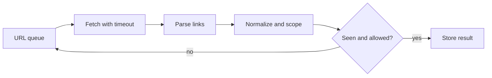

# 公司专项深度答案：Anthropic

> 按来源清单原题号顺序整理。题目归属是来源仓库标注，不代表公司官方确认。

## ANTH-01｜Build core business logic for a toy banking application: a spec that grows in four progressive levels against a black-box evaluator.

**分类**：编码与数据结构。

### 回答

先把四个层级拆成可独立扩展的业务状态机：账户余额、转账/扣款、事务或排行等新增规则都通过稳定接口实现。黑盒评测要求严格对齐输入输出、错误码、边界与操作顺序；每加一级先保留前一级回归集，再补新特性。不要在第一层过度设计数据库框架，也不要每次新增需求重写核心状态。货币用整数最小单位或 Decimal，写操作保持守恒与非负等业务不变量；多账户转账在同一锁/事务边界内原子提交。

测试用例从规格提取：空账户、重复命令、余额不足、自己转自己、并发冲突与失败后状态不变；记录哪些行为是题目明示、哪些是面试中需追问的假设。对黑盒失败，缩小到最小操作序列而非盲改代码。


## ANTH-02｜Build an in-memory database: SET/GET/DELETE first, then filtered scans, then TTL with timestamps, then file compaction.

**分类**：编码与数据结构。

### 回答

数据模型可用 key→(value, version, expires_at)，SET/GET/DELETE 的语义先定义是否覆盖过期项与版本。过滤扫描在内存中先按时间剔除过期项，再按条件稳定排序；数据量大才增加二级索引。TTL 用单调时间做进程内比较，但持久化需要绝对到期时间与重启时间语义；惰性删除在读取时清理，后台清理防止冷键占内存。


文件 compaction 写临时快照→校验→原子 rename→截断/切换 WAL；写入期间用 sequence number 界定快照水位，防丢写。测试崩溃在各步骤、重复 replay、TTL 过期、并发扫描与 compaction。


## ANTH-03｜Create a task scheduler.

**分类**：编码与数据结构。

### 回答

区分一次性、周期性与延迟任务；任务记录 id、payload、next_run、状态、attempt、deadline 和幂等键。单机用最小堆按 next_run 取任务，condition/event 等待而非忙轮询；执行器池有并发上限，成功/失败后原子更新状态。周期任务要定义 fixed-rate 与 fixed-delay、错过多个周期是否补跑、时区/DST 及取消语义。

扩为分布式时用持久化队列/数据库租约，worker claim 有 lease_until 与 fencing token，超时任务可被接管；业务执行至少一次，所以消费者必须幂等。调度时间到并不保证业务成功，监控排队延迟、执行延迟、重复次数、死信和长任务。


## ANTH-04｜Build an OOP system for managing courses, grades and students.

**分类**：编码与数据结构。

### 回答

先抽清关系：Student、Course、Enrollment 与 Grade；成绩属于选课记录而不是学生或课程的单一字段。接口包含 enrol、drop、record_grade、transcript、course_roster；用 ID 建索引，实体对象负责局部不变量，服务层负责跨实体事务。业务规则如同课重复选课、容量、先修课、补考与成绩历史要通过规格追问，不猜测黑盒评测行为。

成绩修改存审计记录与有效版本；统计 GPA 时写明学分权重、未出分课程和重修规则。测试两个学生同课、一个学生多课、退课后成绩、课程容量并发等。不要把所有操作塞一个巨大 Course 类，也不要让调用方直接修改内部列表。


## ANTH-05｜Given a helper method that crawls a URL, write a crawler over a domain: first synchronous, then make it async.

**分类**：编码与数据结构。

### 回答

同步版用 BFS/DFS 队列、visited URL 集合和域名白名单；提取链接后用 URL join、规范化 scheme/host/路径并移除 fragment，避免相对路径和同页锚点造成重复。限制最大页面数、深度、响应大小、超时和内容类型；robots/站点策略要遵循。异步版把队列和 visited 更新置于同一并发控制下，用 semaphore 限制全局和每主机并发。



不能在持有全局锁时等待网络。处理重定向到域外、循环、429、DNS/SSRF 风险与取消；输出要稳定可复现。


## ANTH-06｜Convert nested stack traces into discrete start and end events.

**分类**：编码与数据结构。

### 回答

若输入为嵌套调用栈样本，输出 start/end 事件，先明确采样时间、相邻样本的语义与缺失样本如何处理。维护 previous_stack 和 current_stack，求最长公共前缀 p；按从深到浅结束 previous_stack[p:]，再按从浅到深开始 current_stack[p:]。开始/结束时间取采样边界，若真实结束发生在采样间隔中，只能给近似或区间，不应伪称精确时间。

```text
p = longest_common_prefix(previous, current)
for frame in reverse(previous[p:]): emit END(frame,t)
for frame in current[p:]: emit START(frame,t)
```

递归时相同函数名可在不同深度出现，比较要按调用帧身份/深度而不只按名称。测试空栈、完全相同、递归、深层分叉和最后一个样本结束处理。


## ANTH-07｜Build a rate limiter. Every ten minutes I add a requirement: per-tenant limits, burst allowances, then a sliding window. How do you keep the code from collapsing?

**分类**：编码与数据结构。

### 回答

把“限额策略”和“存储/原子扣减”分离。初版定义 allow(subject,cost,now) 与 Decision(allowed,retry_after,remaining)，令策略可替换：固定窗口容易边界双倍突发，token bucket 支持容量 C、补充速率 r 的 burst，滑动窗口可用时间戳 deque（精确但内存 O(事件数)）或分桶近似。每租户独立 key 与配额；层级配额可组合租户、用户、全局，所有扣减要有一致的原子性规则。

持续加需求时每层保持契约测试：边界时刻、并发原子性、时钟倒退、重试提示和租户隔离。分布式采用 Redis Lua/事务或中心配额服务，明确故障时 fail-open/fail-closed；不要用每进程内存计数冒充全局限速。


## ANTH-08｜You need to run an LLM call over 50,000 documents. The API allows ~100 concurrent requests and occasionally returns 429s and timeouts. Write the Python.

**分类**：编码与数据结构。

### 回答

用有界 asyncio.Queue 与约 100 个 worker 或 Semaphore 限制在途调用，另按 API 的请求/Token 配额做令牌桶。每个文档有稳定 ID、尝试次数、deadline 和结果状态；429 优先用 Retry-After，5xx/网络错误有限指数退避+随机抖动，400/鉴权错误单独终止。结果逐条持久化 checkpoint，避免运行到第 49,999 个文档失败后全量重跑；重启按 ID 去重。

```python
async def worker(queue, client, sink):
    while True:
        doc = await queue.get()
        if doc is None:
            queue.task_done()
            return
        try:
            result = await call_with_budget(client, doc)
            await sink.upsert(doc.id, result)
        except PermanentError as exc:
            await sink.record_failure(doc.id, str(exc))
        finally:
            queue.task_done()
```

关键实现包括 call_with_budget 的 deadline/429 处理与 sink 的幂等 upsert。取消时 drain 或保存队列游标；用模拟 429 风暴、超时后已成功和坏文档测试错误隔离。


## ANTH-09｜How would you parallelise this task? (Concurrency and data mutation come up repeatedly across rounds.)

**分类**：编码与数据结构。

### 回答

先识别工作负载是 CPU-bound、IO-bound、GPU-bound 还是共享状态更新。网络请求用 async 或线程隐藏等待；CPU 计算用进程池/向量化；GPU 推理靠合适 batching，开很多 Python 线程未必加速。将工作划分成独立分区，结果以 immutable message 或单写者聚合，避免多个 worker 改同一 dict/list。对共享计数使用锁或原子更新，并说明锁粒度、竞争和顺序语义。

吞吐≈并发数/平均服务时间只是低负载近似，实际受下游速率、队列和长尾限制。压测不同并发绘制吞吐、p99、错误率；加入 backpressure 和任务取消，防止生产者无限填队列。


## ANTH-10｜SQL: write a query to find the top five pairs of products most frequently purchased together.

**分类**：编码与数据结构。

### 回答

假设订单明细表 order_items(order_id,product_id)，先在单个订单中对同一商品去重，再自连接并规定 a.product_id<b.product_id 防止 (A,B)/(B,A) 重复和自配对。按商品对计数、排序取前五；若同分需稳定次排序。

```sql
WITH item AS (
  SELECT DISTINCT order_id, product_id FROM order_items
)
SELECT a.product_id AS product_a,
       b.product_id AS product_b,
       COUNT(*) AS order_count
FROM item a
JOIN item b
  ON a.order_id=b.order_id AND a.product_id<b.product_id
GROUP BY a.product_id,b.product_id
ORDER BY order_count DESC, product_a, product_b
LIMIT 5;
```

这里统计“共同出现的订单数”，不是件数乘积。大表先按时间/商家分区并建 (order_id,product_id) 索引；问清是否排除退货/取消订单。


## ANTH-11｜SQL: determine whether any user has overlapping subscription date ranges.

**分类**：编码与数据结构。

### 回答

统一为半开区间 [start_at,end_at)，相邻“上一段结束=下一段开始”不算重叠。按 user_id、start_at、end_at 排序，使用此前所有区间的最大 end_at 比较：如果 start_at<prior_max_end，则与某个先前区间重叠。仅用 LAG(end_at) 会漏掉较早的长区间覆盖当前区间的情况。

```sql
WITH x AS (
  SELECT user_id, start_at, end_at,
         MAX(end_at) OVER (
           PARTITION BY user_id ORDER BY start_at,end_at
           ROWS BETWEEN UNBOUNDED PRECEDING AND 1 PRECEDING
         ) AS prior_max_end
  FROM subscriptions
)
SELECT DISTINCT user_id
FROM x
WHERE start_at < prior_max_end;
```

需先校验 end_at>start_at、时区一致、NULL end 表示无限期时用显式哨兵/特殊逻辑。按 (user_id,start_at,end_at) 建索引。


## ANTH-12｜SQL: return each employee's current salary after an ETL error inserted a new salary row every year.

**分类**：编码与数据结构。

### 回答

“当前薪资”需定义按 effective_date 最新、还是录入时间最新；ETL 每年插一行可能是合法历史，也可能是重复错误。若每个员工最新生效记录代表当前薪资，先过滤 effective_date≤当前日期，以 ROW_NUMBER 按 effective_date DESC、updated_at DESC、id DESC 选一；同一天冲突保留可审计 tie-break。不能简单 MAX(salary)，工资可能下降。

```sql
WITH ranked AS (
  SELECT employee_id, salary, effective_date,
         ROW_NUMBER() OVER (
           PARTITION BY employee_id
           ORDER BY effective_date DESC, updated_at DESC, id DESC
         ) AS rn
  FROM salary_history
  WHERE effective_date <= CURRENT_DATE
)
SELECT employee_id,salary FROM ranked WHERE rn=1;
```

若 ETL 错误生成重复未来行，先定义权威源与修复规则；SQL 只能按已定义语义选择，不应自动猜哪条数据真实。
