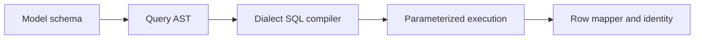
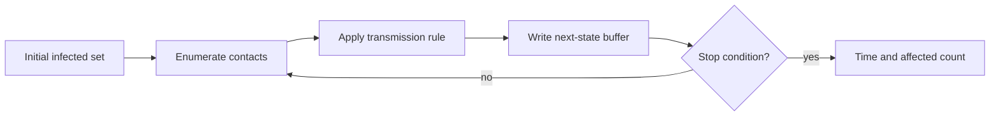
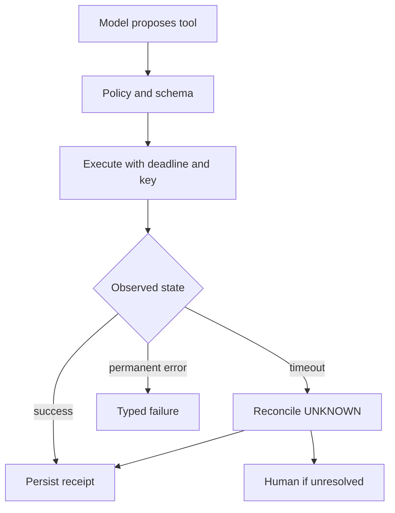

# 公司专项深度答案：OpenAI

> 按来源清单原题号顺序整理。题目归属是来源仓库标注，不代表公司官方确认。

## OAI-01｜Design and implement an in-memory key-value store supporting set, transactional begin, commit and abort.

**分类**：编码与数据结构。

### 回答

事务语义先明确：BEGIN 创建 overlay，SET 写当前层；GET 从当前层向父层逐级查找，删除用 tombstone 区分“本层已删除”和“本层没有记录”；COMMIT 把本层修改合并到父层（最外层才写基础 store），ABORT 丢弃当前层。若只支持单层，结构可简化，但要向面试官确认嵌套、无事务 commit、覆盖与读已写值的行为。

```text
base: key -> value
transactions: stack[dict(key -> value | TOMBSTONE)]
get(k): search overlays from newest to oldest; fall back to base
commit(): pop child; merge into parent or base
abort(): pop child
```

单线程内存实现每个操作平均 O(事务深度)，可用额外索引优化；并发事务需要隔离级别、版本检测和持久化，不能把栈模型直接宣称为 ACID 数据库。测试嵌套覆盖/删除、回滚后可见性、同键多次写和无效状态转换。


## OAI-02｜Create a database ORM, step by step.

**分类**：编码与数据结构。

### 回答

ORM 从可验证的最小链路开始：模型字段元数据→SQL 参数化生成→连接/事务→行映射→查询构造器。字段类型、NULL、默认值、主键和标识符转义要单独处理；值必须绑定参数，不能用字符串拼接防 SQL 注入。查询表达式编译为 AST 后生成 SQL，比靠链式方法任意拼接更容易保证括号和运算符优先级。



后续再加关联加载、迁移、乐观锁和方言；避免 N+1 查询与隐式事务。测试 SQL 快照、参数顺序、NULL 比较、回滚、并发更新及不同数据库方言。


## OAI-03｜Code a trivial web crawler using Go.

**分类**：编码与数据结构。

### 回答

Go 爬虫用 net/http Client，设置 Timeout、连接池、最大响应体与重定向策略；URL Parse/ResolveReference 处理相对链接，规范化 host/path/fragment 并限定同域。单线程先写队列与 visited，再用 goroutine worker pool 加速；visited 的 check-and-add 要原子，否则并发重复爬取。请求 Context 支持取消和整体 deadline。

```text
queue → worker fetch → HTML parser → normalize links
      → same-host/allowed check → atomic visited → queue
```

限制并发与每域速率，检查 robots/站点政策；防重定向到内网地址的 SSRF、无限链接空间与压缩炸弹。测试相对链接、循环、404、429、超时与取消。


## OAI-04｜Implement a UI from a mockup with provided CSS and API.

**分类**：编码与数据结构。

### 回答

先把 mockup 拆为布局网格、间距、字体、颜色、组件状态和响应式断点，再核对提供的 CSS token 与 API contract。优先做静态结构与语义标签，接入数据时区分 loading/empty/error/success；列表分页、按钮禁用、提交中和失败重试都要有明确状态。逐步对照截图而非一次性堆大量内联样式。

用浏览器截图在规定 viewport 做视觉回归，检查键盘导航、焦点、对比度和小屏溢出。API 数据不可信，文本转义、URL 校验；提交动作避免重复点击，用 request ID 或服务端幂等。说明哪些视觉差异是字体/浏览器渲染造成。


## OAI-05｜Refactor bad code: here are ~120 lines of working but messy code with passing tests. Improve the architecture without breaking them. What do you change first?

**分类**：编码与数据结构。

### 回答

先运行现有测试建立基线并阅读调用方，找职责混杂、重复逻辑、隐式状态和高风险边界；选最小可验证的重构单元，先补行为特征测试（尤其错误和边界），再提取纯函数/模块、隔离副作用、命名类型与接口。每一步保持外部行为不变并跑测试，避免把“重构”与功能改动混在同一提交。

优先处理会妨碍理解/测试的边界，不为了套设计模式引入抽象。对 120 行代码可用一页图说明数据流与状态，标出输入验证、核心计算、IO；最终解释改动如何降低耦合并没有改变兼容契约。


## OAI-06｜Write a Python function that displays the first n Fibonacci numbers.

**分类**：编码与数据结构。

### 回答

先澄清 n 是“前 n 个数”还是“直到数值 n”，以及 F0=0、F1=1。迭代版避免指数递归，时间 O(n)、额外空间 O(1)（若返回列表则输出空间 O(n)）；n<0 抛参数错误，n=0 返回空列表。Python 大整数不会溢出，但结果位数随 n 增长，输出与内存仍有成本。

```python
def first_fibonacci(n: int) -> list[int]:
    if n < 0:
        raise ValueError("n must be non-negative")
    result, a, b = [], 0, 1
    for _ in range(n):
        result.append(a)
        a, b = b, a + b
    return result
```

测试 n=0/1/2、前十项以及大 n；不要用递归版本不加缓存来显示“优雅”。


## OAI-07｜Infection-spread simulation.

**分类**：编码与数据结构。

### 回答

感染传播仿真先明确图/网格、离散还是连续时间、传播概率、潜伏/恢复、同步更新或即时更新。确定性最短传播时间可用多源 BFS：初始感染点入队，每层扩散一次，O(V+E)；带随机概率则固定随机种子，逐时间步用当前状态生成 next_state，不能一边遍历一边修改造成同一时间步连锁传播。



验证空感染源、隔离节点、周期图、概率 0/1、恢复与并发接触。若是真实流行病模型，参数需数据校准，模拟输出不能被当作预测事实。


## OAI-08｜Compute the KL divergence given different random variables.

**分类**：机器学习与深度学习基础。

### 回答

离散分布 KL(P||Q)=Σ_x P(x)log[P(x)/Q(x)]，P(x)=0 的项取 0；若 P(x)>0 而 Q(x)=0，则 KL 为无穷。连续分布是对密度的积分，需相同支撑/基准测度。KL 不对称且非距离，KL(P||Q) 与 KL(Q||P) 往往不同。

对高斯 P=N(μp,σp²)、Q=N(μq,σq²)，KL(P||Q)=log(σq/σp)+(σp²+(μp-μq)²)/(2σq²)-1/2。若“不同随机变量”不在同一空间，先定义映射到共同事件空间或联合分布，不能直接把两个样本数组代公式。数值计算用 log-sum-exp、epsilon 的引入必须说明会改变分布。


## OAI-09｜If the accuracy of a classifier is 1, what is the lower/upper bound on the loss function for a single training example?

**分类**：机器学习与深度学习基础。

### 回答

分类准确率 1 只说明所有样本的 argmax 类别正确，不固定某个样本交叉熵。若正确类概率 p_y 在多类中严格大于其他类别，单样本交叉熵 -log p_y 的下界接近 0（p_y→1），上界取决于类别数 K：在 K 类且 argmax 正确时，p_y 至少约 1/K，故交叉熵最多接近 log K；若有平局判定、标签平滑、类别权重或采用非交叉熵 loss，结论需重写。

二分类用阈值 0.5 正确时，p_y≥0.5，未加权交叉熵上界 log 2。若 accuracy 是全数据集 1，但问“某个训练样本的 loss”，要先确认损失定义和预测规则；不要说 accuracy=1 就 loss=0。


## OAI-10｜We have two models, 85% and 82% accuracy. Which do you pick?

**分类**：机器学习与深度学习基础。

### 回答

85% 与 82% 不能直接选。先看同一测试集、样本量、置信区间、类别不平衡、错误成本和评估是否有数据泄漏。若正例稀少，总准确率可能被多数类主导；应看 precision/recall、PR-AUC、校准、不同群体和严重错误，并计算业务效用。比如误放行风险远高于误拒，阈值与成本矩阵比总体 accuracy 更关键。

再比较延迟、推理成本、稳定性、可解释/审计需求和分布漂移。用配对样本做显著性分析；若 3 个百分点来自小样本噪声，不应做强结论。上线灰度 A/B 看真实业务指标与护栏。


## OAI-11｜How do you handle missing data in Pandas?

**分类**：机器学习与深度学习基础。

### 回答

先报告缺失机制与比例：MCAR、MAR、MNAR 的假设不同，不能一律填均值。按列类型、业务语义和时间分组决定删除、固定哨兵、组内统计填补、前向填充或模型插补；对“缺失本身有信息”的特征加 is_missing 指示。所有填补统计只在训练折计算，再应用到验证/测试，避免数据泄漏。

```python
train["age_missing"] = train["age"].isna().astype(int)
median = train["age"].median()
train["age"] = train["age"].fillna(median)
valid["age_missing"] = valid["age"].isna().astype(int)
valid["age"] = valid["age"].fillna(median)
```

时间序列 forward fill 只能用过去信息，不能穿越用户/设备边界；评价填补前后分群性能与校准。对 Pandas 的 NA/None/NaN 与 dtype 转换要显式测试。


## OAI-12｜Explain self-attention. What is its computational complexity, and what are your options when contexts get long?

**分类**：LLM 内部原理与架构。

### 回答

Self-attention 的 QKᵀ 与 attention×V 时间约 O(S²d)，若物化概率矩阵空间约 O(S²)；FlashAttention 降低 IO/中间存储但不改变精确全注意力的二次算术量。长上下文选项包括分块/稀疏/滑动窗口以减少交互，线性/状态空间结构改变记忆机制，RAG 把外部事实召回为较短证据；解码 KV Cache 避免重算历史投影，但缓存随 S 增长。

选方案先明确任务要全局逐 token 关系还是只需特定证据、训练与推理长度、可接受质量损失、硬件/延迟和数据更新频率。测长距离定位、多跳、短上下文退化，而不是只看能否接受 1M token 输入。


## OAI-13｜What is the relationship between cross-entropy, KL divergence and perplexity, and why is cross-entropy the training loss for language models?

**分类**：LLM 内部原理与架构。

### 回答

交叉熵 H(P,Q)=E_{x~P}[-log Q(x)]；KL(P||Q)=H(P,Q)-H(P)，目标真实分布 P 固定时，最小化交叉熵等价最小化 KL。语言模型对每个上下文的真实 next-token 样本做负 log likelihood，整个数据集的平均 token loss 是经验交叉熵；perplexity=exp(平均自然对数交叉熵)，若用 log2 则是 2 的对应幂。报告 perplexity 时要注明 tokenizer/数据集，不同词表的数值不能盲比。

训练时 teacher forcing 用真实前缀，推理用自身生成前缀，存在 exposure bias；降低交叉熵不保证事实性、安全或工具成功。实现上对目标 token 取 log_softmax，mask padding，按有效 token 数归一化；用融合算子避免先 softmax 再 log 的数值问题。


## OAI-14｜What is the effect of adjusting an LLM's context window size?

**分类**：LLM 内部原理与架构。

### 回答

上下文窗口变大增加可放入的 prompt 与历史，但不代表模型能可靠利用所有位置。Prefill 的 attention 计算、KV 缓存与 TTFT 增长；长文可能有 lost-in-the-middle、证据冲突和更高成本。位置编码扩展、长上下文训练/微调、chunked prefill 与 KV 管理分别解决表示、能力、调度和显存问题，不能互相替代。

决策按任务检验：全文必须逐句比较时可能需要长窗口；经常变化的企业文档适合 RAG+引用；复杂问题可先检索再在有限长窗口里综合。衡量证据位置敏感性、引用支持率、短任务退化、p99 与单位任务成本。


## OAI-15｜You are building a production agent that calls tools (function calling). What makes the loop reliable enough to ship?

**分类**：Agent 与工具调用。

### 回答

可靠性来自 Host/Runtime 的硬约束而非模型“会调用函数”：工具注册与版本、参数 schema、身份/权限、风险等级、超时、错误分类、有限重试、幂等与 UNKNOWN 状态核对、结构化 observation、审计和终止预算。读操作可按策略重试；发信/下单等写操作在丢响应时先查 operation ID，不能直接再执行。



以故障注入 eval 验证 429、5xx、超时、重复调用、权限撤销和取消，且每个用户只看自身允许的工具/数据。
