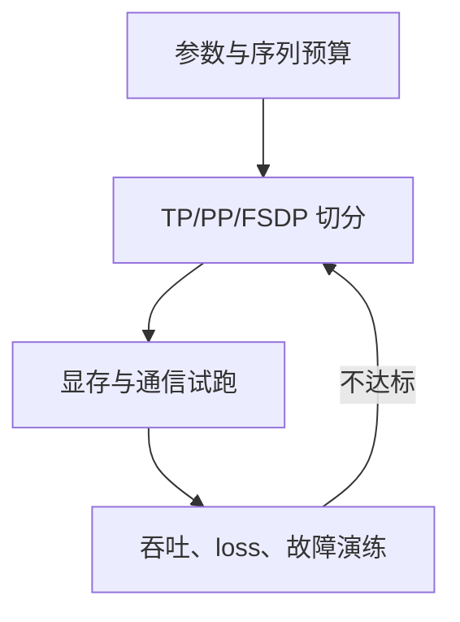

# Google DeepMind / Google AI｜逐题答案

对应 [原题库](../../00-all-598-questions.md) 公司专项第 3 组，22 道。答案以面试推理路径为主，面试经历题需换成个人真实事例。

## GDM-01｜You are receiving an unbounded stream of event IDs. Return the k most frequent IDs seen so far, at any point, with bounded memory.

**解法。** 精确答案在最坏情况下不能只用有界内存：若每个 ID 都可能成为最终第一名，必须保留任意多计数。先明确是“精确”还是“近似”。近似采用 Space-Saving 的 m 个槽位，命中加一；空槽插入；否则替换最小计数槽为新 ID，计数设为 min+1，误差记为 min。查询取前 k，附误差区间；m 由允许误差决定（频率误差约 N/m）。分布式场景先局部候选再汇总候选的精确计数或二次扫描；单纯合并局部 top-k 可能漏掉全局热门。

## GDM-02｜Closest key: given a dictionary with letter keys and lists of letters as values, find the closest key.

**先澄清距离定义。** 若字典是 key→一组字母，输入是一个字母，键值是键盘邻接表，则对输入键做 BFS，首个出现在字典键集的节点即最短无权路径；多个并列按字典序稳定选择。若输入是词、字母列表是候选词，改用编辑距离动态规划，取最小距离，平局规则明确。BFS O(V+E)，编辑距离逐候选 O(Σ|query|·|candidate|)；需处理缺失节点和不可达。

## GDM-03｜Write a function to compute root-mean-square error given y_pred and y_true lists.

设 n>0 且两列表等长。计算 `sqrt(sum((p-t)**2 for p,t in zip(y_pred,y_true))/n)`；数值极大时用稳定求和（如 `math.fsum`）或在线均方更新。空列表与非有限值给出明确异常；RMSE 与目标同单位，异常值会被平方放大。

## GDM-04｜Parse bigrams: extract two-word phrases from strings for NLP feature engineering.

先确定 token 化规则（大小写、标点、Unicode、跨句边界）。逐句正规化并 tokenize，然后用 `zip(tokens,tokens[1:])` 得相邻二元组；例如 “New York is fun” → (new,york),(york,is),(is,fun)。默认不跨句，时间 O(字符数+token 数)，可用 Counter 统计频次；生产上训练和推理共用同一 tokenizer。

## GDM-05｜Define the bias-variance trade-off and discuss the relationship between the two.

偏差是模型平均预测与真值的系统误差，方差是不同训练样本导致的预测波动；平方损失的期望误差分解为 bias²+variance+不可约噪声（在相应假设下）。模型容量提高通常降低偏差、增加方差，但数据量、正则化和集成会改变关系。看训练/验证曲线判断：都差先改善表示或容量，训练好验证差先补数据、正则与防泄漏。

## GDM-06｜What are the assumptions of linear regression?

区分用于预测与用于统计推断：线性条件期望 `E[y|X]=Xβ`、样本独立/依赖结构被正确建模、外生性 `E[ε|X]=0`、设计矩阵满秩。OLS 的无偏性不要求误差正态；同方差且无相关性支持传统最优线性无偏与标准误，正态性多用于小样本精确检验。检查残差、异方差、多重共线、异常点和数据泄漏；时间序列需处理自相关。

## GDM-07｜Distinguish regularization from validation: when is each the right tool?

正则化是训练目标里的约束：L2 抑制大权重、L1 可产生稀疏解，用于控制复杂度；验证是训练外的性能估计与模型选择，不能反复调参到验证集上。做法：先按实体/时间分组切出训练、验证、独立测试；在训练折内拟合标准化和正则模型，用验证选择系数，最后仅一次报告测试。二者互补，不互相替代。

## GDM-08｜Derive the gradient of cross-entropy loss with softmax inputs, and explain why we fuse them numerically.

令 logits 为 z，`p_i=e^{z_i}/Σ_j e^{z_j}`，one-hot 标签 y；`L=-Σ_i y_i log p_i`，由 softmax Jacobian `∂p_i/∂z_j=p_i(δ_ij-p_j)` 得 `∂L/∂z_j=p_j-y_j`（一般概率标签总和为 1）。实现为 `logsumexp(z)-z_target`，先减去最大 logit，避免 exp 溢出与 log(0)；fused kernel 还省中间张量与带宽。

## GDM-09｜Explain the SVD and give two places it shows up in modern deep learning.

SVD：`A=UΣVᵀ`，U/V 正交，Σ 的奇异值递减；截断前 r 项给出最优秩 r 的 Frobenius 范数近似。用途一是低秩权重压缩：选秩后测模型误差与推理内核是否真的加速；二是 embedding 矩阵降维/谱分析：识别主方向、冗余及病态条件数。LoRA 是训练低秩增量而非对全量权重做 SVD，应区别。

## GDM-10｜On average, how many fair coin flips until you see two heads in a row? Walk me through it.

设 E0 为尚未出现连续末尾 H 时的期望剩余次数，E1 为末尾已有一个 H 时的期望。`E0=1+(E0+E1)/2`；`E1=1+E0/2`（下一次 H 结束）。解得 `E0=6`、`E1=4`。直观校验：HTH 会重置进度，故不是 4 次。

## GDM-11｜When would you choose Q-learning over policy gradients, and vice versa?

Q-learning 适合可枚举/可优化动作、离策略复用历史数据，目标为 Bellman bootstrap 的 Q；离散动作下 DQN 类方法可从 replay 学习，但函数逼近与分布外动作可能不稳。策略梯度直接优化随机策略，适合连续/复杂动作和约束策略；通常样本效率较低、方差高，靠 baseline/actor-critic 降方差。选型比较动作空间、能否安全探索、离线数据偏差及评估方式。

## GDM-12｜You have a binary loan-approval classifier and limited access to feature weights. How do you explain a rejection?

**合规解释不能靠臆测特征权重。** 先拿到模型版本、输入快照、审核策略与决策阈值，区分模型分数和硬规则。可访问局部解释接口时，用同版本可审计的 SHAP/反事实候选，并检查相关特征、不可行动变量与稳定性；权限不足则给出可确认的规则原因和人工复核通道，不推断敏感因素。对用户提供具体可核验的主要因素、纠错方式和复议路径，记录解释证据与权限审计。

## GDM-13｜Your pretraining loss suddenly diverges at step 300k of a long run. Diagnose and fix it.

先冻结检查点与运行状态：loss、梯度范数、学习率、动态 loss scaling、单机/各 rank、吞吐及刚进入的样本 shard。若仅一批触发，校验 tokenizer、超长序列、NaN/Inf 和样本权重；若全局同步，检查调度、优化器状态、混合精度溢出与节点故障。回滚到最后可信 checkpoint，复现首个异常 step，隔离坏 batch；在修复后以较低 LR、梯度裁剪和有限值告警小规模重跑，再恢复并比较验证集。不要仅掩盖 loss spike 而丢掉根因。

## GDM-14｜Design the training setup for a model that doesn't fit on one accelerator, say 70B parameters on a pod.

70B BF16 权重约 140GB，仅参数已超单张 80GB 卡；训练还需梯度、优化器和激活。先按集群内 NVLink/跨节点网络拓扑规划：张量并行用于层内矩阵，流水并行切层，数据并行/FSDP 分片状态，序列/上下文并行降低长序列激活，检查点重计算换显存。用 profiler 测通信与空泡，计算 global batch=微批×累积×数据并行，设稳定性指标和故障 checkpoint。具体并行度由显存预算、互联与目标 token/s 求解。 

## GDM-15｜Design the serving system for a multimodal assistant (text + image in, streaming text out) at hundreds of millions of users.

入口做鉴权、按 token/图像成本限流和地域路由；图像解码/缩放/安全检查后进入视觉编码器，文本 token 与视觉 token 送模型；prefill 与 decode 分离、连续批处理和 KV 管理，SSE 流式输出且支持取消。容量按峰值并发×平均输出长度、图像 token 分布和显存预算估算；多地域隔离、回退到小模型、超时与排队上限。评估首 token/端到端延迟、质量、安全拒答、成本和故障域；上传内容有生命周期、权限与日志脱敏。

## GDM-16｜Design a personalised recommendation system for rental listings using demographics, property metadata, amenities, price, reviews and location.

目标先选用户效用（有效咨询/入住），不要把点击当唯一标签。构建地理、价格、可住日期和硬约束过滤的候选池；按协同过滤、向量近邻、内容相似和热门召回，排序模型融合房源质量、位置距离、价格适配、设施、评论与用户短期意图。新用户用明确偏好与上下文，新房源靠元数据；训练用曝光日志与负采样，做位置偏差校正。线上做多样性、库存/公平约束、A/B，监控有效联系率、取消率、覆盖、延迟与隐私。

## GDM-17｜Design a classifier that predicts the optimal moment to insert a commercial break in a video.

把视频分镜、静音/音频转场、字幕语义、情绪高潮和广告时长约束映射为候选时间点；训练标签可来自人工边界标注和经随机化实验估计的留存损失，避免用已有广告位置当真值。先规则提候选，再时序模型打分，动态规划/约束优化选若干互不相邻的插入点，排除高风险场景。离线用边界容忍度与标注一致率，线上用广告收益、观看完成率和负反馈联合评估。

## GDM-18｜How would you improve product search results, focusing on the fraction of relevant documents retrieved (recall)?

先固定相关性定义与标注池，测 Recall@k=相关且被检出的文档数/全部相关文档数；不完整 judgment 要用抽样审查而非把未标注文档当无关。分析零结果、同义词、拼写、语种及过滤条件过严；提高召回用词法 BM25+语义 ANN 多路召回、查询扩展、实体解析及更大候选 k。随后 rerank 控制 precision、延迟与成本；离线看分层 Recall@k，线上看成功搜索/转化与 p95，保护敏感属性及库存约束。

## GDM-19｜Justify using a neural network for a given problem: what do you need to know about the network, dataset, timeline and business context?

先定义业务目标、错误代价和上线时限，再做强基线（规则/线性/树模型）。神经网络有意义的证据是高维非结构化输入、充足且代表性的标签、可复用预训练表示和可接受的推理成本。说明网络输入/结构/参数量、训练与服务数据一致性、类别不平衡、部署内存/延迟、数据漂移与解释要求。以同一时间外测试集比较质量和成本；若增益不足以抵消复杂度，优先基线。

## GDM-20｜Build the evaluation harness for a new frontier model release. What does it need to do?

评测清单按能力、安全、工具使用、多模态、语言与长上下文分层，固定提示模板、采样配置、判分器版本、污染检查和数据权限；对每次 run 保存模型 hash、题目版本、原始轨迹、评分依据与不确定性。自动判分需人工抽检和对抗复核；不只看平均分，还看子群体、长尾严重错误及回归。灰度发布设置预定门槛、回滚阈值、在线日志抽样与盲测。

## GDM-21｜Do 1 million Seattle ride trips suffice to build an accurate ETA prediction model? How would you decide?

一百万条是否足够取决于覆盖和标签噪声，而不是总量。按道路段、时段、天气、节假日、长尾起终点及司机/路线切片，计算有效样本与覆盖；按时间留出测试，防同一行程信息泄漏。以路线距离/历史分位数基线对比模型，画学习曲线（10%、25%、50%、100% 数据）和切片 MAE/p90 误差；若曲线仍下降且罕见条件误差高，补数据或外部交通特征。部署后监控新区域与季节漂移。

## GDM-22｜Tell me about a time you disagreed with a researcher or tech lead about priorities, and what happened.

用真实项目按 STAR 讲：共同目标及期限→你和研究者各自的证据与担心→先确定决定标准（质量、安全、成本或交付风险）→做最小对照实验/灰度→结果与后续复盘。明确你如何倾听、让对方观点进入方案、升级决策而不绕过负责人。量化指标只填自己可核实的数值；若实验否定自己，说明如何改变决定。
