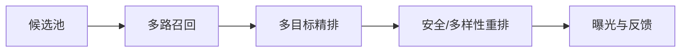
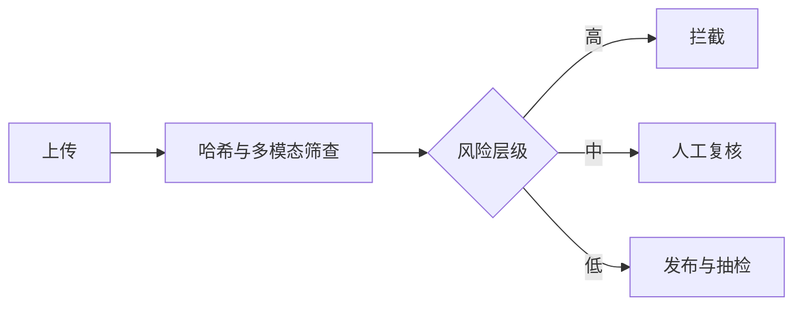

# Meta｜逐题答案

对应 [原题库](../../00-all-598-questions.md) 公司专项第 4 组，共 26 道。行为题为真实经历的组织框架。

## META-01｜Given an array nums of n integers where n > 1, return an output array (product of array except self).

前后缀积，`out[i]=∏_{j<i}nums[j]`，再从右向左维护 suffix 并乘入。时间 O(n)，额外空间 O(1)（不计输出）；不使用除法，因此零元素自然成立。测试 [1,2,3,4]→[24,12,8,6]、单零、多零、负数与溢出策略。

## META-02｜Find the minimum window in S which will contain all the characters in T.

用滑动窗口：Counter 记录 T 每个字符需求，右指针扩展，满足的不同字符数达到需求类别数时左指针缩小并更新最短答案。重复字符要按计数满足，例如 T=AABC 不能把 ABC 当完成。时间 O(|S|+|T|)，空间 O(字符集)；无解返回空串。

## META-03｜Serialize and deserialize a binary tree.

前序遍历，空子树写 `#`，值写长度前缀或安全分隔编码；反序列化依次消费 token，`#`→None，否则递归建左右子树。时间/空间 O(n)；深树用显式栈避免递归溢出。处理负值、重复值、空树和损坏输入，不能只存前序值而丢结构。

## META-04｜Convert a binary tree to a circular doubly linked list.

若原树是 BST，中序遍历可输出排序链表；若仅二叉树，则中序顺序但不保证排序。DFS 返回子树 (head,tail)，拼接左链、当前节点和右链；根节点与尾节点再闭环。原地 O(n) 时间，递归栈 O(h)；先保存孩子指针再改 prev/next，防止遍历被破坏。

## META-05｜Alien dictionary: determine character ordering from a sorted word list.

比较相邻词，找到第一处不同字符并加有向边；若前词更长且以后词为前缀（abc,ab），立即判无效。把所有出现字符入图，去重边后用 Kahn 入度排序；若输出字符数不足则有环。顺序可能不唯一，可用最小堆做确定性输出。时间 O(所有字符+边)。

## META-06｜K closest points to origin; top-k frequent elements; minimum number of conference rooms.

三题分别选合适结构：k 最近点可 O(n log k) 最大堆或线性期望 quickselect，以平方距离避免 sqrt；top-k 高频先 Counter，再最小堆 O(n+k log u)，频率平局规则要定；最少会议室按开始时间排序，用结束时间最小堆释放已结束会议，堆最大长度即所需房间数 O(n log n)。逐题说清边界 k=0、重复及端点相接是否重叠。

## META-07｜Regular expression matching with '.' and '\*'.

二维 DP：`dp[i][j]` 表示 s 前 i 字符匹配 p 前 j 字符。普通字符/点号取 `dp[i-1][j-1]`；星号表示前一个元素零次时取 `dp[i][j-2]`，一次以上且字符匹配时取 `dp[i-1][j]`。初始化空串与 a*b* 一类模式；`*` 不能出现在开头。时间 O(|s||p|)，空间可压缩到 O(|p|)。

## META-08｜Two-part warm-up: given a stream of user actions, return the k most engaged-with items. Then: why might your heap solution be the wrong choice in production?

先确认“参与度”按计数、加权事件还是时间衰减。精确实现哈希计数+大小 k 堆，更新若维护堆索引需 O(log k)，惰性堆会积累旧记录；查询频繁/写入密集时可用分片聚合、流处理窗口、Space-Saving 近似与离线校正。生产选择受高基数、迟到事件、热点 key、窗口语义、跨分片合并、成本和可接受误差支配，不能凭面试堆结构直接上线。

## META-09｜Your ads CTR model shows a 2% offline AUC gain, but the online A/B is revenue-neutral with worse calibration. What is going on, and what do you do?

AUC 只看相对排序，广告收入还取决于校准概率、出价、预算/竞价机制和用户体验。检查随机化/触发条件、样本延迟、曝光与点击归因、位置偏差、训练线上特征一致性，按广告主/出价/地域切片对比 PR、log loss、校准曲线和 eCPM。若新模型过度自信，胜出价和预算消耗可能改变却不增加收益；用训练内校准器、竞价回放及小流量实验验证，按预设多目标门槛决定回滚。

## META-10｜Explain the architectural choices in a Llama-class model: why grouped-query attention, RoPE and SwiGLU instead of the vanilla 2017 Transformer?

GQA 让多个 query 头共享少量 KV 头，显著减少 decode 时 KV cache/带宽，通常在质量与 MQA 极端共享之间折中。RoPE 给 Q/K 注入相对位置信息，长上下文仍需实测外推而非自动成立。SwiGLU 门控 FFN 通常提高参数利用率，但增加相应矩阵计算；具体收益取决于宽度与训练配方。联系内存、吞吐和质量指标解释选择，避免声称这些组件单独造成全部提升。

## META-11｜What breaks when you scale LLM training from 8 GPUs to thousands, and how do modern stacks deal with it?

千卡规模下出现梯度同步、跨节点网络瓶颈、流水空泡、负载不均、GPU/网络故障、样本顺序漂移及 checkpoint 时间。组合 TP/PP/DP/FSDP 与重计算，让高频通信尽量留节点内，调微批填管线，分布式检查点可恢复优化器和数据游标。监控 MFU、有效 token/s、goodput、loss 与各 rank 异常；逐级扩容做故障注入，防“大规模只看峰值 FLOPS”。

## META-12｜You need to serve a Llama-class 70B+ model to hundreds of millions of assistant users. What does the serving stack look like and where does the money go?

70B BF16 权重约 140GB，需多卡分片或量化；按请求分布配置文本/图像前处理、路由、prefill/decode 池、连续批处理、paged KV、前缀缓存、流式输出和背压。成本拆成权重驻留、prefill 算力、decode 显存带宽/KV、跨卡通信、峰值冗余和长上下文。以 p95 首 token、每 token 延迟、质量、拒答和每千有效请求成本做容量模型；量化及小模型路由须做分层质量回归。

## META-13｜You're dropped into an unfamiliar multi-file codebase with a failing behaviour and an LLM assistant available. Walk me through how you'd fix it.

先复现并写下输入、期望、实际、日志/栈和最小失败测试；用搜索定位入口、调用链与版本变化。让 LLM 帮忙列假设、解释局部代码和生成候选测试，但只给最小必要上下文且核对每个引用；跑测试与断点验证根因。做最小修复，加边界/回归测试，检查性能、安全及相邻调用者，代码审查时说明证据与回滚方案。

## META-14｜Walk me through a post-training recipe to turn a pretrained base model into a personalised assistant.

先定义个性化边界：稳定偏好（由用户可编辑/删除）与会话临时上下文隔离。SFT 训练指令遵循、工具协议和拒答；偏好数据做配对标注，经 DPO/RL 或可控蒸馏优化有用性，不把用户隐私直接烘进共享权重。记忆由授权的检索层实现，带过期、删除、敏感信息过滤。离线看指令遵循/事实性/安全及不同用户切片，线上 A/B 比较任务成功、延迟和负反馈。

## META-15｜Design the recommendation system for Instagram Reels.

候选从关注、相似内容、协同过滤、热门探索多路召回；短期 session、用户长期兴趣、视频内容/音频/文本和作者特征进入多目标排序（完播、长期留存、负反馈）。去重/多样性、频控、内容安全与新作者探索在重排层执行。事件流水实时刷新短期状态、批量训练表示；防曝光选择偏差与延迟标签，线上实验监控观看质量、留存、公平覆盖、延迟。

## META-16｜Design a personalised news-feed ranking system / the “next post” logic for Facebook's feed.

“下一条”受可见权限、好友关系、关注、时效与已读约束。召回好友/群组/推荐内容，精排预测有意义互动与长期满意度，同时显式抑制隐藏、举报、刷屏；重排控制作者重复、探索和新鲜度。训练样本按真实曝光构造，位置偏差校正，离线 NDCG/AUC 只作代理，线上看留存、互动质量、负反馈与健康度；把权限和删除事件实时传播到缓存。

## META-17｜Design a recommendation system for Facebook Ads, and an evaluation framework for ads ranking.

先过滤政策、受众资格、预算和投放条件，再召回广告并预测点击/转化概率、价值、负反馈；竞价把校准后的概率、出价、预算节奏和体验约束合成排序。离线用时间切分、校准曲线、AUC、log loss、分广告主切片及竞价回放；线上随机化实验同时看增量收入、转化、广告主 ROI、用户留存和预算消耗，警惕归因延迟与干扰。

## META-18｜Design the ML components behind an Instagram Story feature.

以发布 Story 为例：图像/视频质量与安全审核、对象/文字识别、自动字幕、贴纸/音乐推荐、好友可见权限和观看排序。端侧轻量处理提升预览速度，服务端异步高成本推理；状态机保证发布成功/审核/撤回一致。关注上传延迟、误封、字幕 WER、观看完成率与隐私；标注中区分原始内容和叠加贴纸，避免数据泄漏。

## META-19｜Design an end-to-end classification pipeline for Marketplace listings.

上传后先做格式校验、OCR/视觉编码、文本与类目词解析；层级分类模型给类目/属性/违规风险及置信度，低置信或高风险送人工。商品目录、区域规则和语言特征联动，去重/垃圾内容过滤；训练集按商家与时间划分，关注长尾类目和新型商品。评估层级准确率、校准、人工复核负载、成交/搜索相关性；纠错标签回流时记录审核版本。

## META-20｜Design a language translation model / service.

决定语种、领域和质量/延迟预算。多语 Transformer 以平行语料做 seq2seq 训练，清洗对齐、去重、保留术语并处理低资源语种；服务端检测语言、可选文档上下文、术语表约束、批处理与流式/句级返回。自动 BLEU/chrF/COMET 类指标与双语人工评审互补，检查数字、专名、语义遗漏和安全；在线按语言/领域监控质量与延迟。

## META-21｜How would you build the evaluation system for a Meta AI assistant before and after each model release?

固定版本化测试集：基础能力、工具轨迹、图文、地区语言、敏感场景与红队。采样参数/工具模拟器/判分器都锁版本，保存每例输出与误差类型；自动评分做人工一致性抽检，检查数据污染。发布前比上一版本的显著回归、最差切片、成本/延迟，灰度后监控真实反馈与高危事件，门槛触发回滚；新增事故进入永久回归集。

## META-22｜Design the harmful-content detection system for Facebook and Instagram uploads.

上传链路先做可解析性与哈希匹配，文本、图像、视频多模态分类检索；风险分层：明显违规自动拦截、灰区限制传播与人工复核、低风险放行并持续抽检。模型输出要有政策类别、置信度和证据片段，地区/年龄规则单独配置，用户申诉可复审。监控有害内容漏检率、误封率、审核延迟、不同语言和群体差异，隐私及抗对抗扰动也纳入压力测试。

## META-23｜How do modern multimodal models get image and video understanding into an LLM, and what changes for video specifically?

图像经视觉编码器成 patch/token，经投影器对齐 LLM token 空间；模型在图文混合序列上对齐训练。视频多出时间维：帧采样、镜头边界、时间戳、音频同步与稀疏/层级聚合，避免所有帧直接拼入上下文导致成本爆炸。评估事件顺序、跨帧指代、时间定位和视觉幻觉；服务侧缓存视觉编码、按任务自适应帧率并测长视频延迟。

## META-24｜Give me an example of a project where you used data and machine learning. What obstacles did you hit?

用自己真实项目填写：业务问题和基线→数据来源、清洗和泄漏防护→模型/实验设计→障碍（标签噪声、冷启动、部署差异等）及你采取的诊断→上线结果及反事实。给出可核实的样本量、指标和个人贡献；若没有线上实验，诚实区分离线结果与上线影响。

## META-25｜Tell me about a time you drove a significant result through ambiguity, and a time you were wrong.

准备两个独立 STAR 故事。模糊任务：写明如何把目标转成可检验里程碑、争取决策人、选择最小实验、衡量结果。犯错：说明当时假设、早期信号、你何时承认/回滚、修复和制度化预防。不要把团队错误归咎别人，也不要编造指标；突出改变决策的证据。

## META-26｜Tell me about maintaining a production ML pipeline. Why Meta?

生产流水线从事件采集、schema/隐私校验、特征变换、训练、离线评测、注册、灰度、回滚到漂移监控；举个人真实故障例，说明数据新鲜度、训练/服务一致性、告警阈值及责任划分。为何选择 Meta 可结合具体产品规模、推荐/开源模型课题与自己经历说明适配；避免只说“规模大”。
