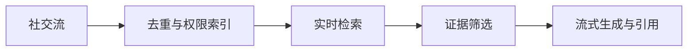

# xAI｜逐题答案

对应原题库公司专项第 5 组，共 10 道。

## XAI-01｜Build an in-memory key-value store with SET/GET/DELETE, then add transactions with BEGIN/COMMIT/ROLLBACK, including nested transactions.

基础层哈希表存已提交状态；事务栈每层只存改动日志（key→新值或墓碑）。GET 自顶向下查首个覆盖，SET/DELETE 写当前层；COMMIT 将顶层增量并入父层，最外层提交到基础层；ROLLBACK 丢弃顶层。说明事务隔离只覆盖单线程内存语义，多线程需锁/MVCC，崩溃持久化需 WAL。每操作典型 O(嵌套深度)，可用索引优化；测试嵌套覆盖、删除后回滚和空事务。

## XAI-02｜Write an iterator class that lazily flattens an arbitrarily nested list of lists/integers: no generators, explicit state.

显式栈保存当前各层的 `(list,index)`；`hasNext()` 循环：栈顶耗尽则弹出，遇列表就压入，遇整数返回 True 但不消费；`next()` 调用 hasNext 后消费该整数，否则 StopIteration。任意深度不会递归溢出；每元素被访问有限次，总摊销 O(n)，空间 O(深度)。定义输入是否允许其他类型、循环引用。

## XAI-03｜Here is a scheduler class from a small LLM inference engine. One method, \_admit_requests, is a stub: no spec, no docstring, no tests. Walk me through your first thirty minutes.

前 5 分钟复现测试/阅读调用点，列出调度不变量：预算（KV blocks、token、并发）、优先级、取消和公平；5–15 分钟追踪现有 request 状态和同类函数，写最小行为测试；15–25 分钟实现保守 admission，容量计算与状态更新原子化，避免重复调度；最后跑测试并检查边界。无规格时先把假设写出来并请维护者确认，不能让 LLM 生成的想象契约覆盖代码证据。

## XAI-04｜Estimate the KV-cache memory to serve a 70B-class model at 128k context. What do you do when it doesn't fit?

KV 内存近似 `2×层数×KV头数×每头维度×序列长度×并发序列数×每元素字节数`；以 80 层、8 KV 头、128 维、128k、BF16 为例，单请求约 42.9GB（十进制），实际依模型结构与 paged block 碎片而变。批量 4 已超多卡显存余量；量化 KV、上下文并行/分片、分层卸载、前缀共享、滑窗或检索压缩，并测质量与首 token 延迟。

## XAI-05｜Design a rate limiter for an LLM API where cost scales with tokens, not requests.

预留按预测输入 token+最大输出 token 的预算，分租户/模型 token bucket，流输出逐 token 扣费或先预留、结束退款；并发上限限制占用中的 KV。分布式用 Redis Lua/中心配额服务原子扣减，设置局部短租约降低热点，保证故障时保守拒绝或限额降级。按实际模型成本加权 token，返回剩余额度与 retry-after，测试取消、断线和重试幂等。

## XAI-06｜You're training on tens of thousands of GPUs and hardware fails constantly. How do you keep goodput high?

优化 goodput=有效训练 token/墙钟时间，不只看 GPU utilization。检测 ECC/网络/慢 rank，容错 checkpoint 同时保存优化器、随机状态与数据游标；按故障率权衡 checkpoint 间隔及异步写入，故障隔离后快速重排 rank。并行映射贴合拓扑，重叠通信/计算、动态处理 straggler、重启重放去重；监控恢复时间、丢失计算比例和 loss 连续性。

## XAI-07｜Loss spikes mid-run on a large pretraining job. Walk me through your debugging process.

捕获首个异常 step 前后的样本 ID、梯度/激活范数、LR、loss scale、各 rank 与机器健康。重放可疑批次，检查坏数据、超长序列、精度溢出、optimizer/chkpt 错位和网络静默错误；只在有证据时排除样本。回滚可靠检查点，用更低 LR、裁剪、有限值断言小规模复现，再恢复；记录根因和防复发监控。

## XAI-08｜Design a deduplication pipeline for a web-scale pretraining corpus. It has to run as a streaming process.

流式摄入时先做规范化、URL/crawl 元数据与 exact hash 去重，再用 shingles+MinHash/SimHash 生成近似重复候选；按语言/域分桶，LSH/外部状态存储查近邻并控制内存。保留代表文档的质量和时间规则，保留版权/许可与来源谱系；对假阳性（模板页/翻译）人工抽样。窗口内精确、跨全量近似需明确；测重复率、漏检、吞吐与数据分布漂移。

## XAI-09｜Design the serving stack for a consumer chatbot with real-time search over a social-media firehose.

社交流摄入后去重、实体抽取、事件时间窗口索引，冷热分层词法+向量检索；查询时过滤权限、时间与可信来源，并把证据送 LLM 带引用生成。热索引保秒级新鲜度，迟到/删除事件追索到缓存和引用；高峰按检索与生成分别扩容，限流与回退到“仅链接”。测新鲜度 p95、引用准确率、误信息、泄漏与首 token 延迟。

## XAI-10｜You have four hours to build and demo a working AI-powered product. How do you spend them?

0–30 分钟定唯一用户故事和验收输入；30–90 分钟接通数据/API 与最短可用路径；90–150 分钟补异常、超时、注入/权限检查和观测；150–210 分钟用 3–5 个真实例子演练、修最明显失败；最后准备可重复的演示脚本、备用录屏/样例及下一步。优先端到端可运行，不在四小时内训练模型或堆复杂代理框架。
