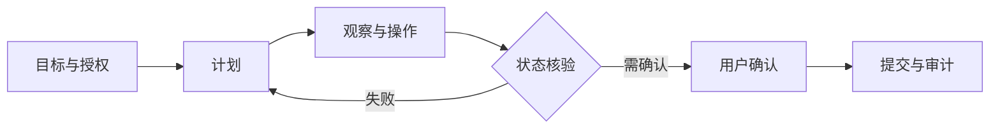

# Zhipu AI（GLM）｜逐题答案

对应原题库公司专项第 10 组，共 11 道。

## GLM-01｜GLM's original pre-training objective is autoregressive blank infilling. How does it differ from BERT and GPT, and why did the team argue it unifies understanding and generation?

BERT 的 mask 预测偏双向理解，GPT 左到右生成；原始 GLM 先在输入中遮盖可变长度 span，再以自回归方式填空，配合二维位置/特殊 attention mask，使可见上下文双向、待生成片段自回归。通过片段长度/任务形式覆盖理解和生成，但是否真的统一要看两类任务对照。

## GLM-02｜GLM-4.5 is an MoE with 355B total but 32B active parameters. Explain the economics: what does that split buy you and what does it cost?

355B 总参数要驻留/分片，约 32B 活跃参数让单 token 主要专家计算显著低于全 dense 355B；代价是路由、all-to-all、专家负载、低 batch 推理效率及运维复杂度。计算部署成本时加上共享层/attention、KV 与副本，不把活跃参数当显存需求。

## GLM-03｜Implement a top-k MoE router in PyTorch. Then contrast auxiliary-loss load balancing with a loss-free approach.

PyTorch 教学实现：`scores=router(x.float()); idx=scores.topk(k,dim=-1).indices; weight=softmax(scores.gather(-1,idx),-1)`，按专家索引 gather token，输出乘权重再 index_add_ 回原位置。辅助均衡 loss 在训练目标里惩罚负载偏斜，可能干扰主任务；loss-free 通过动态路由 bias 调整选择，主任务梯度不直接承担平衡项。检验空专家、容量溢出、分布式 all-to-all 和梯度正确性。

## GLM-04｜What is Multi-Token Prediction (MTP), why add an MTP layer, and how does it help at inference time?

MTP 增设预测后续多个 token 的训练目标，给共享表示更多未来信号；训练时权重需控制，推理可丢弃辅助头或用作多 token 草稿、主模型验证，取决于接受率。不要声称 MTP 本身保证推理加速；测真实序列吞吐、准确率和额外内存。

## GLM-05｜GLM has been bilingual Chinese/English since GLM-130B. What changes in tokenization, data and evaluation when a model must serve both languages well?

分词器要比较中英每字符/词的 token fertility，避免中文被过度切碎、英文/代码和数字成本恶化；数据按语种、领域、质量与许可混合，防英文占优。评测分别看中英文推理、知识、代码、方言、文化语境和跨语迁移，并报告每语种 token 预算与人评误差。

## GLM-06｜AutoGLM and CogAgent operate real GUIs from screenshots over tens of steps. Design the agent: perception, action space, and error recovery for a 50-step task.

GUI 代理以截图+可访问性树感知，输出受限的点击/输入/滚动/等待动作并定位目标；每步观察结果，与计划和预期状态比对，失败可重试或回退，持久状态记录已完成子目标。50 步任务要控制上下文压缩、权限与敏感写操作的确认；以成功率、误操作、步数、恢复率和人为接管率评估，截图注入文本不能成为最高权限指令。

## GLM-07｜GLM-4.5 is a hybrid reasoning model with a thinking mode and a direct-response mode. How do you build one model that does both, and what are the training and serving implications?

以显式模式/预算控制训练样本：SFT 同时覆盖短答与长推理，偏好或可验证奖励分别优化，保持共享的格式和安全约束。服务端模式通过结构化控制字段设置并记录，thinking 输出预算/截断要防泄漏与不完整答案；路由策略比较正确率、p95 和成本。

## GLM-08｜Why does long-horizon agentic RL need a disaggregated, asynchronous design (as in the slime framework) rather than colocated-synchronous?

长任务 rollout 需多次工具调用，耗时与 GPU 生成长度差异很大；同步同机等待最慢环境会使训练器闲置。解耦采样 worker、环境和 learner，用队列异步批量汇总经验，管理模型版本滞后、重复样本、奖励可信度与并发环境隔离；以有效样本/秒和政策滞后偏差量化收益。

## GLM-09｜GLM-4.5's post-training trains expert models per domain then unifies with self-distillation. Walk through why you would train specialists and then merge them.

专域模型各自在代码、工具、数学等数据和奖励上深挖，可避免一个统一训练混合把困难任务淹没；之后用这些专家产生经验证的轨迹/偏好，蒸馏到单模型共享表示并做综合 SFT/RL。风险是教师错误、风格冲突与通用能力遗忘，需筛选、配比和各域回归测试。

## GLM-10｜Design AutoGLM end to end: a cloud service letting users delegate multi-step phone tasks (“order my usual coffee”) to an autonomous agent. Architecture and failure modes.

入口鉴权和权限边界→解析“常喝的咖啡”记忆（用户可编辑）→GUI/API 工具执行购物车、地址、价格确认→最终下单需明确授权→收据与可取消记录。每一步有观察、状态验证、超时与补偿动作；价格变更、库存、支付、界面漂移和截图注入要中止/转人工。按端到端成功、误单、平均步数、恢复和隐私事件做灰度。

## GLM-11｜How would you evaluate an agentic coding model on SWE-bench and τ-bench style benchmarks without fooling yourself?

固定模型版本、prompt、工具版本和容器镜像，按实例独立运行 SWE-bench 类补丁/隐藏测试与 τ-bench 类工具状态任务；记录所有行动和最终环境状态，不能只用模型自报成功。去重污染、限制尝试次数和人介入、按语言/任务难度分层，报告 pass@1、方差、成本、延迟、安全违规和无效调用，人工审查可疑通过样本。
