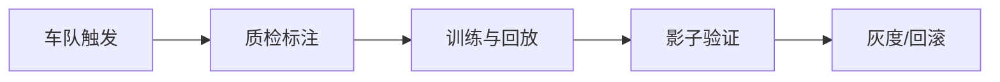

# Tesla｜逐题答案

对应原题库公司专项第 17 组，共 11 道。

## TESLA-01｜Implement non-maximum suppression. Then vectorise it.

按置信度降序，取最高框并删除与它 IoU>阈值的同类框，重复直到空或输出上限；朴素 O(n²)，IoU 交面积用夹紧到 0 的宽高。向量化一次算当前框对剩余框的 IoU，GPU 可批量矩阵计算但需注意排序/类别、显存 O(n²)、浮点边界和空框；Soft-NMS 改为衰减分数以减少近邻漏检。

## TESLA-02｜Write an efficient ring buffer for high-rate sensor data with a fixed memory budget.

固定容量数组+读写索引与占用计数，写满时明确丢最新、覆写最旧或背压策略；写入带单调序号/时间戳以识别断帧。单生产者单消费者可用原子索引和内存序，多生产者需锁/无锁协议防竞态；测峰值写入、消费者慢、环绕、时间对齐与零复制生命周期。

## TESLA-03｜How would you design the neural network architecture for multi-camera 3D object detection without lidar?

多相机图像先共享/独立 backbone 提特征，按相机内外参投影到 BEV 或 3D query 跨视角融合，再时序融合并预测 3D box、速度/不确定性。标定/时间同步与遮挡是关键，训练用 3D/多视角标签和时序一致性，测距离/小物体/夜晚、误检漏检和端侧预算；无 lidar 推理不等于不能用其他传感器辅助训练标注。

## TESLA-04｜How do you handle extreme class imbalance in rare-event detection (e.g. a child running into the road)?

罕见危险事件不能靠总体准确率；用触发/主动学习、仿真与精审真实数据补难例，保留自然基率验证。损失加权/focal 和困难负例、时序先验可提高召回，但阈值要以误刹/漏检风险成本与校准选。按天气、速度、距离、年龄/遮挡切片测 recall、每小时误警与事件时间提前量，闭环安全审查。

## TESLA-05｜Explain how you would auto-label a fleet dataset and what quality controls you would put on it.

车队触发上传多相机短片与传感器/标定元数据，经隐私处理、去重、时序对齐；离线用多视角几何/轨迹重建自动标注，再人工审核边界和罕见事件。记录 label provenance/版本和置信度，抽样分层估错标率，与独立金标准对照；模型不能只用自己预测的伪标签作无偏真值。

## TESLA-06｜How would you detect and handle distribution shift between fleet data and your training set?

把车队和训练分布按地域、天气、昼夜、机型、版本/镜头和道路类型切片，测特征分布、置信度/校准及人工标注性能；仅分布距离不能证明安全影响。漂移高风险时增加采样/回传、标注与再训练，影子模式与灰度验证，定义回滚阈值；评估数据采集中的隐私和选择偏差。

## TESLA-07｜The onboard compute budget is fixed. Walk me through quantizing and pruning a vision model without losing recall on small objects.

先测小目标在不同层/分辨率的 recall，确定敏感卷积、特征金字塔与检测头；量化从高精度基线经代表性校准、混合精度/QAT，结构化剪枝后微调。比较端侧真实延迟、能耗和雨夜远距离小目标分层 recall/误警，不仅 mAP；有安全风险时回滚，保持可解释的容量预算。

## TESLA-08｜Design the data engine: fleet triggers → upload → labelling → retraining → shadow-mode validation → release.

数据引擎：可解释触发器采集难例→授权上传/脱敏去重→自动标注与人工质检→数据/模型版本化训练→离线场景回放→车端影子推理→小范围灰度→监控与回滚。每一步记录场景覆盖和缺陷谱系，防训练与评测车次/路段泄漏；影子模式不直接证明闭环安全。

## TESLA-09｜Disengagement rate is a weak proxy. How would you actually measure whether an autonomy release is safer than the last one?

明确曝光（里程、场景、天气）及安全终点：碰撞/险情、接管质量、交通违规、最小安全距离和特定危险场景通过率；脱离率受驾驶员习惯与环境选择影响。以匹配场景/回放、仿真、影子和受控灰度的证据链比较，给置信区间与严重事件权重；稀有事件需长时间与独立审查，不能从短试验宣称绝对安全。

## TESLA-10｜How would you fuse camera, radar and IMU inputs into a single perception stack, and where would you fuse them?

先时间同步、坐标系/标定和不确定性建模。早融合把雷达速度/距离投影至图像或 BEV，信息丰富但受标定错误影响；中融合各传感器特征在 BEV/对象级交互，兼顾鲁棒和表达；晚融合检测轨迹以置信度合并，便于故障隔离但丢细节。IMU 通常辅助 ego-motion/时序对齐，做传感器失效与恶劣天气消融。

## TESLA-11｜Tell me about the most technically demanding thing you have shipped, and what you would do differently.

真实项目 STAR：规模/约束、最困难的技术取舍、你亲自解决的证据、测试与上线结果，再说今天会怎样改善数据/验证/回滚。涉及保密或安全数据只给获准公开的量化信息，不编数字。
